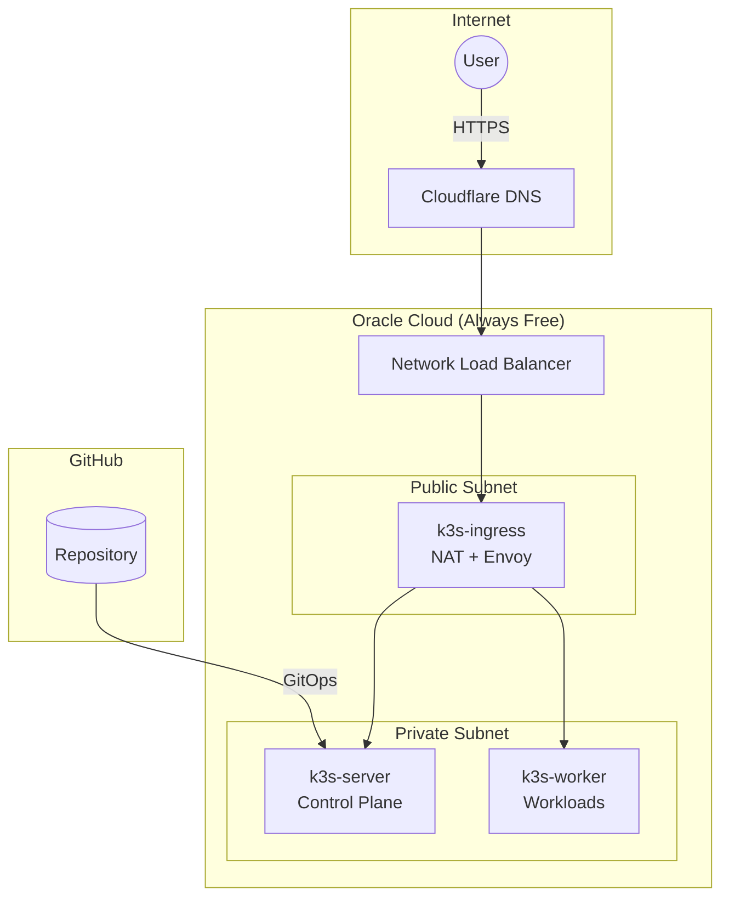

# K3s on Oracle Cloud Always Free

A production-ready K3s cluster on Oracle Cloud Infrastructure using Always Free tier resources. This project provisions infrastructure with Terraform, bootstraps Argo CD for GitOps, and deploys applications via Gateway API with automatic HTTPS.



## Architecture

The cluster runs on three Ampere A1 ARM64 instances within OCI's Always Free limits (4 OCPUs, 24GB RAM total):

| Node | Resources | Subnet | Role |
|------|-----------|--------|------|
| k3s-ingress | 1 OCPU, 6GB | Public (10.0.1.0/24) | NAT gateway, Envoy Gateway |
| k3s-server | 2 OCPU, 12GB | Private (10.0.2.0/24) | K3s control plane, Argo CD |
| k3s-worker | 1 OCPU, 6GB | Private (10.0.2.0/24) | Application workloads |

## Components

| Component | Purpose |
|-----------|---------|
| K3s | Lightweight Kubernetes distribution |
| Argo CD | GitOps continuous delivery |
| Envoy Gateway | Gateway API implementation |
| External DNS | Automatic Cloudflare DNS updates |
| Cert Manager | Let's Encrypt certificate automation |
| OCI Vault | Secrets storage (Always Free) |
| External Secrets | Sync Vault secrets to Kubernetes |

## OCI Always Free Resources

| Resource | Free Limit | Usage |
|----------|------------|-------|
| Ampere A1 Compute | 4 OCPUs, 24 GB RAM | 4 OCPUs, 24 GB |
| Object Storage | 20 GB | ~1 MB (Terraform state) |
| Vault Secrets | 150 secrets | ~10 secrets |
| Vault Master Keys | 20 key versions | 1 key |
| Flexible NLB | 1 instance | 1 instance (ingress) |


## Prerequisites

- OCI Account with Always Free eligibility
- Cloudflare account with a managed domain
- GitHub account with a Personal Access Token
- Terraform installed locally

## Quick Start

### Create Configuration

Create `tf-k3s/terraform.tfvars`:

```hcl
tenancy_ocid         = "ocid1.tenancy.oc1..."
user_ocid            = "ocid1.user.oc1..."
fingerprint          = "xx:xx:xx..."
private_key_path     = "/path/to/oci_api_key.pem"
region               = "us-ashburn-1"
compartment_ocid     = "ocid1.compartment.oc1..."

ssh_public_key_path  = "/path/to/ssh_key.pub"
cloudflare_api_token = "your-cloudflare-token"
cloudflare_zone_id   = "your-zone-id"
domain_name          = "k3s.example.com"
acme_email           = "admin@example.com"

git_repo_url         = "https://github.com/your-user/k3s-oracle.git"
git_username         = "your-github-username"
git_email            = "your-email@example.com"
git_pat              = "ghp_..."

k3s_token             = "your-random-secure-token"
argocd_admin_password = "your-secure-password"
```

### Deploy

```bash
cd tf-k3s
terraform init
terraform apply
```

### Push Manifests

Terraform generates GitOps manifests that must be committed:

```bash
git add argocd/
git commit -m "Configure cluster manifests"
git push
```

### Verify

Wait approximately five minutes for bootstrapping, then verify:

```bash
ssh -J ubuntu@<ingress-ip> ubuntu@10.0.2.10 "sudo kubectl get applications -n argocd"
```

## CI/CD

GitHub Actions workflows handle linting and deployment:

| Workflow | Trigger | Purpose |
|----------|---------|---------|
| `lint.yml` | Pull requests | Run pre-commit hooks (markdownlint, yamllint, tflint) |
| `docker-publish.yml` | Push to main (docs/) | Build Docker image, push to GHCR, restart docs pod |

### GitHub Secrets Required

For automatic docs deployment, add these secrets at `Settings > Secrets > Actions`:

| Secret | Value |
|--------|-------|
| `SSH_PRIVATE_KEY` | Contents of your SSH private key (same key used in `ssh_public_key_path`) |
| `INGRESS_IP` | Public IP of ingress node (from `terraform output ingress_public_ip`) |

### Local Development

```bash
pre-commit install          # Install git hooks
pre-commit run --all-files  # Run all checks manually
```

## Documentation

The full documentation is available at the live cluster site: **[https://k3s.sudhanva.me](https://k3s.sudhanva.me)**.

To view and edit the documentation locally:

```bash
cd docs
bun install
bun start
```

## License

MIT
