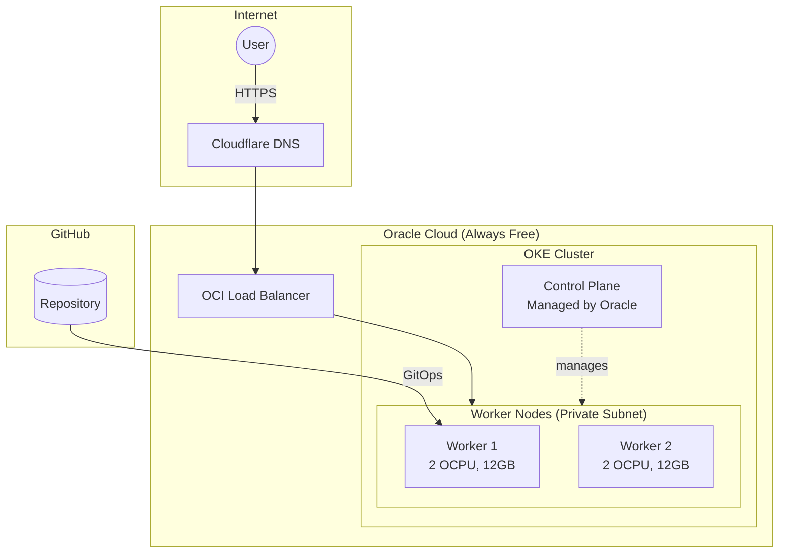
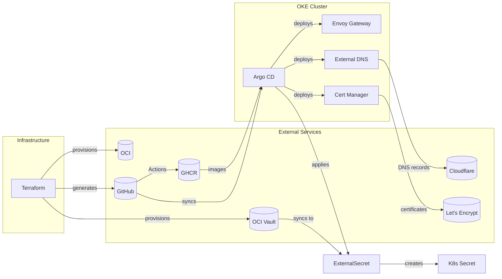

# OKE on Oracle Cloud Always Free

An OKE (Oracle Kubernetes Engine) cluster on Oracle Cloud Infrastructure using Always Free tier resources. This project provisions infrastructure with Terraform, bootstraps Argo CD for GitOps, and deploys applications via Gateway API with automatic HTTPS.

**Documentation:** <https://k8s.sudhanva.me/>



## Architecture

The cluster uses OKE Basic (free managed control plane) with ARM64 worker nodes within OCI's Always Free limits:

| Component | Resources | Details |
|-----------|-----------|---------|
| Control Plane | Managed by Oracle | Free with OKE Basic cluster |
| Worker Node 1 | 2 OCPU, 12GB | VM.Standard.A1.Flex (ARM) |
| Worker Node 2 | 2 OCPU, 12GB | VM.Standard.A1.Flex (ARM) |
| **Total** | **4 OCPUs, 24GB** | Maximizes Always Free tier |

## Components

| Component | Purpose |
|-----------|---------|
| OKE Basic | Managed Kubernetes with free control plane |
| Argo CD | GitOps continuous delivery |
| Envoy Gateway | Gateway API implementation with OCI LoadBalancer |
| External DNS | Automatic Cloudflare DNS updates |
| Cert Manager | Let's Encrypt certificate automation |
| OCI Vault | Secrets storage (Always Free) |
| External Secrets | Sync Vault secrets to Kubernetes |
| Gemma LLM | Gemma 3 1B via llama.cpp with OpenAI-compatible API |

## OCI Always Free Resources

| Resource | Free Limit | Usage |
|----------|------------|-------|
| OKE Control Plane | Free (Basic cluster) | 1 cluster |
| Ampere A1 Compute | 4 OCPUs, 24 GB RAM | 4 OCPUs, 24 GB |
| Object Storage | 20 GB | ~1 MB (Terraform state) |
| Vault Secrets | 150 secrets | ~10 secrets |
| Vault Master Keys | 20 key versions | 1 key |
| Load Balancer | Flexible NLB | 1 instance (Envoy Gateway) |



## Prerequisites

- OCI Account upgraded to Pay-As-You-Go (required for OKE, but stays within free tier)
- Cloudflare account with a managed domain
- GitHub account with a Personal Access Token
- Terraform and OCI CLI installed locally

## Quick Start

### Create Configuration

Create `tf-oke/terraform.tfvars`:

```hcl
tenancy_ocid         = "ocid1.tenancy.oc1..."
user_ocid            = "ocid1.user.oc1..."
fingerprint          = "xx:xx:xx..."
private_key_path     = "/path/to/oci_api_key.pem"
region               = "us-ashburn-1"
compartment_ocid     = "ocid1.compartment.oc1..."

ssh_public_key_path  = "/path/to/ssh_key.pub"
cloudflare_api_token = "your-cloudflare-token"
cloudflare_zone_id   = "your-zone-id"
domain_name          = "k8s.example.com"
acme_email           = "admin@example.com"

git_repo_url         = "https://github.com/your-user/k8s-oracle.git"
git_username         = "your-github-username"
git_email            = "your-email@example.com"
git_pat              = "ghp_..."

argocd_admin_password = "your-secure-password"
```

### Deploy Infrastructure

```bash
cd tf-oke
terraform init
terraform apply
```

### Configure kubectl

After Terraform completes, configure kubectl:

```bash
oci ce cluster create-kubeconfig \
  --cluster-id $(terraform output -raw cluster_id) \
  --file $HOME/.kube/config \
  --region $(terraform output -raw region) \
  --token-version 2.0.0 \
  --kube-endpoint PUBLIC_ENDPOINT
```

### Push Manifests & Install ArgoCD

```bash
git add argocd/
git commit -m "Configure cluster manifests"
git push

kubectl create namespace argocd
kubectl apply -n argocd -f https://raw.githubusercontent.com/argoproj/argo-cd/stable/manifests/install.yaml
kubectl apply -f argocd/applications.yaml
```

### Verify

Wait for the LoadBalancer IP to be assigned and applications to sync:

```bash
kubectl get svc -n envoy-gateway-system
kubectl get applications -n argocd
```

## CI/CD

GitHub Actions workflows handle linting and deployment:

| Workflow | Trigger | Purpose |
|----------|---------|---------|
| `lint.yml` | Pull requests | Run pre-commit hooks (markdownlint, yamllint, tflint) |
| `docker-publish.yml` | Push to main (docs/) | Build Docker image, push to GHCR |

### Local Development

```bash
pre-commit install
pre-commit run --all-files
```

## Documentation

The full documentation is available at the live cluster site.

To view and edit the documentation locally:

```bash
cd docs
bun install
bun start
```

## Why OKE over K3s?

| Aspect | K3s | OKE Basic |
|--------|-----|-----------|
| Control Plane | Uses 2 OCPU, 12GB of your free tier | Free, managed by Oracle |
| Worker Capacity | ~2 nodes worth | 4 nodes worth (all resources for workloads) |
| Management | Self-managed | Oracle-managed control plane |
| Upgrades | Manual | Simplified through OCI Console |
| SLA | None | SLO (no financial SLA for Basic) |

## License

MIT
