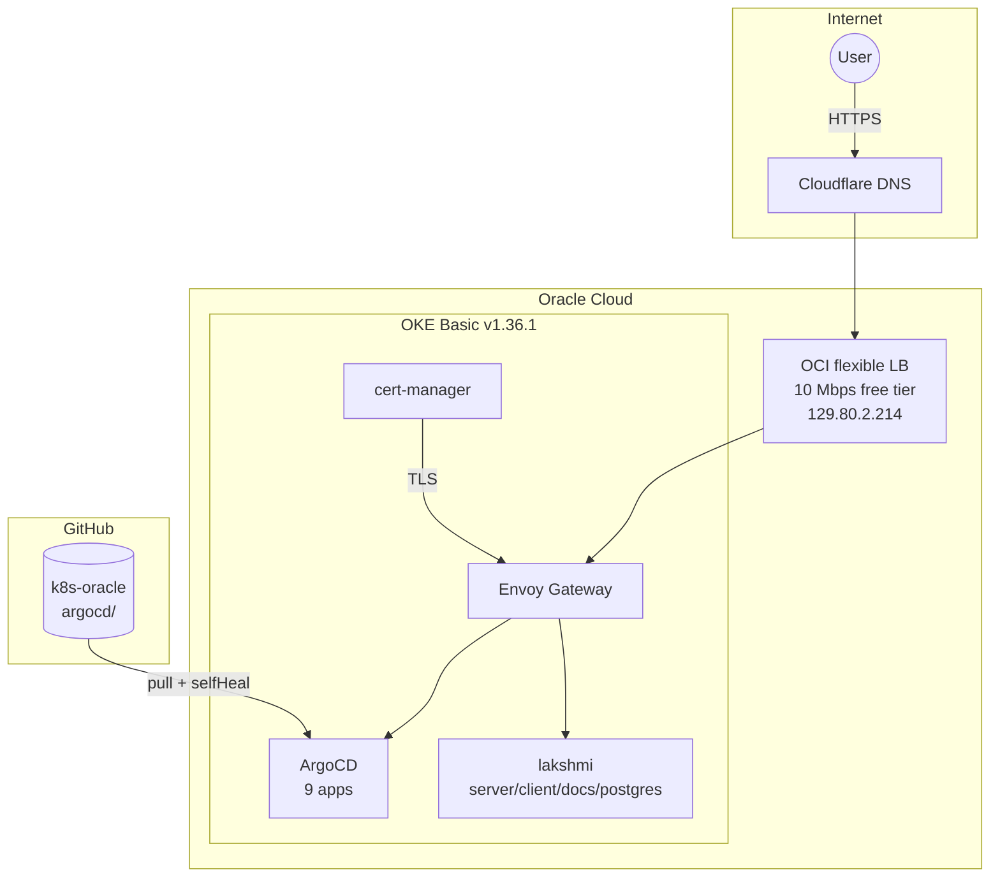
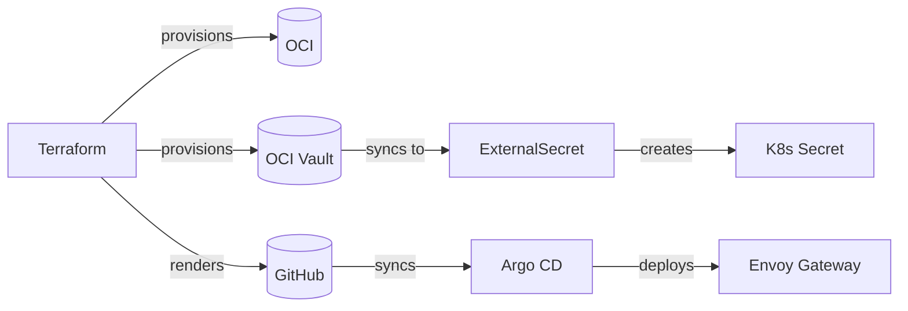

# OKE on Oracle Cloud Always Free

Terraform provisions network, cluster, and Vault. ArgoCD syncs 9 apps. Envoy Gateway exposes two HTTPS hostnames through one free-tier flexible LB.

**Docs:** <https://lakshmi.k8s.sudhanva.me/docs> · **ArgoCD:** `https://cd.k8s.sudhanva.me` · **App:** `https://lakshmi.k8s.sudhanva.me` · **LB:** `129.80.2.214` (flexible 10/10, free tier)


```mermaid
graph TB
    subgraph Internet
        User((User))
        CF[Cloudflare DNS]
    end

    subgraph OCI["Oracle Cloud"]
        LB[OCI flexible LB<br/>10 Mbps free tier<br/>129.80.2.214]
        subgraph OKE["OKE Basic v1.36.1"]
            EG[Envoy Gateway]
            ARGO[ArgoCD<br/>9 apps]
            LAK[lakshmi<br/>server/client/docs/postgres]
            CM[cert-manager]
        end
    end

    subgraph GitHub
        Repo[(k8s-oracle<br/>argocd/)]
    end

    User -->|HTTPS| CF
    CF --> LB
    LB --> EG
    EG --> LAK
    EG --> ARGO
    Repo -->|pull + selfHeal| ARGO
    CM -->|TLS| EG
```

## Cluster

OKE Basic, Flannel, pods `10.244.0.0/16`, services `10.96.0.0/16`. See `tf-oke/cluster.tf`.

| Node | Shape | Status |
|------|-------|--------|
| `10.0.2.215` | 2 OCPU, 12GB `VM.Standard.A1.Flex` ARM | Ready, v1.36.1 |
| `10.0.2.46` | 2 OCPU, 12GB `VM.Standard.A1.Flex` ARM | Ready, v1.36.1 |

4 OCPUs / 24GB total, the Always Free max. VCN `10.0.0.0/16` (public `10.0.1.0/24`, private `10.0.2.0/24`).

## Apps (ArgoCD, all `prune + selfHeal`)

| App | Version | Namespace |
|-----|---------|-----------|
| metrics-server | `3.14.0` | `kube-system` |
| gateway-api-crds | `v1.6.1` | cluster-scoped |
| cert-manager | `v1.21.1` | `cert-manager` |
| external-dns | `1.21.1` (Cloudflare) | `external-dns` |
| envoy-gateway | `v1.9.1` | `envoy-gateway-system` |
| argocd-ingress | git | `argocd` |
| external-secrets | `2.10.0` | `external-secrets` |
| managed-secrets | git | `external-secrets` |
| lakshmi | git (`apps/lakshmi`: server x2, client x2, docs x2, postgres `16-alpine` + `40Gi oci-bv` PVC (live 50Gi Bound)) | `lakshmi` |

ArgoCD itself installs from the unpinned `argo-cd/stable` manifest URL. No version pinned here.


```mermaid
flowchart LR
    TF[Terraform] -->|provisions| OCI[(OCI)]
    TF -->|provisions| Vault[(OCI Vault)]
    TF -->|renders| GH[(GitHub)]
    GH -->|syncs| Argo[Argo CD]
    Argo -->|deploys| EG[Envoy Gateway]
    Vault -->|syncs to| ES[ExternalSecret]
    ES -->|creates| Secret[K8s Secret]
```

## Quick start

Needs: OCI account, Cloudflare zone, GitHub PAT, Terraform + OCI CLI + kubectl.

```bash
cd tf-oke
terraform init
terraform plan -out=tfplan
terraform apply tfplan
```

Create `tf-oke/terraform.tfvars` first. Required: `tenancy_ocid`, `user_ocid`, `fingerprint`, `private_key_path`, `region`, `compartment_ocid`, `cloudflare_api_token`, `cloudflare_zone_id`, `domain_name`, `git_pat`, `git_email`, `argocd_admin_password`, `argocd_admin_password_hash`, `huggingface_token`. Rest default to `""` (skips Vault secret creation) or sane Always Free shapes. Full sample with defaults in `variables.tf`.

```bash
oci ce cluster create-kubeconfig \
  --cluster-id $(terraform output -raw cluster_id) \
  --file $HOME/.kube/config \
  --region us-ashburn-1 \
  --token-version 2.0.0 \
  --kube-endpoint PUBLIC_ENDPOINT

kubectl create namespace argocd --dry-run=client -o yaml | kubectl apply -f -
kubectl apply -n argocd -f https://raw.githubusercontent.com/argoproj/argo-cd/stable/manifests/install.yaml
kubectl apply -f argocd/applications.yaml
```

## Verify

```bash
kubectl get application -A   # 9/9 Synced/Healthy
kubectl get nodes              # 2x Ready v1.36.1 arm64
kubectl get gateway -A         # public-gateway 129.80.2.214
kubectl get httproute -A       # cd + lakshmi hostnames
kubectl get pods -n lakshmi    # 2x client, 2x docs, 2x server, postgres-0
```

## Secrets

- Everything secret lives in OCI Vault, reaches pods via `ExternalSecret` only. Never commit values.
- `terraform apply` before pushing manifest changes, so Vault keys exist when ArgoCD syncs new refs.
- `lakshmi-db-password` and `lakshmi-django-secret-key` are created once by hand in the OCI console, not by Terraform.
- `lakshmi-secrets` syncs DB creds plus `ALPHA_VANTAGE_API_KEY` and `FINNHUB_API_KEY` from Vault.
- State is local (`backend.tf` is commented out). The `oke-tfstate` bucket exists but is not wired up.

## CI

`lint.yml` (pre-commit on PRs). Local: `pre-commit run --all-files`.

## License

MIT
