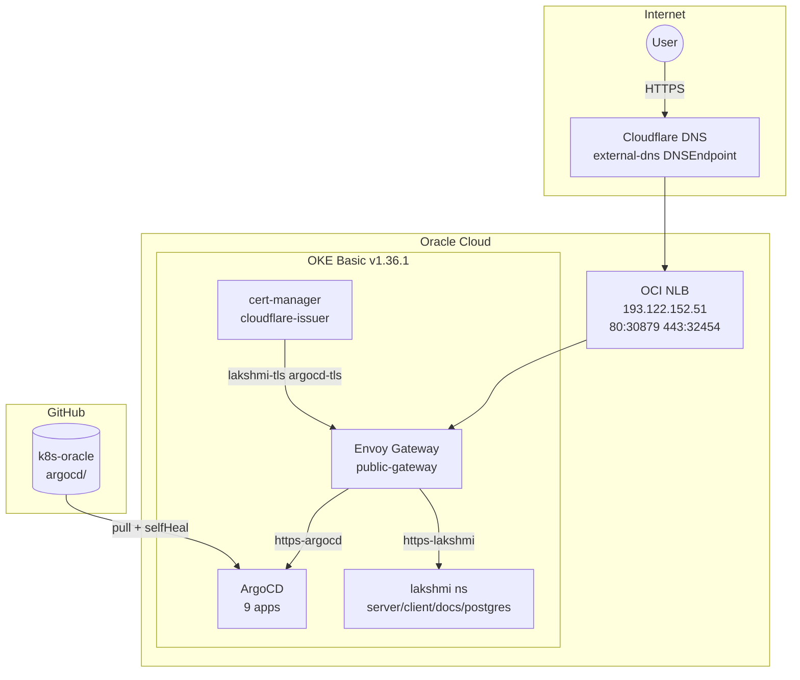
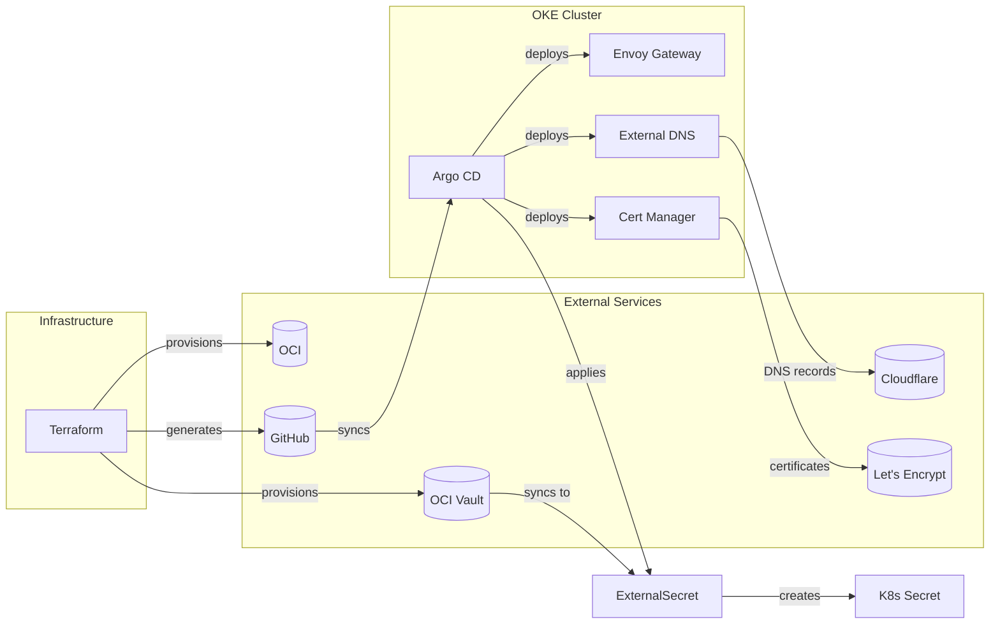

# OKE on Oracle Cloud Always Free

OKE Basic cluster on OCI Always Free. Terraform provisions the network, cluster, vault, and renders ArgoCD manifests. ArgoCD syncs 9 applications. Envoy Gateway exposes two HTTPS hostnames through one OCI NLB.

**Docs:** <https://k8s.sudhanva.me/>
**Live hostnames:** `https://cd.k8s.sudhanva.me` (ArgoCD), `https://lakshmi.k8s.sudhanva.me` (app)
**Live NLB IP:** `193.122.152.51` (verified 2026-09-06 via `kubectl get svc -n envoy-gateway-system` and DNS)


```mermaid
graph TB
    subgraph Internet
        User((User))
        CF[Cloudflare DNS<br/>external-dns DNSEndpoint]
    end

    subgraph OCI["Oracle Cloud"]
        LB[OCI NLB<br/>193.122.152.51<br/>80:30879 443:32454]
        subgraph OKE["OKE Basic v1.36.1"]
            EG[Envoy Gateway<br/>public-gateway]
            ARGO[ArgoCD<br/>9 apps]
            LAK[lakshmi ns<br/>server/client/docs/postgres]
            CM[cert-manager<br/>cloudflare-issuer]
        end
    end

    subgraph GitHub
        Repo[(k8s-oracle<br/>argocd/)]
    end

    User -->|HTTPS| CF
    CF --> LB
    LB --> EG
    EG -->|https-lakshmi| LAK
    EG -->|https-argocd| ARGO
    Repo -->|pull + selfHeal| ARGO
    CM -->|lakshmi-tls argocd-tls| EG
```

## Architecture

OKE Basic (`BASIC_CLUSTER`, Flannel overlay, pods `10.244.0.0/16`, services `10.96.0.0/16`, public endpoint). Defined in `tf-oke/cluster.tf` with `prevent_destroy = true` on cluster and node pool.

| Component | Actual | Source |
|-----------|--------|--------|
| Control Plane | OKE Basic, Kubernetes v1.36.1 | `tf-oke/variables.tf`, `cluster.tf` |
| Worker Node 1 | 2 OCPU, 12GB, `VM.Standard.A1.Flex` ARM, private subnet | live `kubectl get nodes`: `10.0.2.116 Ready v1.36.1` |
| Worker Node 2 | 2 OCPU, 12GB, `VM.Standard.A1.Flex` ARM, private subnet | live `kubectl get nodes`: `10.0.2.124 Ready v1.36.1` |
| Network | VCN `10.0.0.0/16`, public `10.0.1.0/24`, private `10.0.2.0/24`, IGW + NAT + SGW | `tf-oke/network.tf` |
| Ingress | Envoy Gateway `v1.9.1`, Gateway `public-gateway`, OCI NLB `193.122.152.51` | `argocd/applications.yaml`, live `kubectl get gateway -A` |
| **Total** | **4 OCPUs, 24GB** | Always Free max |

Live node shape (2026-09-06):

```text
NAME         STATUS   VERSION   INTERNAL-IP   ARCH
10.0.2.116   Ready    v1.36.1   10.0.2.116    arm64 (Oracle Linux 8.10, cri-o 1.36.0)
10.0.2.124   Ready    v1.36.1   10.0.2.124    arm64 (Oracle Linux 8.10, cri-o 1.36.0)
```

## Applications (ArgoCD, 9 apps)

All 9 are `automated: prune + selfHeal`. Verified `Synced/Healthy` on 2026-09-06 via `kubectl get application -A`.

| App | Chart / source@rev | Namespace |
|-----------|-------------------|-----------|
| metrics-server | `metrics-server:3.14.0` (+ `--kubelet-insecure-tls`, InternalIP) | `kube-system` |
| gateway-api-crds | `gateway-api.git@v1.6.1` path `config/crd/standard` | cluster-scoped |
| cert-manager | `cert-manager:v1.21.1` (`installCRDs: true`) + `infrastructure/cert-manager` | `cert-manager` |
| external-dns | `external-dns:1.21.1` (Cloudflare, `sudhanva.me`, crd source) + `infrastructure/external-dns` | `external-dns` |
| envoy-gateway | `oci://docker.io/envoyproxy/gateway-helm:gateway-helm:v1.9.1` (`skipCrds: true`) + `infrastructure/envoy-gateway` | `envoy-gateway-system` |
| argocd-ingress | git `infrastructure/argocd-ingress` | `argocd` |
| external-secrets | `external-secrets:2.10.0` (webhook `:9443`, capped resources) + `infrastructure/external-secrets` | `external-secrets` |
| managed-secrets | git `infrastructure/managed-secrets` (sync-wave 3) | `external-secrets` |
| lakshmi | git `apps/lakshmi` (sync-wave 5) | `lakshmi` |

ArgoCD itself is installed from the unpinned `argo-cd/stable/manifests/install.yaml` URL (see `tf-oke/outputs.tf` next steps). No ArgoCD version is pinned in this repo.

Platform components not in the table above but present: `ClusterIssuer/cloudflare-issuer` (Ready), Certificates `argocd-tls` + `lakshmi-tls` (both True), `DNSEndpoint/gateway-dns` (`cd` + `lakshmi` hostnames to the NLB IP), 7 `ExternalSecret` syncs (all `SecretSynced`).

## Lakshmi workload (`argocd/apps/lakshmi`)

Kustomization: `namespace, secret, postgres, server, client, docs, ingress`.

| Resource | Actual |
|----------|--------|
| server Deployment | 2 replicas, `ghcr.io/nsudhanva/lakshmi-server:sha-9f8b78f`, `Always`, port 8000, probes on `/api/core/health/`, requests 500m/1Gi limits 1200m/2.5Gi, anti-affinity spread across hosts |
| client Deployment | 2 replicas, `ghcr.io/nsudhanva/lakshmi-client:sha-9f8b78f`, port 80 |
| docs Deployment | 1 replica, `ghcr.io/nsudhanva/lakshmi-docs:sha-9f8b78f`, port 80 |
| postgres StatefulSet | 1 replica, `postgres:16-alpine`, requests 250m/1Gi limits 1000m/3Gi |
| postgres PVC | manifest requests `40Gi oci-bv RWO`; live `postgres-data-lakshmi-postgres-0` is `Bound 50Gi` (expanded in place on 2026-09-06). Do not delete. |
| Services | `lakshmi-server:8000`, `lakshmi-client:80`, `lakshmi-docs:80`, `lakshmi-postgres:5432` (all ClusterIP) |
| HTTPRoute `lakshmi-route` | `lakshmi.k8s.sudhanva.me`: `/api` `/admin` `/static` to server:8000, `/docs` to docs:80, `/` to client:80, via `https-lakshmi` listener |
| HTTPRoute `lakshmi-redirect` | port 80 to HTTPS 301 for the same hostname |
| Certificate `lakshmi-tls` | `cloudflare-issuer`, `commonName lakshmi.k8s.sudhanva.me` |
| ConfigMap `lakshmi-server-config` | `DEBUG=False`, `ALLOWED_HOSTS=*`, CORS/CSRF set to `https://lakshmi.k8s.sudhanva.me,https://lakshmi.sudhanva.me`. Holds no secrets. |
| Secret `lakshmi-secrets` (`ExternalSecret lakshmi-secrets-sync`) | `POSTGRES_*`, `SECRET_KEY`, `DATABASE_URL`, `FINNHUB_API_KEY`, `ALPHA_VANTAGE_API_KEY`, all from OCI Vault. Never commit values. |

## OCI Always Free resources

| Resource | Free limit | This repo |
|----------|------------|-----------|
| OKE control plane | Free (Basic) | 1 cluster `oke-cluster` |
| Ampere A1 | 4 OCPUs, 24GB | 2x `VM.Standard.A1.Flex` 2 OCPU/12GB |
| Boot volumes | part of 200GB block total | 2x ~47GB = ~94GB baseline |
| Block volumes | 200GB total | postgres `40Gi` manifest / `50Gi` live + boot volumes |
| Object Storage | 20GB | bucket `oke-tfstate` with versioning enabled (bucket exists, not used for state) |
| Vault | DEFAULT vault | `oke-secrets-vault` + AES-32 HSM `oke-master-key` |
| Vault secrets | registry dependent | 11 unconditional + 15 conditional (only created when var is non-empty). `secret_ocids` output maps only the 10 base secrets. |
| Load balancer | NLB | 1 OCI NLB via Envoy Gateway service annotation (`oci.oraclecloud.com/load-balancer-type: nlb`), ports 80/443 |


```mermaid
flowchart LR
    subgraph Infra["Infrastructure"]
        TF[Terraform]
    end

    subgraph Cluster["OKE Cluster"]
        Argo[Argo CD]
        EG[Envoy Gateway]
        CM[Cert Manager]
        ED[External DNS]
    end

    subgraph External["External Services"]
        OCI[(OCI)]
        GH[(GitHub)]
        CFl[(Cloudflare)]
        LE[(Let's Encrypt)]
        Vault[(OCI Vault)]
    end

    TF -->|provisions| OCI
    TF -->|provisions| Vault
    TF -->|generates| GH
    GH -->|syncs| Argo
    Argo -->|deploys| EG
    Argo -->|deploys| CM
    Argo -->|deploys| ED
    Argo -->|applies| ES[ExternalSecret]
    Vault -->|syncs to| ES
    ES -->|creates| Secret[K8s Secret]
    CM -->|certificates| LE
    ED -->|DNS records| CFl
```

## Prerequisites

- OCI account with OKE permissions (this repo targets Always Free shapes, account itself is PAYG-capable)
- Cloudflare account with a managed zone (needs API token + zone ID)
- GitHub PAT with repo + `read:packages` scope (ArgoCD + GHCR pull)
- Terraform >= 1.0, OCI CLI, kubectl locally

## State backend

`tf-oke/backend.tf` is commented out. Effective state is local `tf-oke/terraform.tfstate` (present in working copy, gitignored from remote but the bucket `oke-tfstate` with versioning exists in `tf-oke/bucket.tf`). To use remote state, set `AWS_ACCESS_KEY_ID` / `AWS_SECRET_ACCESS_KEY` from OCI Customer Secret Keys, uncomment the `backend "s3"` block, run `terraform init -migrate-state`.

## Quick start

### Create configuration

Create `tf-oke/terraform.tfvars`. Required with no default (plan fails without them):

```hcl
tenancy_ocid     = "ocid1.tenancy.oc1..."
user_ocid        = "ocid1.user.oc1..."
fingerprint      = "xx:xx:xx..."
private_key_path = "/path/to/oci_api_key.pem"
region           = "us-ashburn-1"
compartment_ocid = "ocid1.compartment.oc1..."

cloudflare_api_token = "your-cloudflare-token"
cloudflare_zone_id   = "your-zone-id"
domain_name          = "k8s.sudhanva.me"
git_pat              = "ghp_..."
git_email            = "you@example.com"

argocd_admin_password      = "your-secure-password"
argocd_admin_password_hash = "$2a$10$..."

huggingface_token = "hf_..."
finnhub_api_key      = "your-finnhub-key"
alphavantage_api_key = "your-alphavantage-key"
```

Defaults you usually keep: `kubernetes_version = "1.36.1"`, `node_pool_size = 2`, `node_ocpus = 2`, `node_memory_in_gbs = 12`, `git_repo_url = "https://github.com/nsudhanva/k8s-oracle.git"`, `acme_email = "admin@example.com"`, `load_balancer_ip = ""`. Optional app tokens default to `""` and skip Vault secret creation when empty: `gemma_api_key`, `openclaw_gateway_token`, `telegram_bot_token`, `gemini_api_key`, `google_places_api_key`, `discord_bot_token`, `gog_keyring_password`, `bw_client_id`, `bw_client_secret`, `bw_master_password`, `nvidia_api_key`, `alphavantage_api_key`, `finnhub_api_key`, `oidc_client_id`, `oidc_client_secret`, `oidc_provider_url`.

Manually created Vault secrets (not managed by Terraform, required for the lakshmi app): `lakshmi-db-password`, `lakshmi-django-secret-key`. Create them once in the OCI console under `oke-secrets-vault`. If either is missing, `lakshmi-secrets-sync` fails and the server pods cannot start.

Rollout order for secret changes: `terraform apply` first (creates Vault secrets from `terraform.tfvars`), then commit and push manifest changes so ArgoCD syncs `ExternalSecret` refs that already resolve. Reversing the order breaks the sync.

### Deploy infrastructure

```bash
cd tf-oke
terraform init
terraform plan -out=tfplan
terraform apply tfplan
```

`terraform apply` also rewrites `../argocd/*.yaml` via `local_file` resources in `manifests.tf`. Note: the template `templates/manifests/applications.yaml.tpl` does not include the `lakshmi` Application, while committed `argocd/applications.yaml` does. Re-applying without updating the template drops `lakshmi`. Commit the rendered result or update the template first.

### Configure kubectl

Use the exact command from the `kubeconfig_command` output (there is no `region` output):

```bash
oci ce cluster create-kubeconfig \
  --cluster-id $(terraform output -raw cluster_id) \
  --file $HOME/.kube/config \
  --region us-ashburn-1 \
  --token-version 2.0.0 \
  --kube-endpoint PUBLIC_ENDPOINT
```

### Push manifests and install ArgoCD

Rendered manifests already live in `argocd/`. Commit them before installing so ArgoCD has something to sync:

```bash
git status --short argocd/
git add argocd/
git commit -m "Update ArgoCD manifests"
git push

kubectl create namespace argocd --dry-run=client -o yaml | kubectl apply -f -
kubectl apply -n argocd -f https://raw.githubusercontent.com/argoproj/argo-cd/stable/manifests/install.yaml
kubectl apply -f argocd/applications.yaml
```

### Verify (matches live output 2026-09-06)

```bash
kubectl get application -A
# argocd-ingress Synced/Healthy, cert-manager Synced/Healthy,
# envoy-gateway Synced/Healthy, external-dns Synced/Healthy,
# external-secrets Synced/Healthy, gateway-api-crds Synced/Healthy,
# lakshmi Synced/Healthy, managed-secrets Synced/Healthy,
# metrics-server Synced/Healthy

kubectl get nodes -o wide
# 10.0.2.116 Ready v1.36.1 arm64
# 10.0.2.124 Ready v1.36.1 arm64

kubectl get svc -n envoy-gateway-system
# envoy-...-public-gateway-b3b5c242 LoadBalancer 10.96.56.9 10.0.1.119,193.122.152.51 80:30879/TCP,443:32454/TCP

kubectl get gateway -A
# envoy-gateway-system/public-gateway eg 193.122.152.51 True 117d

kubectl get httproute -A
# argocd/argocd-redirect + argocd-route -> cd.k8s.sudhanva.me
# lakshmi/lakshmi-redirect + lakshmi-route -> lakshmi.k8s.sudhanva.me

kubectl get cert -A; kubectl get clusterissuer; kubectl get externalsecret -A
# argocd-tls True, lakshmi-tls True; cloudflare-issuer True; 7 ExternalSecrets SecretSynced

kubectl get pods -n lakshmi
# 2x client, 1x docs, 2x server, 1x postgres-0 Running
```

## CI/CD

| Workflow | Trigger | Purpose |
|----------|---------|---------|
| `lint.yml` | Pull requests + manual dispatch | pre-commit over all files (markdownlint, yamllint, tflint) |
| `llama-server.yml` | push to main on `docker/llama-server/**` | Buildx `linux/arm64` to `ghcr.io/<owner>/llama-server:latest+b8638+sha` |

`docker/llama-server/Dockerfile` builds `llama.cpp b8638` (`GGML_NATIVE=OFF`, `ubuntu:22.04`, serves `:8080/health`). `scripts/` is empty. `tf-oke/templates/manifests/gemma/` is orphaned (no `local_file` in `manifests.tf`, no ArgoCD app, references unset `workload: llm` label and `https-gemma` listener).

### Local development

```bash
pre-commit install
pre-commit run --all-files
```

## License

MIT
