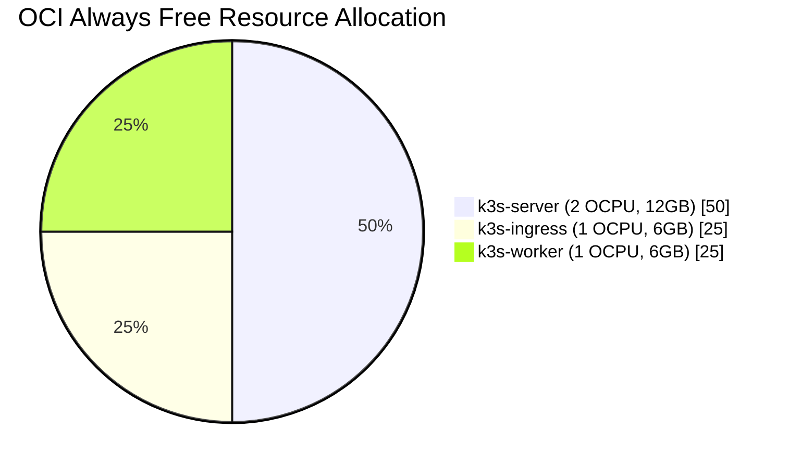
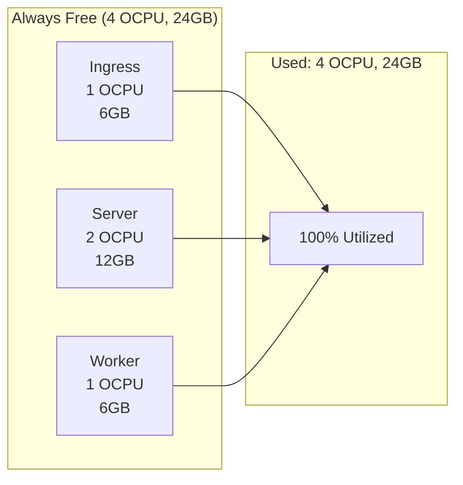
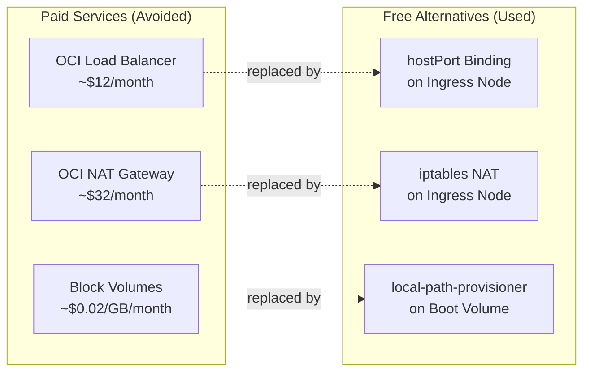
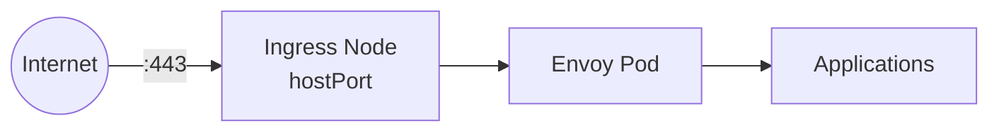
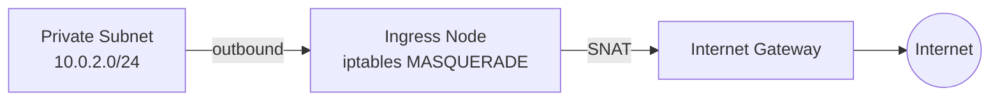

This cluster runs entirely within Oracle Cloud Infrastructure's Always Free tier limits.

## Resource Allocation

OCI Always Free provides 4 OCPUs and 24GB RAM for Ampere A1 instances. This cluster divides these resources across three nodes:

| Node | OCPUs | RAM | Purpose |
|------|-------|-----|---------|
| k3s-ingress | 1 | 6GB | NAT gateway, ingress proxy |
| k3s-server | 2 | 12GB | Control plane, Argo CD |
| k3s-worker | 1 | 6GB | Application workloads |

Total: 4 OCPUs, 24GB RAM (exactly at the limit)

## Always Free Components

### Compute

Ampere A1 Flex instances are ARM64-based. Container images must support the `linux/arm64` architecture.

### Networking

- 1 VCN with up to 2 subnets
- 1 Internet Gateway
- Security lists and route tables
- No NAT Gateway (implemented in software on ingress node)
- No Load Balancer (traffic routed directly to ingress node)

### Storage

- 200GB total block volume storage
- Boot volumes count against this limit
- Each node uses a 50GB boot volume (150GB total)

### Bandwidth

- 10TB outbound data transfer per month
- Unlimited inbound

## Cost Avoidance

This cluster replaces paid OCI services with free alternatives:

### No Load Balancer

OCI Load Balancers are not included in Always Free. This cluster uses hostPort binding on the ingress node to expose ports 80 and 443 directly.

### No NAT Gateway

OCI NAT Gateways are not included in Always Free. The ingress node runs iptables masquerade to provide outbound internet access for the private subnet.

### No Block Volumes

Additional block volumes would consume the 200GB limit. K3s uses local-path-provisioner for persistent storage, storing data on the node's boot volume.

## Staying Within Limits

### Instance Sizing

Terraform enforces the correct instance shapes. Do not manually resize instances in the OCI Console.

### Region Selection

Ampere A1 capacity varies by region. US-Ashburn-1 and EU-Frankfurt-1 typically have better availability. If provisioning fails with "Out of Capacity," try a different availability domain or region.

### Monitoring Usage

Check your tenancy limits in the OCI Console under Governance > Limits, Quotas and Usage. Filter by "compute" to see Ampere A1 availability.
