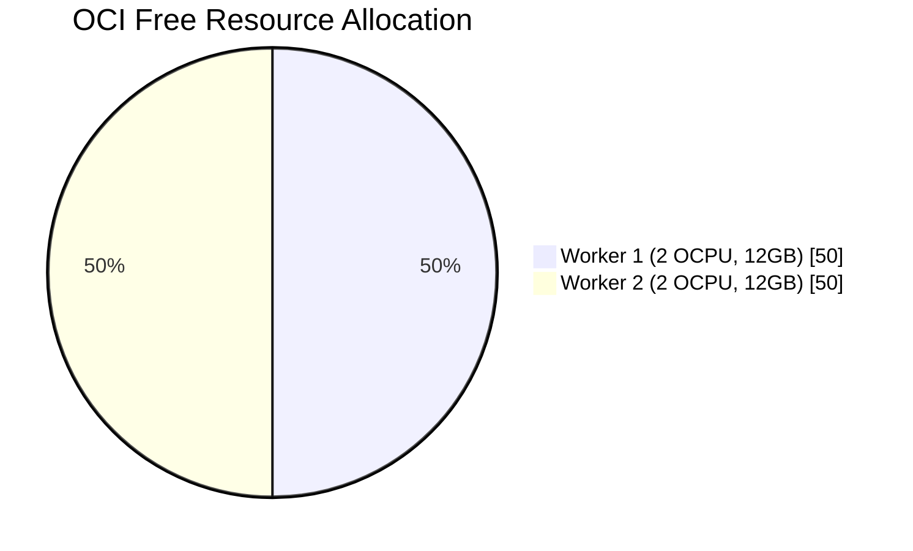
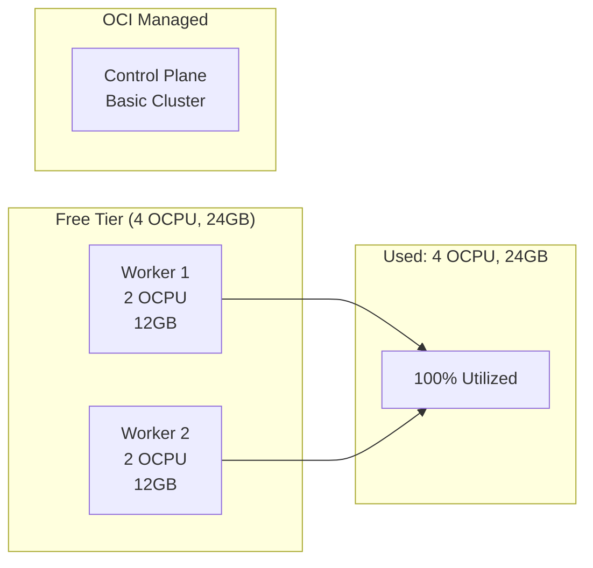
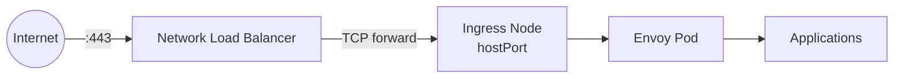

This cluster maximizes Oracle Cloud Infrastructure's Free tier resources.

## Resource Allocation

OCI Always Free provides 4 OCPUs and 24GB RAM for Ampere A1 instances. This cluster divides these resources across two worker nodes, while the Control Plane is managed by OCI (Free for Basic Cluster).

| Node | OCPUs | RAM | Purpose |
|------|-------|-----|---------|
| Control Plane | - | - | OKE Basic Cluster (Managed) |
| Worker 1 | 2 | 12GB | Workloads |
| Worker 2 | 2 | 12GB | Workloads |

Total: 4 OCPUs, 24GB RAM (exactly at the limit)

## Always Free Components

### Compute

Ampere A1 Flex instances are ARM64-based. Container images must support the `linux/arm64` architecture.

### Networking

- 1 VCN with public and private subnets
- 1 Internet Gateway
- 1 NAT Gateway (for private subnet outbound access)
- 1 Network Load Balancer (Always Free includes 1 flexible NLB)

### Storage

- 200GB total block volume storage
- Boot volumes count against this limit
- Each node uses a 50GB boot volume (100GB total used)
- Remaining storage available for Persistent Volumes via OCI CSI

### Bandwidth

- 10TB outbound data transfer per month
- Unlimited inbound

## Cost Avoidance

This cluster maximizes free resources, but note that **NAT Gateway** incurs a small cost if used heavily (though usually negligible).

### Network Load Balancer

OCI Always Free includes 1 Flexible Network Load Balancer. This cluster uses it to provide a stable public IP for ingress traffic:

Benefits of using the NLB:

- Stable public IP (doesn't change if ingress node is replaced)
- Health checks on backend
- Can add more ingress nodes later for HA

### Block Volumes

The OCI CSI driver allows dynamically provisioning Block Volumes for persistent storage, using the remaining free tier storage capacity.

## Staying Within Limits

### Instance Sizing

Terraform enforces the correct instance shapes. Do not manually resize instances in the OCI Console.

### Region Selection

Ampere A1 capacity varies by region. US-Ashburn-1 and EU-Frankfurt-1 typically have better availability. If provisioning fails with "Out of Capacity," try a different availability domain or region.

### Monitoring Usage

Check your tenancy limits in the OCI Console under Governance > Limits, Quotas and Usage. Filter by "compute" to see Ampere A1 availability.
