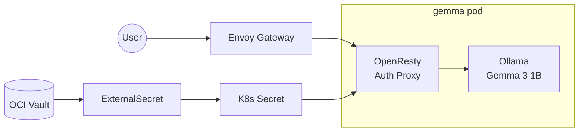

import { Aside } from '@astrojs/starlight/components';

This cluster runs **Gemma 3 1B**, a lightweight text-only LLM from Google, using [Ollama](https://ollama.com) for CPU inference on ARM64 nodes.

## Endpoint

```text
https://gemma.k8s.sudhanva.me
```

<Aside type="tip">
  The API is OpenAI-compatible. Use `/v1/chat/completions` for chat and `/api/generate` for raw generation.
</Aside>

## Authentication

All requests require a Bearer token:

```bash
curl https://gemma.k8s.sudhanva.me/v1/chat/completions \
  -H "Authorization: Bearer YOUR_API_KEY" \
  -H "Content-Type: application/json" \
  -d '{
    "model": "gemma3:1b",
    "messages": [{"role": "user", "content": "Hello!"}]
  }'
```

The API key is stored in OCI Vault (`gemma-api-key`) and synced to the cluster via ExternalSecret.

## Architecture



| Component | Purpose |
|-----------|---------|
| OpenResty sidecar | Validates `Authorization: Bearer` header |
| Ollama container | Runs Gemma 3 1B inference |
| OCI Vault | Stores API key securely |
| ExternalSecret | Syncs API key to cluster |

## Resource Usage

| Resource | Allocated |
|----------|-----------|
| Memory | 2-4 GB |
| CPU | 1-2 cores |
| Model | ~700 MB (Q4 quantized) |

<Aside type="caution">
  First request after pod startup may be slow (~30s) while Ollama loads the model into memory.
</Aside>

## Configuration

The API key is configured in `terraform.tfvars`:

```hcl
gemma_api_key = "your-secret-key"
```

After setting, run `terraform apply` to create the vault secret, then sync `managed-secrets` in ArgoCD.

## Pulling the Model

The model is pulled on first request. To pre-pull:

```bash
kubectl exec -it deploy/gemma -c ollama -- ollama pull gemma3:1b
```

## Available Models

| Model | Size | Use Case |
|-------|------|----------|
| `gemma3:1b` | ~700 MB | Fast, general text |
| `gemma3:1b-it-qat` | ~500 MB | QAT optimized |
