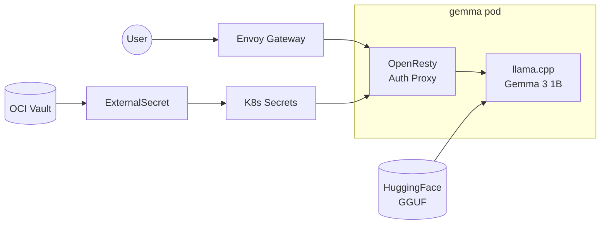

This cluster runs **Gemma 3 1B IT**, Google's lightweight instruction-tuned language model, using [llama.cpp](https://github.com/ggml-org/llama.cpp) for efficient CPU inference on ARM64 nodes.

## Endpoint

```text
https://gemma.k8s.sudhanva.me
```

:::tip
The API is OpenAI-compatible. Use `/v1/chat/completions` for chat and `/v1/completions` for text completion.
:::

## Authentication

All requests require a Bearer token:

```bash
curl https://gemma.k8s.sudhanva.me/v1/chat/completions \
  -H "Authorization: Bearer YOUR_API_KEY" \
  -H "Content-Type: application/json" \
  -d '{
    "model": "gemma-3-1b-it",
    "messages": [{"role": "user", "content": "Hello!"}]
  }'
```

## Streaming

For longer generations, use **streaming** to prevent timeout errors:

### Using curl

Add `"stream": true` and use the `-N` (no-buffer) flag:

```bash
curl -N https://gemma.k8s.sudhanva.me/v1/chat/completions \
  -H "Authorization: Bearer YOUR_API_KEY" \
  -H "Content-Type: application/json" \
  -d '{
    "model": "gemma-3-1b-it",
    "messages": [{"role": "user", "content": "Tell me about Bengaluru"}],
    "stream": true
  }'
```

### Using Python

```python
import openai

client = openai.OpenAI(
    base_url="https://gemma.k8s.sudhanva.me/v1",
    api_key="YOUR_API_KEY"
)

response = client.chat.completions.create(
    model="gemma-3-1b-it",
    messages=[{"role": "user", "content": "Tell me about Bengaluru"}],
    stream=True
)

for chunk in response:
    if chunk.choices[0].delta.content:
        print(chunk.choices[0].delta.content, end="", flush=True)
```

## Architecture



| Component | Purpose |
|-----------|---------|
| OpenResty sidecar | Validates `Authorization: Bearer` header |
| llama-server | Runs Gemma 3 1B inference with OpenAI-compatible API |
| OCI Vault | Stores API key |
| ExternalSecret | Syncs secrets to cluster |
| PVC | Caches GGUF model weights |

## Resource Usage

| Resource | Allocated |
|----------|-----------|
| Memory | 2-4 GB |
| CPU | 1-1.8 cores |
| Model | ~806 MB (Q4_K_M quantized) |
| Storage | 5 GB PVC for model cache |

:::tip[Efficient Quantization]
Using Q4_K_M quantization reduces the model from 2GB (FP16) to just 806MB while maintaining good quality. This is ideal for CPU inference on constrained hardware.
:::

## Configuration

### API Key

The API key is configured in `terraform.tfvars`:

```hcl
gemma_api_key = "your-secret-key"
```

After setting, run `terraform apply` to create the vault secret, then sync `managed-secrets` in ArgoCD.

## llama.cpp Configuration

The deployment uses the official llama.cpp server with the following settings:

| Setting | Value | Description |
|---------|-------|-------------|
| `--hf-repo` | `ggml-org/gemma-3-1b-it-GGUF` | HuggingFace GGUF repository |
| `--hf-file` | `gemma-3-1b-it-Q4_K_M.gguf` | Q4 quantized model file |
| `-c` | `4096` | Context length (tokens) |
| `-ngl` | `0` | GPU layers (0 = CPU only) |

## Monitoring

Check llama-server status:

```bash
kubectl logs -f deploy/gemma -c llama-server
```

Check model loading progress:

```bash
kubectl exec -it deploy/gemma -c llama-server -- curl localhost:8000/health
```

## Available Endpoints

| Endpoint | Description |
|----------|-------------|
| `/v1/chat/completions` | Chat completions (recommended) |
| `/v1/completions` | Text completions |
| `/v1/models` | List available models |
| `/health` | Health check |
| `/slots` | View inference slots status |

## Why llama.cpp?

| Feature | llama.cpp | vLLM | Ollama |
|---------|-----------|------|--------|
| Memory usage | ⭐⭐⭐ Best | ⭐ Heavy | ⭐⭐ Good |
| ARM64 CPU | ⭐⭐⭐ Native | ⚠️ New | ⭐⭐ Good |
| OpenAI API | ✅ Native | ✅ Native | ⚠️ Wrapper |
| Quantization | GGUF (Q4=806MB) | BF16 (2GB) | GGUF |
| Production ready | ✅ Yes | ✅ Yes | ⚠️ Dev-focused |
