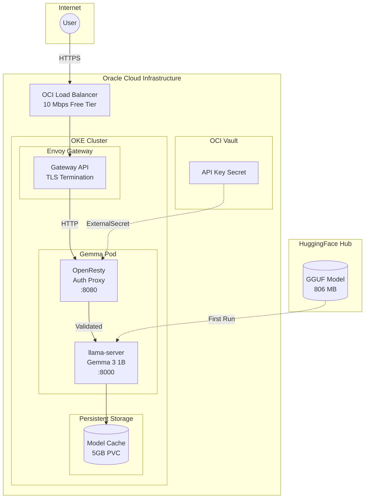
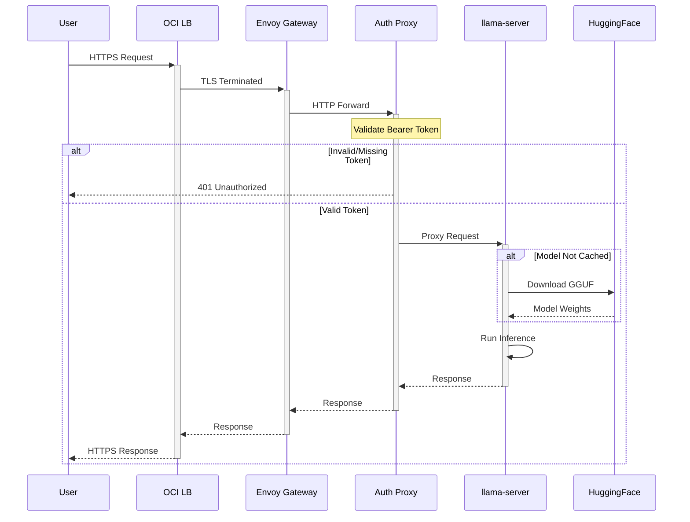
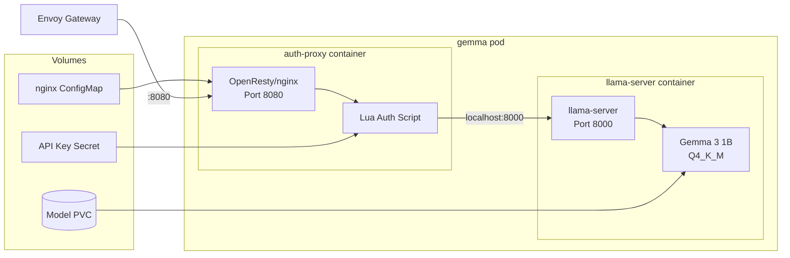
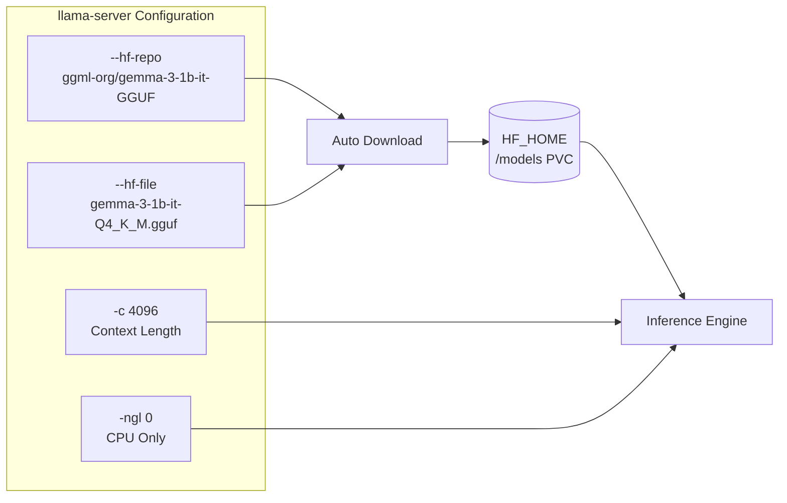
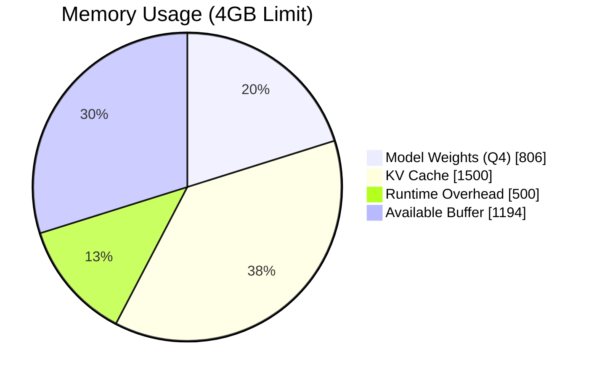
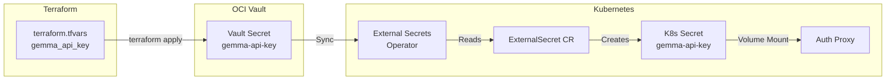
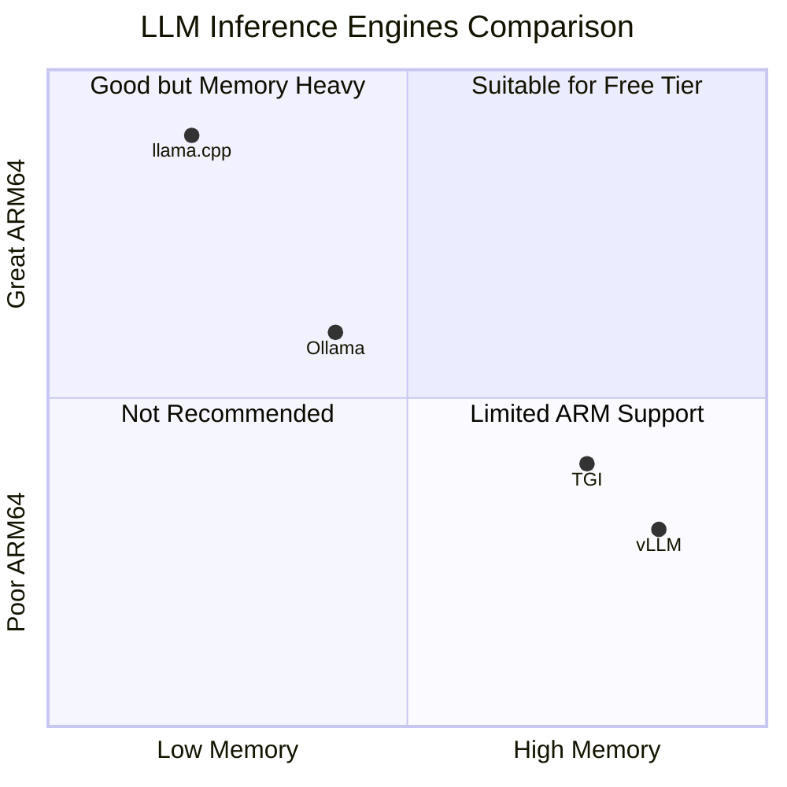

import { Tabs, TabItem, Card, CardGrid, Aside } from '@astrojs/starlight/components';

This cluster runs **Gemma 3 1B IT**, Google's lightweight instruction-tuned language model, using [llama.cpp](https://github.com/ggml-org/llama.cpp) for efficient CPU inference on ARM64 nodes.

## Endpoint

```text
https://gemma.k8s.sudhanva.me
```

<Aside type="tip">
The API is OpenAI-compatible. Use `/v1/chat/completions` for chat and `/v1/completions` for text completion.
</Aside>

## High-Level Architecture

The Gemma deployment follows a sidecar pattern with authentication handled at the proxy level:



## Request Flow

Every API request goes through multiple layers of processing:



## Authentication

All requests require a Bearer token in the `Authorization` header:

<Tabs>
  <TabItem label="curl">
```bash
curl https://gemma.k8s.sudhanva.me/v1/chat/completions \
  -H "Authorization: Bearer YOUR_API_KEY" \
  -H "Content-Type: application/json" \
  -d '{
    "model": "gemma-3-1b-it",
    "messages": [{"role": "user", "content": "Hello!"}]
  }'
```
  </TabItem>
  <TabItem label="Python">
```python
import openai

client = openai.OpenAI(
    base_url="https://gemma.k8s.sudhanva.me/v1",
    api_key="YOUR_API_KEY"
)

response = client.chat.completions.create(
    model="gemma-3-1b-it",
    messages=[{"role": "user", "content": "Hello!"}]
)
print(response.choices[0].message.content)
```
  </TabItem>
  <TabItem label="JavaScript">
```javascript
const response = await fetch('https://gemma.k8s.sudhanva.me/v1/chat/completions', {
  method: 'POST',
  headers: {
    'Authorization': 'Bearer YOUR_API_KEY',
    'Content-Type': 'application/json'
  },
  body: JSON.stringify({
    model: 'gemma-3-1b-it',
    messages: [{ role: 'user', content: 'Hello!' }]
  })
});
const data = await response.json();
console.log(data.choices[0].message.content);
```
  </TabItem>
</Tabs>

## Streaming

For longer generations, use **streaming** to prevent timeout errors and get real-time output:

<Tabs>
  <TabItem label="curl">
```bash
curl -N https://gemma.k8s.sudhanva.me/v1/chat/completions \
  -H "Authorization: Bearer YOUR_API_KEY" \
  -H "Content-Type: application/json" \
  -d '{
    "model": "gemma-3-1b-it",
    "messages": [{"role": "user", "content": "Explain quantum computing"}],
    "stream": true
  }'
```
  </TabItem>
  <TabItem label="Python">
```python
import openai

client = openai.OpenAI(
    base_url="https://gemma.k8s.sudhanva.me/v1",
    api_key="YOUR_API_KEY"
)

response = client.chat.completions.create(
    model="gemma-3-1b-it",
    messages=[{"role": "user", "content": "Explain quantum computing"}],
    stream=True
)

for chunk in response:
    if chunk.choices[0].delta.content:
        print(chunk.choices[0].delta.content, end="", flush=True)
```
  </TabItem>
</Tabs>

## Pod Architecture

The Gemma deployment uses a sidecar pattern with two containers:



### Container Details

| Container | Image | Purpose | Resources |
|-----------|-------|---------|-----------|
| `auth-proxy` | `openresty/openresty:alpine` | Bearer token validation | 32-64 MB, 10-50m CPU |
| `llama-server` | `ghcr.io/nsudhanva/llama-server:latest` | LLM inference | 2-4 GB, 1.2-2 CPU |

## Model Configuration



### Settings

| Setting | Value | Description |
|---------|-------|-------------|
| `--hf-repo` | `ggml-org/gemma-3-1b-it-GGUF` | HuggingFace GGUF repository |
| `--hf-file` | `gemma-3-1b-it-Q4_K_M.gguf` | Q4 quantized model file |
| `-c` | `4096` | Context length (tokens) |
| `-ngl` | `0` | GPU layers (0 = CPU only) |
| `--threads` | `2` | Parallel inference threads |
| `--batch-size` | `512` | Batch size for prompt processing |
| `HF_HOME` | `/models` | Model cache directory (PVC mounted) |

## Resource Allocation

The deployment is optimized for OCI Always Free tier constraints:



| Resource | Allocated | Notes |
|----------|-----------|-------|
| Memory Request | 2 GB | Minimum for model loading |
| Memory Limit | 4 GB | Allows KV cache growth |
| CPU Request | 1.2 cores | Dedicated compute |
| CPU Limit | 2 cores | Burst capacity for inference |
| Storage | 5 GB PVC | Model cache persistence |

<Aside type="tip" title="Efficient Quantization">
Using Q4_K_M quantization reduces the model from 2GB (FP16) to 806MB while maintaining good quality. This allows CPU inference on constrained hardware.
</Aside>

## Secrets Management

The API key flows from OCI Vault to the cluster via External Secrets Operator:



### Configuration

Set the API key in `terraform.tfvars`:

```hcl
gemma_api_key = "your-secret-key"
```

After setting, run `terraform apply` to create the vault secret, then sync `managed-secrets` in ArgoCD.

## Available Endpoints

| Endpoint | Method | Description |
|----------|--------|-------------|
| `/v1/chat/completions` | POST | Chat completions (recommended) |
| `/v1/completions` | POST | Text completions |
| `/v1/models` | GET | List available models |
| `/v1/embeddings` | POST | Text embeddings |
| `/health` | GET | Health check |
| `/slots` | GET | View inference slots status |

## Monitoring

### Check Pod Status

```bash
kubectl get pods -l app=gemma
```

### View Logs

```bash
kubectl logs -f deploy/gemma -c llama-server
```

### Check Model Loading

```bash
kubectl exec deploy/gemma -c llama-server -- curl -s localhost:8000/health
```

### View Inference Slots

```bash
kubectl exec deploy/gemma -c llama-server -- curl -s localhost:8000/slots
```

## Why llama.cpp?

We evaluated multiple inference engines for running LLMs on the free tier:



### Comparison

| Feature | llama.cpp | vLLM | Ollama |
|---------|-----------|------|--------|
| Memory usage | Best | Heavy | Good |
| ARM64 CPU | Native NEON | Experimental | Good |
| OpenAI API | Native | Native | Wrapper |
| Quantization | GGUF (Q4=806MB) | BF16 (2GB+) | GGUF |
| Production ready | Yes | Yes | Dev-focused |
| Auto model download | Yes | Yes | Manual pull |

<Aside type="note">
llama.cpp was chosen because it offers the best memory efficiency with native ARM64 support, critical for running on the constrained free tier resources.
</Aside>

## Troubleshooting

### Pod in CrashLoopBackOff

Check logs for the specific error:
```bash
kubectl logs deploy/gemma -c llama-server --previous
```

Common causes:
- **OOMKilled**: Reduce context size (`-c`) or use smaller quantization
- **Model download failed**: Check HuggingFace token if using gated models

### 401 Unauthorized

Verify your API key:
```bash
kubectl get secret gemma-api-key -o jsonpath='{.data.api-key}' | base64 -d
```

### Slow Inference

This is expected on CPU. For better performance:
- Use streaming to get incremental responses
- Keep prompts concise
- Reduce `max_tokens` in requests
