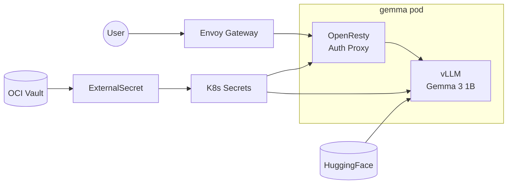

This cluster runs **Gemma 3 1B IT**, Google's lightweight instruction-tuned language model, using [vLLM](https://docs.vllm.ai/) for optimized CPU inference on ARM64 nodes.

## Endpoint

```text
https://gemma.k8s.sudhanva.me
```

:::tip
The API is OpenAI-compatible. Use `/v1/chat/completions` for chat and `/v1/completions` for text completion.
:::

## Authentication

All requests require a Bearer token:

```bash
curl https://gemma.k8s.sudhanva.me/v1/chat/completions \
  -H "Authorization: Bearer YOUR_API_KEY" \
  -H "Content-Type: application/json" \
  -d '{
    "model": "google/gemma-3-1b-it",
    "messages": [{"role": "user", "content": "Hello!"}]
  }'
```

## Streaming

For longer generations, use **streaming** to prevent timeout errors:

### Using curl

Add `"stream": true` and use the `-N` (no-buffer) flag:

```bash
curl -N https://gemma.k8s.sudhanva.me/v1/chat/completions \
  -H "Authorization: Bearer YOUR_API_KEY" \
  -H "Content-Type: application/json" \
  -d '{
    "model": "google/gemma-3-1b-it",
    "messages": [{"role": "user", "content": "Tell me about Bengaluru"}],
    "stream": true
  }'
```

### Using Python

```python
import openai

client = openai.OpenAI(
    base_url="https://gemma.k8s.sudhanva.me/v1",
    api_key="YOUR_API_KEY"
)

response = client.chat.completions.create(
    model="google/gemma-3-4b-it",
    messages=[{"role": "user", "content": "Tell me about Bengaluru"}],
    stream=True
)

for chunk in response:
    if chunk.choices[0].delta.content:
        print(chunk.choices[0].delta.content, end="", flush=True)
```

## Architecture



| Component | Purpose |
|-----------|---------|
| OpenResty sidecar | Validates `Authorization: Bearer` header |
| vLLM container | Runs Gemma 3 1B inference with OpenAI-compatible API |
| OCI Vault | Stores API key and HuggingFace token |
| ExternalSecret | Syncs secrets to cluster |
| PVC | Caches model weights (no manual download needed) |

## Resource Usage

| Resource | Allocated |
|----------|-----------|
| Memory | 8-10 GB (dedicated node) |
| CPU | 1-2 cores |
| Model | ~2 GB (BF16) |
| Storage | 10 GB PVC for model cache |

:::caution
First request after pod startup may take several minutes while vLLM downloads and loads the model from HuggingFace. Subsequent restarts use the cached model from the PVC.
:::

## Configuration

### API Key

The API key is configured in `terraform.tfvars`:

```hcl
gemma_api_key = "your-secret-key"
```

### HuggingFace Token

Gemma 3 is a gated model requiring license acceptance:

1. Visit [google/gemma-3-1b-it](https://huggingface.co/google/gemma-3-1b-it) and accept Google's license
2. Generate a token at [HuggingFace Settings](https://huggingface.co/settings/tokens)
3. Add to `terraform.tfvars`:

```hcl
huggingface_token = "hf_..."
```

After setting both, run `terraform apply` to create the vault secrets, then sync `managed-secrets` in ArgoCD.

## vLLM Configuration

The deployment uses the official vLLM ARM64 CPU image with the following settings:

| Setting | Value | Description |
|---------|-------|-------------|
| `--model` | `google/gemma-3-1b-it` | HuggingFace model ID |
| `--dtype` | `bfloat16` | Data type for inference |
| `--max-model-len` | `4096` | Maximum context length |
| `--enable-chunked-prefill` | enabled | Better latency for long prompts |
| `VLLM_CPU_KVCACHE_SPACE` | `4` | 4GB KV cache for conversations |

## Monitoring

Check vLLM server status:

```bash
kubectl logs -f deploy/gemma -c vllm
```

Check model loading progress:

```bash
kubectl exec -it deploy/gemma -c vllm -- curl localhost:8000/health
```

## Available Endpoints

| Endpoint | Description |
|----------|-------------|
| `/v1/chat/completions` | Chat completions (recommended) |
| `/v1/completions` | Text completions |
| `/v1/models` | List available models |
| `/health` | Health check |

## Why vLLM over Ollama?

| Feature | vLLM | Ollama |
|---------|------|--------|
| OpenAI API | Native support | Wrapper |
| Model source | HuggingFace (auto-download) | Manual `docker pull` |
| Batching | Continuous batching | Sequential |
| Production ready | Yes | Hobby/development |
| Memory efficiency | PagedAttention | Basic |
| ARM64 CPU support | Official images | Limited |
