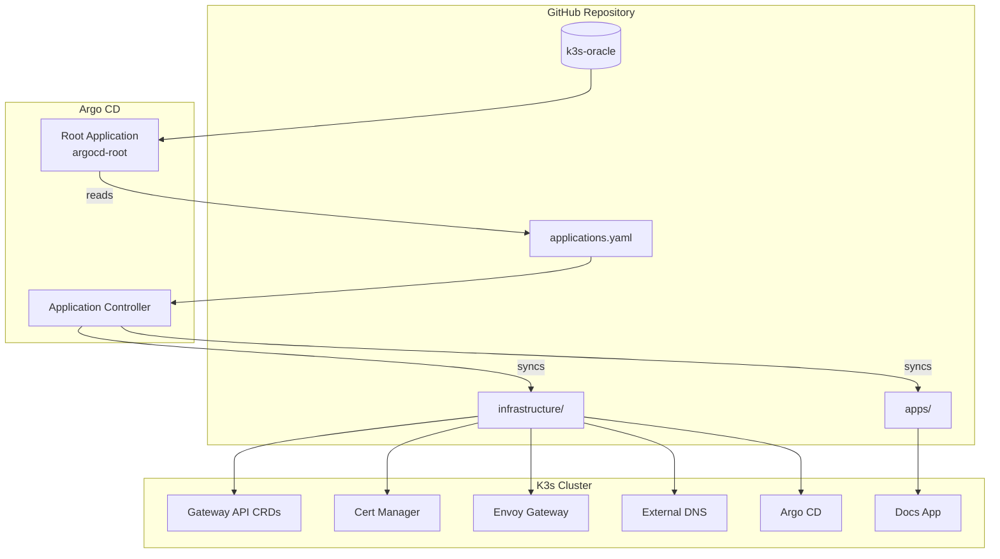
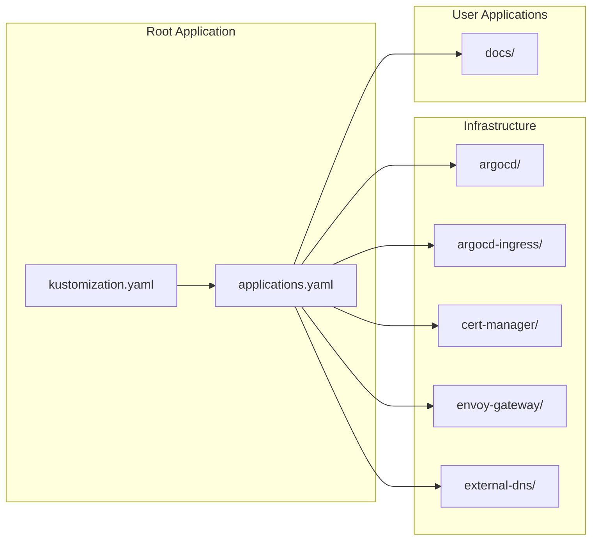
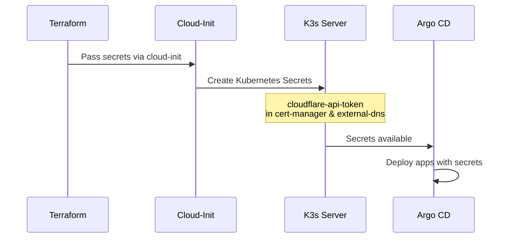
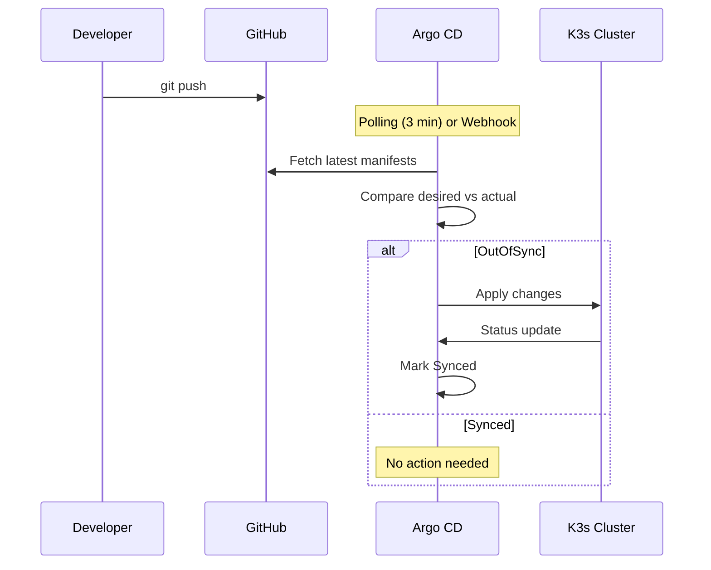
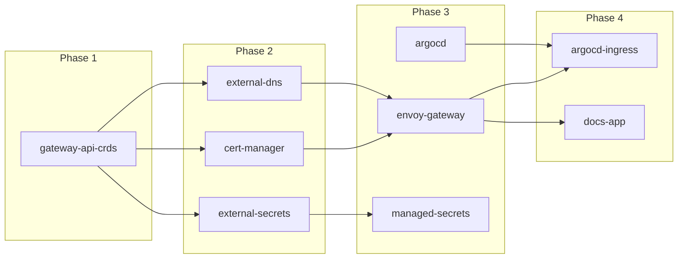

Argo CD manages all cluster resources using the App-of-Apps pattern.



## Directory Structure

```text
argocd/
├── kustomization.yaml
├── applications.yaml
├── infrastructure/
│   ├── argocd/
│   ├── argocd-ingress/
│   ├── cert-manager/
│   ├── envoy-gateway/
│   └── external-dns/
└── apps/
    └── docs/
```



## Applications

| Application | Purpose | Namespace |
|-------------|---------|-----------|
| gateway-api-crds | Gateway API CRDs | cluster-wide |
| cert-manager | TLS certificate automation | cert-manager |
| external-dns | Cloudflare DNS management | external-dns |
| external-secrets | OCI Vault secret sync | external-secrets |
| managed-secrets | ExternalSecret CRs for Vault | external-secrets |
| envoy-gateway | Gateway API controller | envoy-gateway-system |
| argocd-self-managed | Self-managed Argo CD | argocd |
| argocd-ingress | Argo CD UI ingress | argocd |
| docs-app | Documentation website | default |

## Secrets

Cloudflare API tokens are injected during cluster bootstrap via cloud-init and stored in the `cert-manager` and `external-dns` namespaces.



## Sync Workflow



## Sync Issues

If an application remains OutOfSync or Unknown:

### CRD Dependencies

Some applications depend on CRDs that must be installed first. The `gateway-api-crds` application installs before `envoy-gateway`.



### Hard Refresh

Force a sync with:

```bash
kubectl patch app <app-name> -n argocd --type merge \
  -p '{"metadata": {"annotations": {"argocd.argoproj.io/refresh": "hard"}}}'
```
