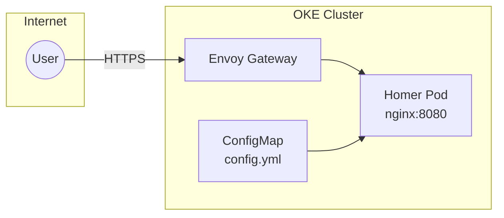

import { Aside } from '@astrojs/starlight/components';

This cluster runs **Homer**, a lightweight dashboard that serves as a central hub for all services.

## Endpoint

```text
https://hub.sudhanva.me
```

## Features

| Feature | Description |
|---------|-------------|
| **Service Directory** | Quick links to all services |
| **Categorized Layout** | Services organized by type |
| **Cluster Badges** | Visual indicators for OKE vs K3s services |
| **Minimal Resources** | Only 32MB memory, 10m CPU |

## Architecture

Homer is a simple static web application:



## Resource Allocation

Homer is extremely lightweight:

| Resource | Request | Limit |
|----------|---------|-------|
| Memory | 32 MB | 64 MB |
| CPU | 10m | 100m |

## Configuration

The dashboard is configured via a ConfigMap containing `config.yml`:

```yaml
title: "Homelab"
subtitle: "Sudhanva's Self Hosted Stuff!"

services:
  - name: "AI & Chat"
    icon: "fas fa-brain"
    items:
      - name: "Chat"
        url: "https://chat.k8s.sudhanva.me"
        tag: "OKE"
        tagstyle: "is-success"
```

### Badge Styles

| Tag | Style | Color | Usage |
|-----|-------|-------|-------|
| OKE | `is-success` | Green | Oracle Cloud services |
| K3s | `is-info` | Blue | Raspberry Pi services |

## Adding Services

To add a new service to the dashboard:

1. Edit `argocd/apps/homer/deployment.yaml`
2. Add entry under the appropriate category in `config.yml`
3. Commit and push - ArgoCD will sync automatically

Example entry:
```yaml
- name: "My Service"
  subtitle: "Description"
  tag: "OKE"
  tagstyle: "is-success"
  url: "https://myservice.k8s.sudhanva.me"
  target: "_blank"
```

## Kubernetes Manifests

| File | Purpose |
|------|---------|
| `argocd/apps/homer/deployment.yaml` | Deployment + ConfigMap |
| `argocd/apps/homer/service.yaml` | ClusterIP service |
| `argocd/apps/homer/httproute.yaml` | Gateway routing + TLS certificate |
