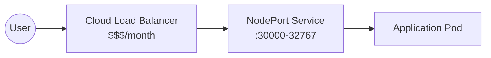
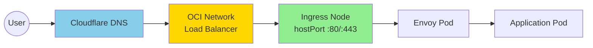
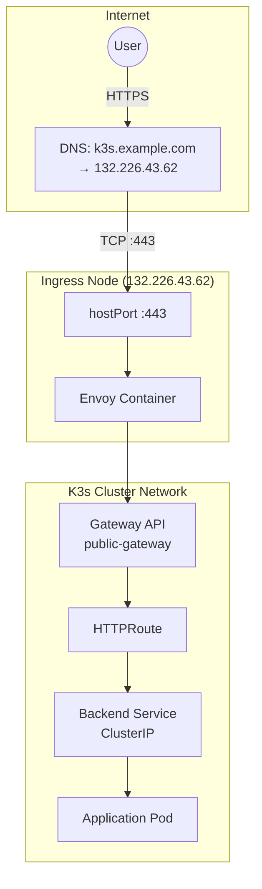
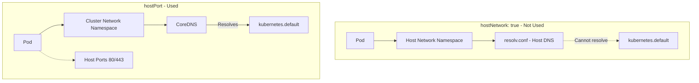
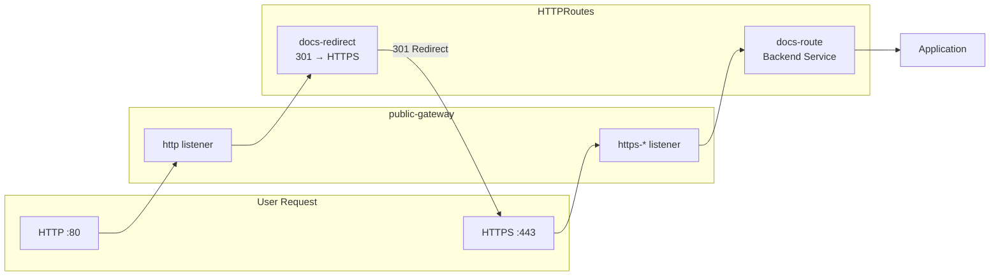

This cluster uses OCI's Always Free Network Load Balancer combined with Envoy Gateway for ingress.

## Traditional Cloud Setup

In a typical cloud Kubernetes deployment:



1. A cloud load balancer receives traffic on ports 80/443
2. The load balancer forwards traffic to NodePort services
3. Kubernetes routes traffic to the appropriate pods

This requires a paid load balancer resource.

## This Cluster's Approach

This cluster uses the OCI Always Free Network Load Balancer for a stable ingress IP:



1. DNS points to the Network Load Balancer's public IP
2. NLB forwards TCP traffic to the ingress node
3. Envoy Gateway binds ports 80/443 on the host via hostPort
4. Envoy routes traffic to backend services

The NLB provides a stable IP that doesn't change if the ingress node is replaced.

## How It Works

### DNS Configuration

External DNS creates A records in Cloudflare pointing your domain to the ingress node's public IP:

```text
k3s.example.com -> 132.226.43.62
```

### hostPort Binding

The Envoy proxy runs as a Kubernetes pod but binds directly to the host's network ports using hostPort:

```yaml
containers:
  - name: envoy
    ports:
      - containerPort: 80
        hostPort: 80
      - containerPort: 443
        hostPort: 443
```

When traffic arrives at the ingress node on port 80 or 443, it goes directly to the Envoy container.

### Node Selector

The Envoy proxy only runs on the ingress node via nodeSelector:

```yaml
nodeSelector:
  role: ingress
```

The ingress node is labeled during K3s installation with `--node-label role=ingress`.

### Traffic Flow



## Why hostPort Instead of hostNetwork



Using `hostNetwork: true` would give the pod the host's network namespace. This causes DNS resolution issues because the host's `/etc/resolv.conf` does not know about Kubernetes services.

Using `hostPort` keeps the pod in the cluster network namespace while still binding to host ports. The pod can resolve Kubernetes services via CoreDNS.

## Single Public Gateway

All public applications share a single Gateway resource (`public-gateway` in the `default` namespace). This is required because only one Envoy deployment can bind to hostPort 80/443 on the ingress node.

The Gateway defines multiple HTTPS listeners, one per hostname:

```yaml
listeners:
- name: http
  port: 80
  protocol: HTTP
  allowedRoutes:
    namespaces:
      from: All
- name: https-docs
  port: 443
  protocol: HTTPS
  hostname: "k3s.sudhanva.me"
  tls:
    certificateRefs:
    - name: docs-tls
- name: https-argocd
  port: 443
  protocol: HTTPS
  hostname: "cd.k3s.sudhanva.me"
  tls:
    certificateRefs:
    - name: argocd-tls
      namespace: argocd
```

## HTTPS Enforcement

All HTTP traffic is redirected to HTTPS using a 301 permanent redirect. Each application has two HTTPRoutes:



1. A route attached to the HTTPS listener that serves traffic
2. A redirect route attached to the HTTP listener

```yaml
apiVersion: gateway.networking.k8s.io/v1
kind: HTTPRoute
metadata:
  name: docs-redirect
spec:
  parentRefs:
  - name: public-gateway
    sectionName: http
  hostnames:
  - "k3s.sudhanva.me"
  rules:
  - filters:
    - type: RequestRedirect
      requestRedirect:
        scheme: https
        statusCode: 301
```

## Cross-Namespace References

When the Gateway references a TLS secret in a different namespace, a ReferenceGrant is required:

```yaml
apiVersion: gateway.networking.k8s.io/v1beta1
kind: ReferenceGrant
metadata:
  name: allow-gateway-to-secrets
  namespace: argocd
spec:
  from:
  - group: gateway.networking.k8s.io
    kind: Gateway
    namespace: envoy-gateway-system
  to:
  - group: ""
    kind: Secret
```

This allows the public-gateway in the envoy-gateway-system namespace to access TLS secrets in the argocd namespace. Similar ReferenceGrants are needed for each namespace containing TLS secrets (e.g., default for docs-tls).

## Security Considerations

### Single Point of Entry

All traffic enters through one node. If this node fails, the cluster is unreachable. For production workloads, consider:

- Multiple ingress nodes with round-robin DNS
- A cloud load balancer (not free)

### Firewall Rules

OCI security lists must allow inbound traffic on ports 80 and 443 from 0.0.0.0/0. The ingress node's iptables must also accept this traffic.

### TLS Termination

Envoy terminates TLS using certificates issued by Cert Manager. Traffic between Envoy and backend services is unencrypted within the cluster network.

## Comparison

| Approach | Cost | Complexity | Availability |
|----------|------|------------|--------------|
| Paid Cloud Load Balancer | ~$12/month | Low | High |
| OCI Free NLB + hostPort (this cluster) | Free | Medium | Single node (expandable) |
| hostPort only | Free | Low | Single node, IP tied to instance |
| NodePort + DNS | Free | Low | Single node |

This cluster uses the free OCI Network Load Balancer with hostPort for a stable IP and Gateway API compatibility.
