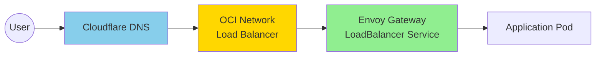
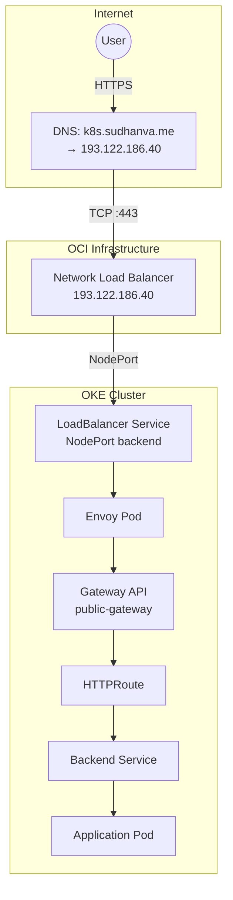
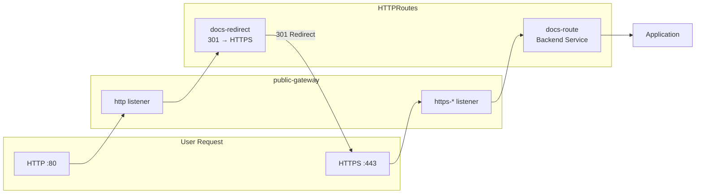

This cluster uses OCI's Always Free Network Load Balancer combined with Envoy Gateway for ingress.

## Architecture Overview



1. DNS (managed by External DNS) points to the Network Load Balancer's public IP
2. OCI NLB forwards TCP traffic on ports 80/443 to NodePort backends
3. Envoy Gateway receives traffic via its LoadBalancer service
4. Envoy routes traffic to backend services based on HTTPRoutes

The NLB provides a stable public IP that persists across pod restarts.

## How It Works

### LoadBalancer Service

Envoy Gateway creates a LoadBalancer service that provisions an OCI Network Load Balancer:

```yaml
apiVersion: gateway.envoyproxy.io/v1alpha1
kind: EnvoyProxy
metadata:
  name: custom-proxy-config
  namespace: envoy-gateway-system
spec:
  provider:
    type: Kubernetes
    kubernetes:
      envoyService:
        type: LoadBalancer
        annotations:
          oci.oraclecloud.com/load-balancer-type: "nlb"
```

The NLB receives traffic on ports 80/443 and forwards to NodePort backends on the worker nodes.

### DNS Configuration

External DNS watches DNSEndpoint resources and creates A records in Cloudflare:

```yaml
apiVersion: externaldns.k8s.io/v1alpha1
kind: DNSEndpoint
metadata:
  name: gateway-dns
spec:
  endpoints:
    - dnsName: k8s.sudhanva.me
      recordType: A
      targets:
        - "193.122.186.40"  # NLB public IP
```

### Traffic Flow



## Single Public Gateway

All public applications share a single Gateway resource (`public-gateway` in the `envoy-gateway-system` namespace).

The Gateway defines multiple HTTPS listeners, one per hostname:

```yaml
listeners:
- name: http
  port: 80
  protocol: HTTP
  allowedRoutes:
    namespaces:
      from: All
- name: https-docs
  port: 443
  protocol: HTTPS
  hostname: "k8s.sudhanva.me"
  tls:
    certificateRefs:
    - name: docs-tls
      namespace: default
- name: https-argocd
  port: 443
  protocol: HTTPS
  hostname: "cd.k8s.sudhanva.me"
  tls:
    certificateRefs:
    - name: argocd-tls
      namespace: argocd
```

## HTTPS Enforcement

All HTTP traffic is redirected to HTTPS using a 301 permanent redirect. Each application has two HTTPRoutes:



1. A route attached to the HTTPS listener that serves traffic
2. A redirect route attached to the HTTP listener

```yaml
apiVersion: gateway.networking.k8s.io/v1
kind: HTTPRoute
metadata:
  name: docs-redirect
spec:
  parentRefs:
  - name: public-gateway
    sectionName: http
  hostnames:
  - "k8s.sudhanva.me"
  rules:
  - filters:
    - type: RequestRedirect
      requestRedirect:
        scheme: https
        statusCode: 301
```

## Cross-Namespace References

When the Gateway references a TLS secret in a different namespace, a ReferenceGrant is required:

```yaml
apiVersion: gateway.networking.k8s.io/v1beta1
kind: ReferenceGrant
metadata:
  name: allow-gateway-to-secrets
  namespace: argocd
spec:
  from:
  - group: gateway.networking.k8s.io
    kind: Gateway
    namespace: envoy-gateway-system
  to:
  - group: ""
    kind: Secret
```

This allows the public-gateway in the envoy-gateway-system namespace to access TLS secrets in the argocd namespace. Similar ReferenceGrants are needed for each namespace containing TLS secrets (e.g., default for docs-tls).

## Security Considerations

### High Availability

The OCI Network Load Balancer distributes traffic across all healthy backend nodes. If one worker node fails, traffic is routed to the remaining healthy nodes.

### Network Security Lists

OCI security lists control traffic:

- **Public subnet**: Allow inbound 80, 443 from 0.0.0.0/0
- **Private subnet**: Allow NodePort range (30000-32767) from VCN CIDR for NLB health checks

### TLS Termination

Envoy terminates TLS using certificates issued by Cert Manager. Traffic between Envoy and backend services is unencrypted within the cluster network.

## Comparison

| Approach | Cost | Complexity | Availability |
|----------|------|------------|--------------|
| Paid Cloud Load Balancer | ~$12/month | Low | High |
| OCI Free NLB + LoadBalancer Service (this cluster) | Free | Medium | Multi-node HA |
| NodePort + DNS | Free | Low | Single node |

This cluster uses the free OCI Network Load Balancer with a LoadBalancer service type for a stable IP, health checks, and Gateway API compatibility.
