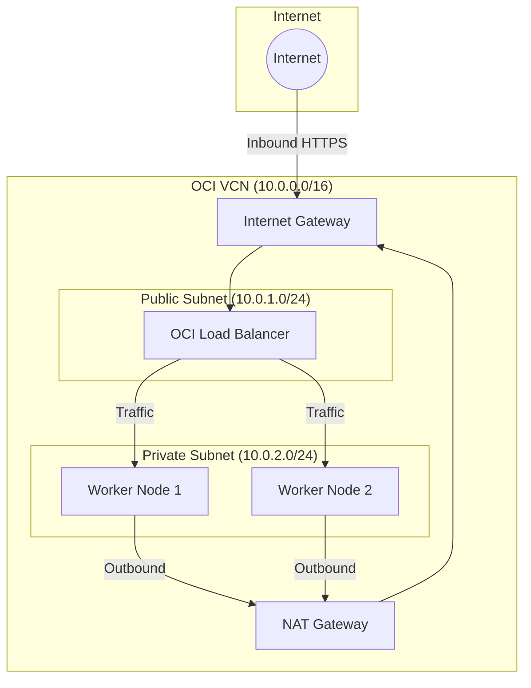
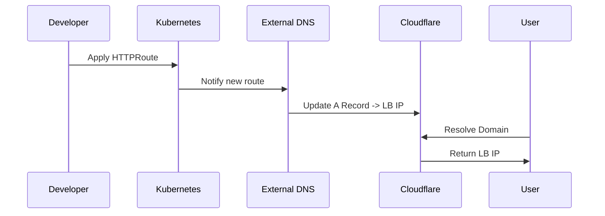

The OKE cluster uses a VCN with distinct public and private subnets to ensure security while maintaining connectivity.

## Network Topology

| Subnet | CIDR | Components | Access |
|--------|------|------------|--------|
| Public | 10.0.1.0/24 | OCI Load Balancer, Bastion (optional) | Reachable from Internet |
| Private | 10.0.2.0/24 | OKE Worker Nodes | No direct Internet access |

The VCN uses CIDR 10.0.0.0/16.

## Ingress Traffic

Ingress traffic is managed by Envoy Gateway, which provisions an OCI Network Load Balancer (NLB) or Load Balancer.

1. **User** requests `https://k3s.yourdomain.com`.
2. **Cloudflare** resolves DNS to the OCI Load Balancer IP.
3. **OCI Load Balancer** receives traffic on port 443.
4. **Load Balancer** forwards traffic to the Envoy Gateway Envoy Proxy running on Worker Nodes.
5. **Envoy Proxy** terminates TLS (if configured) or passes through, routing to the application Pod.

## Egress Traffic

Worker nodes are in a private subnet and cannot receive direct connections from the internet. For outbound access (e.g., pulling container images, accessing external APIs), they use the **NAT Gateway**.

## CNI (Container Network Interface)

The cluster uses **Flannel** in VXLAN overlay mode.

- **Pod CIDR:** 10.244.0.0/16
- **Service CIDR:** 10.96.0.0/16

## DNS Integration

**External DNS** watches `Gateway` and `HTTPRoute` resources. When a new route is defined, it automatically updates Cloudflare DNS records to point to the OCI Load Balancer's public IP.

