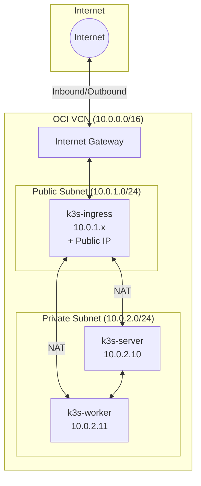
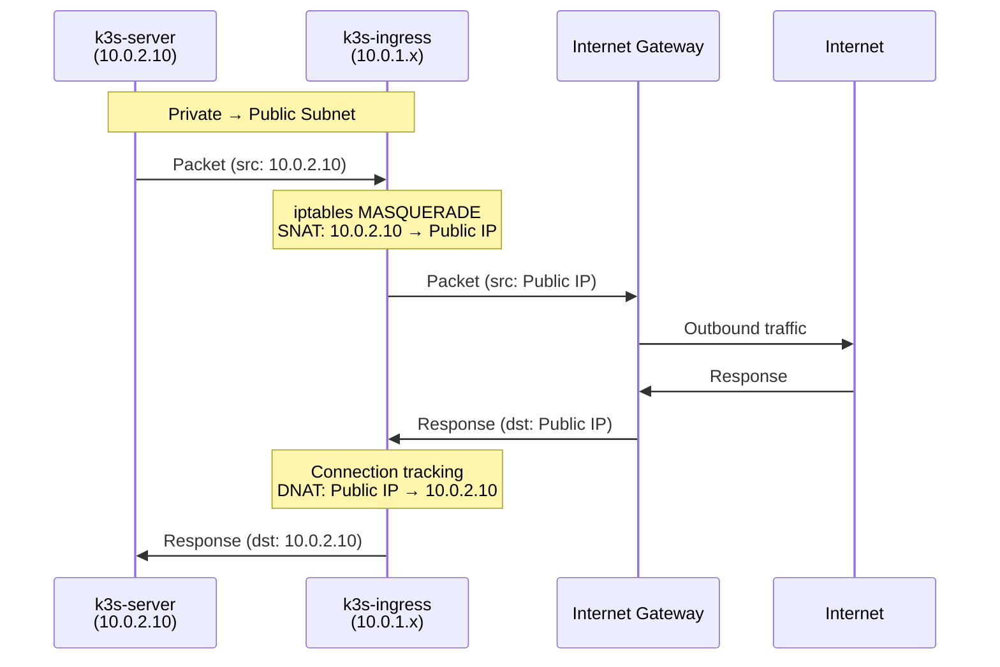
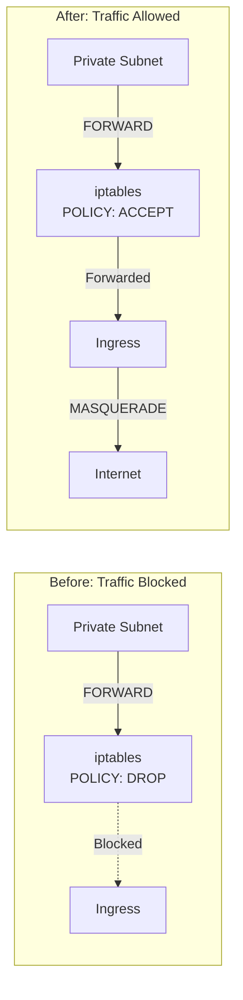
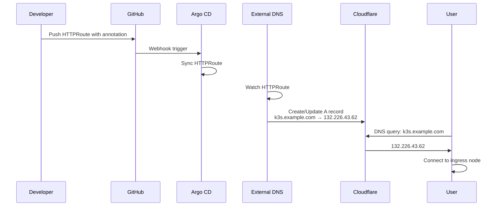
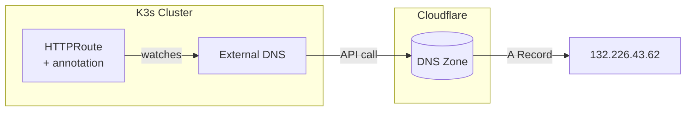

OCI Always Free does not include a managed NAT Gateway. This cluster implements software NAT on the ingress node.



## Network Topology

| Subnet | CIDR | Nodes |
|--------|------|-------|
| Public | 10.0.1.0/24 | k3s-ingress |
| Private | 10.0.2.0/24 | k3s-server, k3s-worker |

The VCN uses CIDR 10.0.0.0/16 with an internet gateway attached to the public subnet.

## NAT Configuration

The ingress node routes egress traffic for the private subnet. Cloud-init applies these configurations:



### IP Forwarding

```bash
echo "net.ipv4.ip_forward=1" > /etc/sysctl.d/99-nat.conf
sysctl -p /etc/sysctl.d/99-nat.conf
```

### Masquerade

```bash
iptables -t nat -A POSTROUTING -o enp0s6 -j MASQUERADE
```

### Firewall Rules

Ubuntu 24.04 on OCI includes restrictive iptables rules that block forwarded traffic. The ingress node requires additional rules because it's in a different subnet and needs to:

1. Allow VXLAN traffic (UDP 8472) for Flannel pod networking
2. Allow traffic from the private subnet (10.0.2.0/24)
3. Allow traffic from the pod network (10.42.0.0/16)
4. Allow HTTP/HTTPS traffic (ports 80, 443)

```bash
iptables -P FORWARD ACCEPT
iptables -I INPUT -p udp --dport 8472 -j ACCEPT
iptables -I INPUT -s 10.0.2.0/24 -j ACCEPT
iptables -I INPUT -s 10.42.0.0/16 -j ACCEPT
iptables -I INPUT -p tcp --dport 80 -j ACCEPT
iptables -I INPUT -p tcp --dport 443 -j ACCEPT
iptables -I FORWARD -s 10.42.0.0/16 -d 10.42.0.0/16 -j ACCEPT
netfilter-persistent save
```



Cloud-init applies these rules automatically during node bootstrap.

## Ingress Traffic

Envoy Gateway handles inbound traffic using hostPort binding instead of hostNetwork. This approach maintains cluster network connectivity while exposing ports 80 and 443 on the host interface.

Configuration via EnvoyProxy custom resource:

```yaml
spec:
  provider:
    kubernetes:
      envoyDeployment:
        pod:
          nodeSelector:
            role: ingress
        patch:
          value:
            spec:
              containers:
                - name: envoy
                  ports:
                    - containerPort: 80
                      hostPort: 80
                    - containerPort: 443
                      hostPort: 443
```

## DNS

External DNS watches HTTPRoute resources and updates Cloudflare A records. The `external-dns.alpha.kubernetes.io/target` annotation specifies the ingress node public IP for each route.




