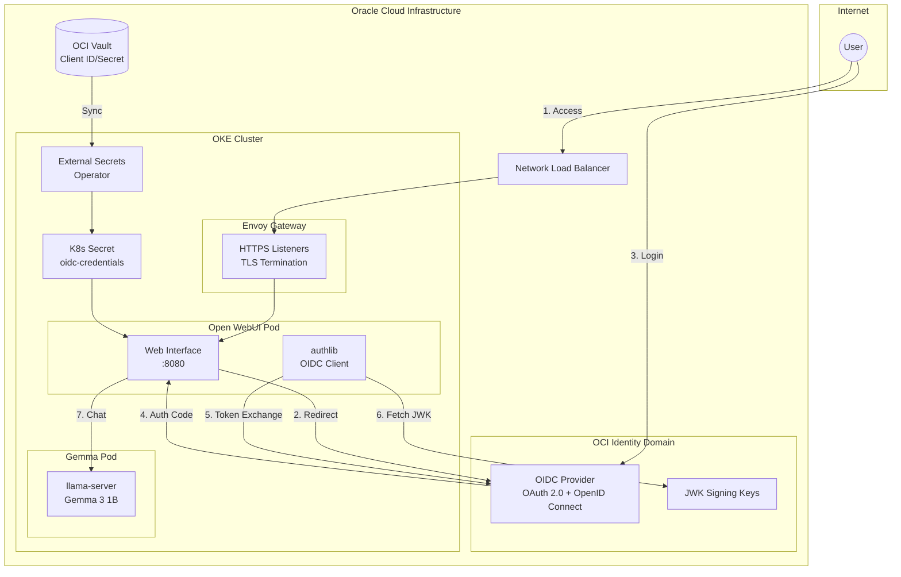
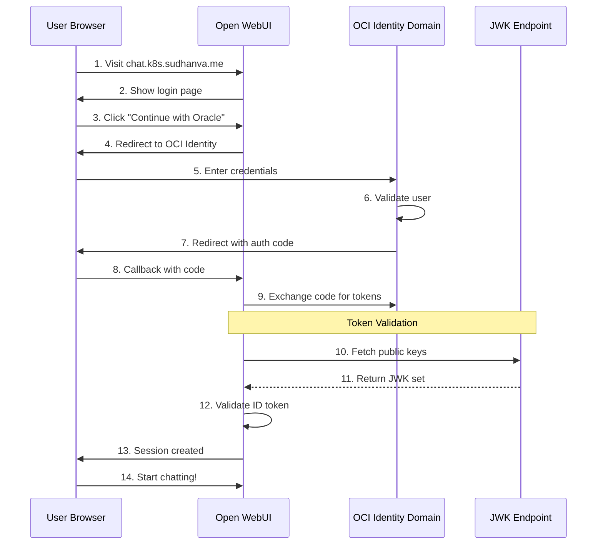
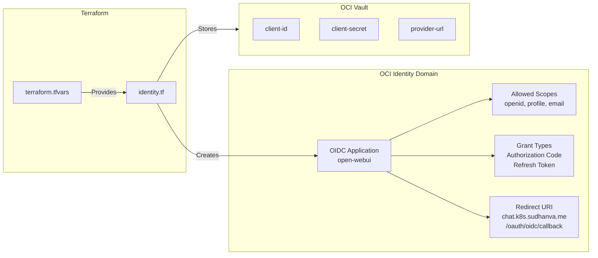
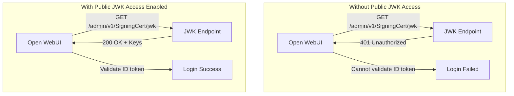
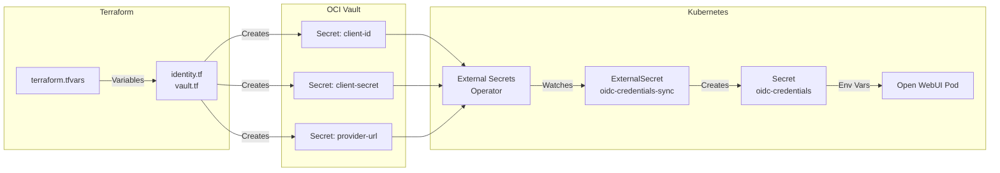

import { Tabs, TabItem, Card, CardGrid, Aside } from '@astrojs/starlight/components';

This cluster runs **Open WebUI**, providing a modern chat interface for the self-hosted Gemma LLM with enterprise-grade authentication via OCI Identity Domain.

## Endpoint

```text
https://chat.k8s.sudhanva.me
```

<Aside type="tip">
Login with your OCI Identity Domain credentials. Only users assigned to the Open WebUI application can access.
</Aside>

## High-Level Architecture

Open WebUI connects to Gemma via the OpenAI-compatible API, with authentication handled by OCI Identity Domain:



## OIDC Authentication Flow

The complete OpenID Connect authentication flow:



<Aside type="note" title="JWK Public Access Required">
Step 10-11 requires public access to the signing certificate. This is configured in OCI Identity Domain settings (see OCI Configuration below).
</Aside>

## Features

| Feature | Description |
|---------|-------------|
| **Chat Interface** | Modern, responsive ChatGPT-like UI |
| **OCI OIDC Authentication** | Secure SSO via OCI Identity Domain |
| **Gemma Integration** | Pre-configured to use Gemma 3 1B |
| **Conversation History** | Persistent chat storage (2GB PVC) |
| **Model Selection** | Switch between available models |
| **OAuth User Signup** | Auto-create users on first OIDC login |

## Resource Allocation

Open WebUI is configured with generous resources within free tier limits:

| Resource | Request | Limit | Notes |
|----------|---------|-------|-------|
| Memory | 1 GB | 4 GB | Ample headroom for UI operations |
| CPU | 0.5 core | 2 cores | Burst capacity for responsiveness |
| Storage | 2 GB PVC | - | Persistent user data and chats |

<Aside type="note" title="Free Tier Budget">
Total cluster: 4 OCPUs, 24 GB RAM. Open WebUI uses up to ~4 GB RAM and 2 CPUs (burst), leaving plenty for Gemma (4 GB) and system components.
</Aside>

## OCI Identity Domain Configuration

### Application Setup

The OIDC application is created via Terraform in `tf-oke/identity.tf`:



### Required OCI Console Settings

<Aside type="caution" title="Manual Configuration Required">
After Terraform creates the application, you **must** configure these settings manually in the OCI Console.
</Aside>

Navigate to **OCI Console → Identity & Security → Domains → Default → Applications → open-webui**:

#### 1. OAuth Configuration

| Setting | Required Value | Location |
|---------|---------------|----------|
| **Authorization Code** | ✅ Enabled | OAuth configuration |
| **Refresh Token** | ✅ Enabled | OAuth configuration |
| **Redirect URL** | `https://chat.k8s.sudhanva.me/oauth/oidc/callback` | OAuth configuration |

#### 2. Token Issuance Policy (Scopes)

Under **Resources → Token Issuance Policy**, add these scopes:

| Scope | Purpose |
|-------|---------|
| `openid` | Required for OIDC (ID token) |
| `profile` | Access user's name |
| `email` | Access user's email |

#### 3. Access Signing Certificate

Navigate to **Settings → Domain settings → Edit domain settings**:

| Setting | Required Value | Purpose |
|---------|---------------|---------|
| **Configure client access** | ✅ Enabled | Allows public access to JWK endpoint |



<Aside type="caution" title="Critical Setting">
The "Configure client access" toggle under "Access signing certificate" **must** be enabled. Without this, the JWK endpoint returns 401 Unauthorized, preventing token validation.
</Aside>

## Secrets Management

OIDC credentials flow from OCI Vault to the cluster:



### Terraform Variables

Set in `tf-oke/terraform.tfvars`:

```hcl
# OIDC Configuration for Open WebUI
oidc_client_id     = "your-client-id-from-oci"
oidc_client_secret = "your-client-secret-from-oci"
oidc_provider_url  = "https://idcs-xxxxx.identity.oraclecloud.com/.well-known/openid-configuration"
```

<Aside type="caution" title="Provider URL Format">
The `oidc_provider_url` **must** include the full discovery endpoint path (`/.well-known/openid-configuration`). Some OIDC libraries require this for proper metadata discovery.
</Aside>

### Environment Variables

Open WebUI receives these environment variables from the `oidc-credentials` secret:

| Variable | Source | Description |
|----------|--------|-------------|
| `OAUTH_CLIENT_ID` | Vault secret | Application client ID |
| `OAUTH_CLIENT_SECRET` | Vault secret | Application client secret |
| `OPENID_PROVIDER_URL` | Vault secret | OIDC discovery endpoint |
| `ENABLE_OAUTH_SIGNUP` | Deployment | `true` - Create users on first login |
| `ENABLE_LOGIN_FORM` | Deployment | `false` - OIDC only, no password login |
| `OAUTH_PROVIDER_NAME` | Deployment | `Oracle` - Button text |
| `OAUTH_SCOPES` | Deployment | `openid profile email` |

## User Management

### Adding Users

Only users assigned to the Open WebUI application in OCI Identity can login:

1. Go to **OCI Console → Identity & Security → Domains → Default**
2. Click **Applications → open-webui**
3. Under **Users**, click **Assign**
4. Select users to grant access

### Removing Users

1. Same path as above
2. Under **Users**, find the user
3. Click **Revoke**

### First-Time Login

When a user logs in for the first time:
1. They are redirected to OCI Identity Domain
2. After authentication, redirected back to Open WebUI
3. Open WebUI creates a local user account (ENABLE_OAUTH_SIGNUP=true)
4. User can start chatting immediately

## Troubleshooting

### Common OIDC Errors

#### 401 Unauthorized on JWK Fetch

```text
httpx.HTTPStatusError: Client error '401 Unauthorized' for url 
'https://idcs-xxx.identity.oraclecloud.com/admin/v1/SigningCert/jwk'
```

**Cause:** The "Access signing certificate" setting is disabled in OCI Identity Domain.

**Fix:**
1. Navigate to **OCI Console → Identity & Security → Domains → Default**
2. Go to **Settings → Domain settings**
3. Click **Edit domain settings**
4. Enable **Configure client access** under "Access signing certificate"
5. Save changes
6. Restart Open WebUI: `kubectl rollout restart deploy/open-webui`

#### 401 Unauthorized on Metadata Fetch

```text
httpx.HTTPStatusError: Client error '401 Unauthorized' for url 
'https://idcs-xxx.identity.oraclecloud.com/.well-known/openid-configuration'
```

**Cause:** The `OPENID_PROVIDER_URL` is incorrectly formatted (e.g., includes `:443` port or missing discovery path).

**Fix:** Ensure the provider URL in `terraform.tfvars` follows this format:
```hcl
oidc_provider_url = "https://idcs-xxxxx.identity.oraclecloud.com/.well-known/openid-configuration"
```

Then run `terraform apply` and restart Open WebUI.

#### invalid_scope Error

```text
Error: invalid_scope - Scope 'openid' is not configured for the application
```

**Cause:** Required OIDC scopes not enabled in OCI Identity Domain.

**Fix:**
1. Navigate to **Applications → open-webui → Resources → Token Issuance Policy**
2. Add scopes: `openid`, `profile`, `email`
3. Save changes

#### Login Redirect Loop

**Cause:** Redirect URI mismatch between OCI application config and actual callback URL.

**Fix:** Verify the redirect URI matches exactly:
```text
https://chat.k8s.sudhanva.me/oauth/oidc/callback
```

#### "User Not Assigned" Error

**Cause:** User not assigned to the Open WebUI application in OCI Identity Domain.

**Fix:** Assign the user (see User Management section above).

### Check OIDC Configuration

Verify the secret is synced correctly:

```bash
# Check ExternalSecret status
kubectl get externalsecret oidc-credentials-sync

# View secret contents (base64 decoded)
kubectl get secret oidc-credentials -o jsonpath='{.data.client-id}' | base64 -d
kubectl get secret oidc-credentials -o jsonpath='{.data.provider-url}' | base64 -d
```

### View Open WebUI Logs

```bash
# Follow logs
kubectl logs -f deploy/open-webui

# Check for OIDC errors
kubectl logs deploy/open-webui | grep -i "oauth\|oidc\|401\|error"
```

### Connection to Gemma Failed

Check Gemma pod is healthy:

```bash
kubectl get pods -l app=gemma
kubectl logs -f deploy/gemma -c llama-server
```

## Kubernetes Manifests

| File | Purpose |
|------|---------|
| `argocd/apps/open-webui/deployment.yaml` | Pod specification with OIDC env vars |
| `argocd/apps/open-webui/service.yaml` | ClusterIP service on port 8080 |
| `argocd/apps/open-webui/httproute.yaml` | Gateway routing for chat.k8s.sudhanva.me |
| `argocd/infrastructure/managed-secrets/secrets.yaml` | ExternalSecret for oidc-credentials |
| `argocd/infrastructure/envoy-gateway/config.yaml` | HTTPS listener for chat subdomain |
| `argocd/infrastructure/envoy-gateway/dnsendpoint.yaml` | DNS record for chat.k8s.sudhanva.me |

## Configuration Checklist

Use this checklist when setting up Open WebUI with OIDC:

- [ ] Terraform creates OCI Identity Domain application
- [ ] Terraform stores credentials in OCI Vault
- [ ] Enable **Authorization Code** grant type in OCI Console
- [ ] Enable **Refresh Token** grant type in OCI Console
- [ ] Add **openid**, **profile**, **email** scopes
- [ ] Enable **Configure client access** for signing certificate
- [ ] Assign users to the application
- [ ] ExternalSecret syncs to `oidc-credentials` secret
- [ ] Open WebUI pod starts without errors
- [ ] OIDC login works end-to-end
