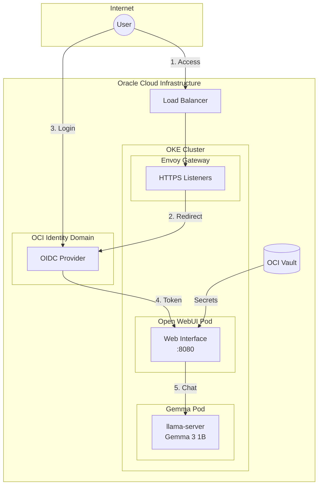
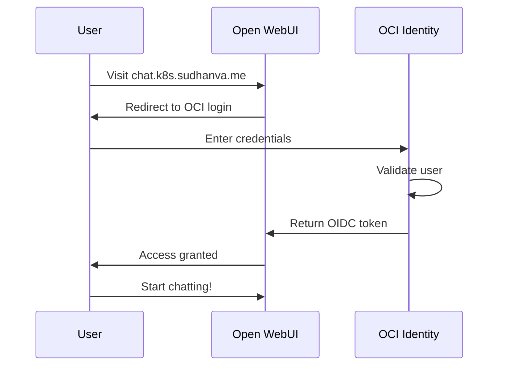
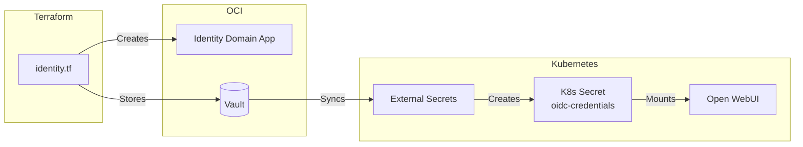

import { Tabs, TabItem, Card, CardGrid, Aside } from '@astrojs/starlight/components';

This cluster runs **Open WebUI**, providing a modern chat interface for the self-hosted Gemma LLM.

## Endpoint

```text
https://chat.k8s.sudhanva.me
```

<Aside type="tip">
Login with your OCI Identity Domain credentials. Only assigned users can access.
</Aside>

## Architecture

Open WebUI connects to Gemma via the OpenAI-compatible API:



## Authentication Flow



## Features

| Feature | Description |
|---------|-------------|
| **Chat Interface** | Modern, responsive ChatGPT-like UI |
| **OCI Authentication** | Secure login via OCI Identity Domain |
| **Gemma Integration** | Pre-configured to use Gemma 3 1B |
| **Conversation History** | Persistent chat storage |
| **Model Selection** | Switch between available models |

## Resource Allocation

Open WebUI is configured with generous resources within free tier limits:

| Resource | Request | Limit | Notes |
|----------|---------|-------|-------|
| Memory | 1 GB | 4 GB | Ample headroom for UI operations |
| CPU | 0.5 core | 2 cores | Burst capacity for responsiveness |
| Storage | 2 GB PVC | - | Persistent user data and chats |

<Aside type="note" title="Free Tier Budget">
Total cluster: 4 OCPUs, 24 GB RAM. Open WebUI uses up to ~4 GB RAM and 2 CPUs (burst), leaving plenty for Gemma (4 GB) and system components.
</Aside>

## Configuration

Open WebUI connects to Gemma via environment variables:

| Variable | Value | Description |
|----------|-------|-------------|
| `OPENAI_API_BASE_URL` | `http://gemma.default.svc.cluster.local/v1` | Internal Gemma API |
| `ENABLE_OLLAMA_API` | `false` | Disable Ollama integration |
| `ENABLE_OAUTH_SIGNUP` | `true` | Allow OIDC user creation |
| `ENABLE_LOGIN_FORM` | `false` | Force OIDC-only login |
| `OAUTH_PROVIDER_NAME` | `Oracle` | Display name on login button |

## User Management

### Adding Users

Only users assigned to the Open WebUI app in OCI Identity can login:

1. Go to **OCI Console → Identity & Security → Domains → Default**
2. Click **Applications → open-webui**
3. Under **Users**, click **Assign**
4. Select users to grant access

### Removing Users

1. Same path as above
2. Under **Users**, click the user
3. Click **Revoke**

## Secrets Management

OIDC credentials flow from OCI Vault:



## Troubleshooting

### Login Redirect Loop

Check that the redirect URI matches exactly:
```bash
# Expected redirect URI in OCI Identity app:
https://chat.k8s.sudhanva.me/oauth/oidc/callback
```

### "User Not Assigned" Error

Ensure you've assigned your user to the app in OCI Identity Console.

### Connection to Gemma Failed

Check Gemma pod is healthy:
```bash
kubectl get pods -l app=gemma
kubectl logs -f deploy/gemma -c llama-server
```

### View Open WebUI Logs

```bash
kubectl logs -f deploy/open-webui
```
