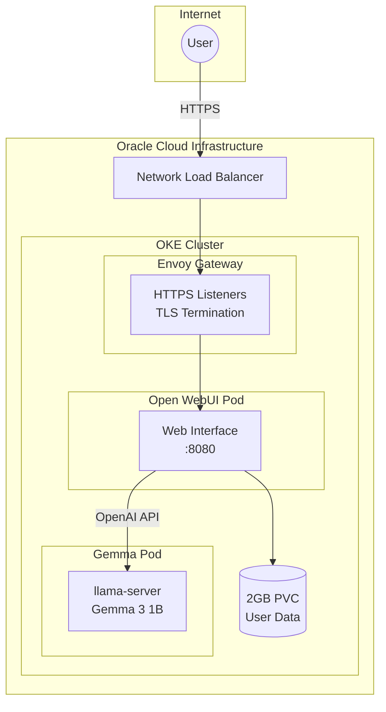

import { Tabs, TabItem, Card, CardGrid, Aside } from '@astrojs/starlight/components';

This cluster runs **Open WebUI**, providing a modern chat interface for the self-hosted Gemma LLM.

## Endpoint

```text
https://chat.k8s.sudhanva.me
```

<Aside type="tip">
Create an account using the local signup form to start chatting with Gemma.
</Aside>

## High-Level Architecture

Open WebUI connects to Gemma via the OpenAI-compatible API:



## Features

| Feature | Description |
|---------|-------------|
| **Chat Interface** | Modern, responsive ChatGPT-like UI |
| **Local Authentication** | Email/password signup and login |
| **Gemma Integration** | Pre-configured to use Gemma 3 1B |
| **Conversation History** | Persistent chat storage (2GB PVC) |
| **Model Selection** | Switch between available models |

## Resource Allocation

Open WebUI is configured with optimized resources:

| Resource | Request | Limit | Notes |
|----------|---------|-------|-------|
| Memory | 768 MB | 2 GB | Optimized for actual usage |
| CPU | 250m | 1.5 cores | Burst capacity for responsiveness |
| Storage | 2 GB PVC | - | Persistent user data and chats |

## Configuration

Open WebUI is configured via environment variables in the deployment:

| Variable | Value | Description |
|----------|-------|-------------|
| `OPENAI_API_BASE_URL` | `http://gemma.default.svc.cluster.local/v1` | Internal Gemma API endpoint |
| `OPENAI_API_KEY` | From secret | Gemma API key |
| `ENABLE_LOGIN_FORM` | `true` | Enable local authentication |
| `WEBUI_URL` | `https://chat.k8s.sudhanva.me` | Public URL |
| `WEBUI_NAME` | `Gemma Chat` | UI branding |
| `DEFAULT_MODELS` | `gemma-3-1b-it` | Pre-selected model |

## First-Time Setup

1. Visit https://chat.k8s.sudhanva.me
2. Click "Sign up" to create an account
3. The first user to sign up becomes the admin
4. Start chatting with Gemma!

## Troubleshooting

### Connection to Gemma Failed

Check Gemma pod is healthy:

```bash
kubectl get pods -l app=gemma
kubectl logs -f deploy/gemma -c llama-server
```

### Check Open WebUI Logs

```bash
kubectl logs -f deploy/open-webui
```

### Restart Open WebUI

```bash
kubectl rollout restart deploy/open-webui
```

## Kubernetes Manifests

| File | Purpose |
|------|---------|
| `argocd/apps/open-webui/deployment.yaml` | Pod specification with env vars |
| `argocd/apps/open-webui/service.yaml` | ClusterIP service on port 80 |
| `argocd/apps/open-webui/httproute.yaml` | Gateway routing + TLS certificate |
