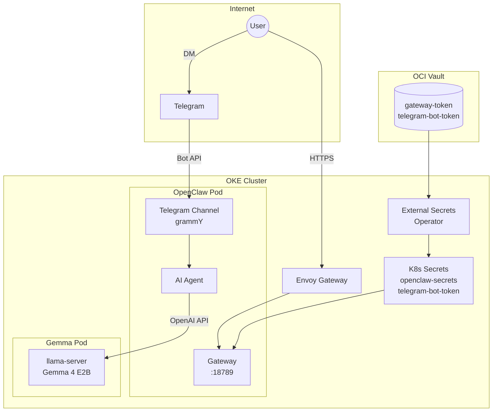

import { Aside } from '@astrojs/starlight/components';

This cluster runs **OpenClaw**, an open-source AI agent platform that connects messaging channels (Telegram, Discord, etc.) to LLM providers.

## Endpoint

```text
https://claw.k8s.sudhanva.me
```

<Aside type="tip">
The web UI requires the gateway token for authentication. The Telegram bot (@CoochiepieBot) uses DM pairing for access control.
</Aside>

## Architecture

OpenClaw acts as a gateway between messaging platforms and the Gemma LLM:



## Features

| Feature | Description |
|---------|-------------|
| **Telegram Bot** | Chat with AI via @CoochiepieBot |
| **Web UI** | Control UI at claw.k8s.sudhanva.me |
| **Gemma Integration** | Connected to local Gemma 4 E2B model |
| **DM Pairing** | Secure access control for Telegram |
| **Persistent Config** | 2GB PVC for OpenClaw home directory |

## Resource Allocation

| Resource | Request | Limit |
|----------|---------|-------|
| Memory | 512 MB | 2 GB |
| CPU | 100m | 1000m |
| Storage | 2 GB PVC | - |

## Configuration

OpenClaw is configured via a ConfigMap (`openclaw-config`) containing `openclaw.json`:

```json
{
  "gateway": {
    "mode": "local",
    "port": 18789
  },
  "models": {
    "providers": {
      "gemma": {
        "baseUrl": "http://gemma.default.svc.cluster.local/v1",
        "api": "openai-completions",
        "models": [{ "id": "gemma-4-E2B-it", "name": "Gemma 4 E2B", "contextWindow": 32768, "maxTokens": 2048 }]
      }
    }
  },
  "agents": {
    "defaults": {
      "model": { "primary": "gemma/gemma-4-E2B-it" },
      "timeoutSeconds": 900,
      "compaction": { "reserveTokensFloor": 20000 }
    }
  },
  "channels": {
    "telegram": {
      "enabled": true,
      "botToken": "(injected by init container)",
      "dmPolicy": "pairing"
    }
  }
}
```

### Key Config Notes

- **v2026.4.9** binds to `0.0.0.0` by default. Health probes use `exec` with `wget` to reach localhost.
- **Telegram token** is injected into the config by the init container via a node script that reads the Kubernetes Secret and sets `botToken`.
- **Gemma API key** is passed via `GEMMA_API_KEY` env var from the existing `gemma-api-key` secret. Referenced in config as `"apiKey": "${GEMMA_API_KEY}"`.
- **Context window** is set to 32768 in OpenClaw config (higher than Gemma's actual 16384) to satisfy the compaction reserve precheck. Actual prompts stay within Gemma's 16K limit.
- **Compaction reserve** (`reserveTokensFloor: 20000`) prevents context overflow errors on small context windows.
- **Agent timeout** is set to 900s (15 min). CPU-only prompt processing on ARM takes ~12 minutes for the first message. Subsequent messages use llama.cpp's prompt cache and are much faster.

## Secrets Management

Two secrets are managed via Terraform and synced by External Secrets Operator:

| Vault Secret | K8s Secret | Purpose |
|-------------|------------|---------|
| `openclaw-gateway-token` | `openclaw-secrets` | Web UI auth token |
| `telegram-bot-token` | `telegram-bot-token` | Telegram Bot API token |

### Terraform Variables

Add to `tf-oke/terraform.tfvars`:

```hcl
openclaw_gateway_token = "random-hex-string"
telegram_bot_token     = "your-botfather-token"
```

## Telegram Setup

1. Create a bot via [@BotFather](https://t.me/BotFather) on Telegram
2. Add the bot token to `terraform.tfvars` as `telegram_bot_token`
3. Run `terraform apply` to store in OCI Vault
4. After deployment, DM the bot on Telegram
5. Approve pairing:

```bash
kubectl exec deploy/openclaw -c openclaw -- openclaw pairing list telegram
kubectl exec deploy/openclaw -c openclaw -- openclaw pairing approve telegram <CODE>
```

<Aside type="note">
Pairing codes expire after 1 hour. DM pairing grants access to direct messages only, not group messages.
</Aside>

## Troubleshooting

### Bot Not Responding

```bash
kubectl logs deploy/openclaw | grep telegram
```

Common causes:
- Invalid bot token (check `kubectl get secret telegram-bot-token -o jsonpath='{.data.telegram-bot-token}' | base64 -d`)
- Pairing not approved (run `openclaw pairing list telegram`)

### Config Invalid Errors

```bash
kubectl logs deploy/openclaw | head -20
```

Common causes:
- Missing `name` field on model definitions
- Unknown config keys (check version compatibility)
- Legacy `gateway.bind` or `gateway.controlUI` keys

### Health Probes Failing

The gateway binds to `127.0.0.1` in v2026.3.1. Probes must use `exec` with `wget` hitting localhost, not `httpGet`.

## Kubernetes Manifests

| File | Purpose |
|------|---------|
| `argocd/apps/openclaw/deployment.yaml` | PVC + ConfigMap + Deployment |
| `argocd/apps/openclaw/service.yaml` | ClusterIP service (80 -> 18789) |
| `argocd/apps/openclaw/httproute.yaml` | Gateway routing + TLS cert |
| `argocd/infrastructure/managed-secrets/secrets.yaml` | ExternalSecrets for vault sync |
| `tf-oke/vault.tf` | OCI Vault secret resources |
| `tf-oke/variables.tf` | Terraform variable definitions |
