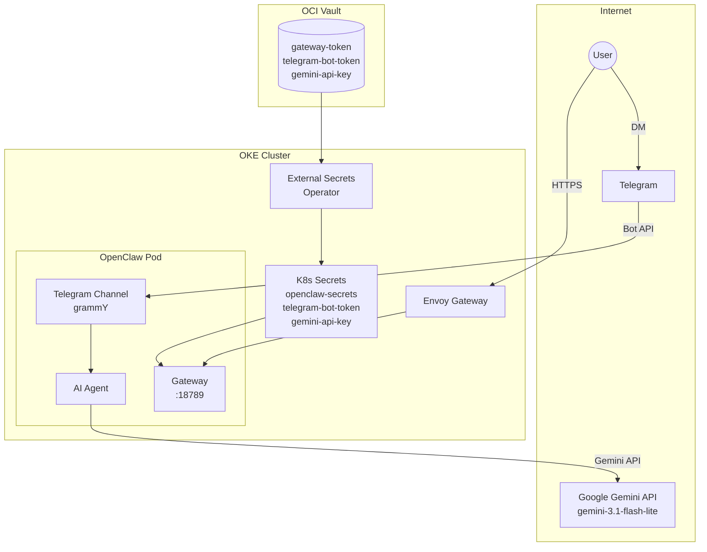

import { Aside } from '@astrojs/starlight/components';

This cluster runs **OpenClaw v2026.4.9**, an open-source AI agent platform that connects messaging channels (Telegram, Discord, etc.) to LLM providers. It uses the **Google Gemini API** for fast, cloud-based inference.

## Endpoint

```text
https://claw.k8s.sudhanva.me
```

<Aside type="tip">
The web UI requires the gateway token for authentication. The Telegram bot (@CoochiepieBot) uses DM pairing for access control.
</Aside>

## Architecture

OpenClaw acts as a gateway between messaging platforms and the Gemini API:



## Features

| Feature | Description |
|---------|-------------|
| **Telegram Bot** | Chat with AI via @CoochiepieBot |
| **Web UI** | Control UI at claw.k8s.sudhanva.me |
| **Gemini Integration** | Connected to Google Gemini 3.1 Flash Lite via API |
| **DM Pairing** | Secure access control for Telegram |
| **Persistent Config** | 2GB PVC for OpenClaw home directory |

## Resource Allocation

| Resource | Request | Limit |
|----------|---------|-------|
| Memory | 1 GB | 4 GB |
| CPU | 500m | 2000m |
| Storage | 2 GB PVC | - |

## Configuration

OpenClaw is configured via a ConfigMap (`openclaw-config`) containing `openclaw.json`:

```json
{
  "gateway": {
    "mode": "local",
    "port": 18789
  },
  "models": {
    "providers": {
      "google": {
        "baseUrl": "https://generativelanguage.googleapis.com/v1beta",
        "apiKey": "${GEMINI_API_KEY}",
        "api": "google-generative-ai",
        "models": [{ "id": "gemini-3.1-flash-lite-preview", "name": "Gemini 3.1 Flash Lite", "contextWindow": 131072, "maxTokens": 8192 }]
      }
    }
  },
  "agents": {
    "defaults": {
      "model": { "primary": "google/gemini-3.1-flash-lite-preview" },
      "timeoutSeconds": 300
    }
  },
  "channels": {
    "telegram": {
      "enabled": true,
      "botToken": "(injected by init container)",
      "dmPolicy": "pairing"
    }
  }
}
```

### Key Config Notes

- **v2026.4.9** binds to `0.0.0.0` by default. Health probes use `exec` with `wget` to reach localhost.
- **Telegram token** is injected into the config by the init container. The init container uses the OpenClaw image (`ghcr.io/openclaw/openclaw:2026.4.9`) and runs a `node` script that reads the token from the Kubernetes Secret mount and writes `botToken` into the JSON config.
- **Gemini API key** is passed via `GEMINI_API_KEY` env var from the `gemini-api-key` K8s secret. Referenced in config as `"apiKey": "${GEMINI_API_KEY}"`.
- **Context window** is set to 131072 (Gemini's native context size). The Gemini API handles context management server-side.
- **Agent timeout** is 300s (5 min), sufficient for cloud API responses.

### Init Container

The init container performs setup before the main OpenClaw process starts:

1. Copies `openclaw.json` and `AGENTS.md` from the ConfigMap to the PVC
2. Removes stale `models.json` cache (prevents overriding the main config)
3. Reads the Telegram bot token from the mounted secret and injects it as `botToken` into the config via a `node -e` script

The init container uses the same OpenClaw image (`ghcr.io/openclaw/openclaw:2026.4.9`) to have access to the Node.js runtime.

## Secrets Management

Three secrets are managed via Terraform and synced by External Secrets Operator:

| Vault Secret | K8s Secret | Purpose |
|-------------|------------|---------|
| `openclaw-gateway-token` | `openclaw-secrets` | Web UI auth token |
| `telegram-bot-token` | `telegram-bot-token` | Telegram Bot API token |
| `gemini-api-key` | `gemini-api-key` | Google Gemini API key |

### Terraform Variables

Add to `tf-oke/terraform.tfvars`:

```hcl
openclaw_gateway_token = "random-hex-string"
telegram_bot_token     = "your-botfather-token"
gemini_api_key         = "your-google-api-key"
```

## Telegram Setup

1. Create a bot via [@BotFather](https://t.me/BotFather) on Telegram
2. Add the bot token to `terraform.tfvars` as `telegram_bot_token`
3. Run `terraform apply` to store in OCI Vault
4. After deployment, DM the bot on Telegram
5. Approve pairing:

```bash
kubectl exec deploy/openclaw -c openclaw -- openclaw pairing approve telegram <CODE>
```

<Aside type="note">
Pairing codes expire after 1 hour. DM pairing grants access to direct messages only, not group messages. Pairing data persists across pod restarts (stored on PVC).
</Aside>

## Migration History

OpenClaw was originally deployed with a self-hosted Gemma 4 E2B model running on CPU-only ARM nodes via llama.cpp. The 12K+ token system prompt took ~15 minutes to process on CPU, causing persistent timeouts. The deployment was migrated to Google Gemini API for near-instant responses.

The Gemma deployment (`argocd/apps/gemma/`) is scaled to 0 replicas but kept in the repository for potential future GPU-based local inference.

## Troubleshooting

### Bot Not Responding

```bash
kubectl logs deploy/openclaw -c openclaw | grep telegram
```

Common causes:
- Invalid bot token (check `kubectl get secret telegram-bot-token -o jsonpath='{.data.telegram-bot-token}' | base64 -d`)
- Pairing not approved (run `openclaw pairing approve telegram <CODE>`)
- v2026.4.9 Telegram polling may take ~30s after startup before processing messages

### Config Invalid Errors

```bash
kubectl logs deploy/openclaw -c openclaw | head -20
```

Common causes:
- Wrong `api` value (must be `google-generative-ai` for Gemini)
- Missing `baseUrl` (required even for Google provider)
- Unknown config keys (check version compatibility)

### Health Probes Failing

v2026.4.9 binds to `0.0.0.0` but probes use `exec` with `wget` hitting localhost for reliability.

## Kubernetes Manifests

| File | Purpose |
|------|---------|
| `argocd/apps/openclaw/deployment.yaml` | PVC + ConfigMap + Deployment |
| `argocd/apps/openclaw/service.yaml` | ClusterIP service (80 -> 18789) |
| `argocd/apps/openclaw/httproute.yaml` | Gateway routing + TLS cert |
| `argocd/infrastructure/managed-secrets/secrets.yaml` | ExternalSecrets for vault sync |
| `tf-oke/vault.tf` | OCI Vault secret resources |
| `tf-oke/variables.tf` | Terraform variable definitions |
