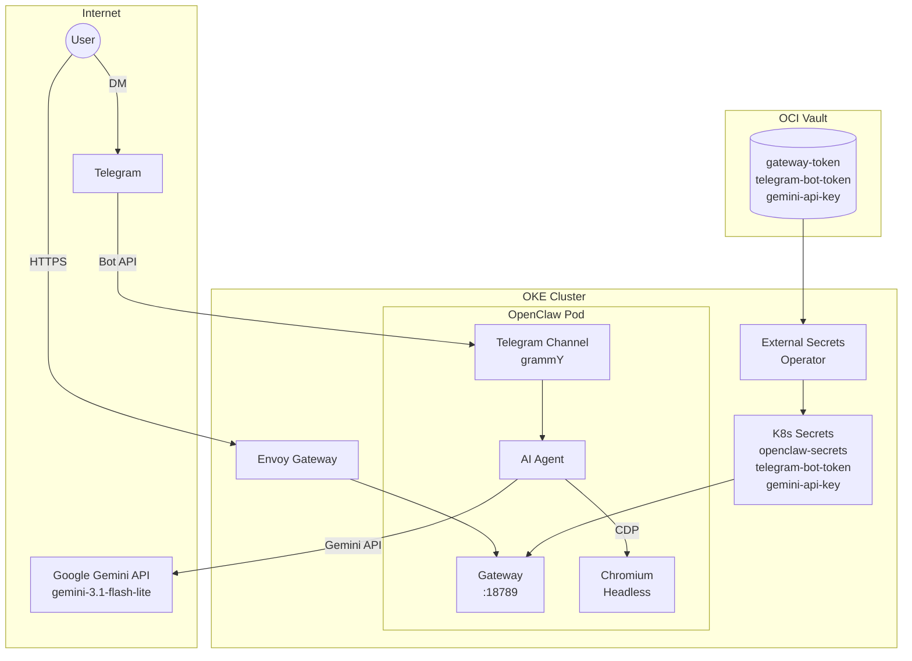

import { Aside } from '@astrojs/starlight/components';

This cluster runs **OpenClaw v2026.4.11**, an open-source AI agent platform that connects messaging channels (Telegram, Discord, etc.) to LLM providers. It uses the **Google Gemini API** for fast, cloud-based inference and a **custom Docker image** with Chromium and CLI tools baked in.

## Endpoint

```text
https://claw.k8s.sudhanva.me
```

<Aside type="tip">
The web UI requires the gateway token for authentication. The Telegram bot (@CoochiepieBot) uses DM pairing for access control.
</Aside>

## Architecture



## Features

| Feature | Description |
|---------|-------------|
| **Telegram Bot** | Chat with AI via @CoochiepieBot |
| **Web UI** | Control UI at claw.k8s.sudhanva.me |
| **Gemini Integration** | Google Gemini 3.1 Flash Lite via API |
| **Browser Control** | Headless Chromium for web browsing and scraping |
| **Memory + Dreaming** | Persistent memory with background consolidation |
| **Session Isolation** | Per-sender sessions with 2hr idle auto-reset |
| **Message Queuing** | Batches rapid Telegram messages (1.5s debounce) |
| **Ack Reactions** | Eyes emoji when processing starts |
| **Slash Commands** | `/model`, `/reset`, `/focus`, `/plugins` in chat |
| **DM Pairing** | Secure access control for Telegram |
| **Persistent Config** | 2GB PVC for OpenClaw home directory |

## Custom Docker Image

The standard OpenClaw image lacks Chromium and system dependencies. A custom image is built and pushed to `ghcr.io/nsudhanva/openclaw:latest`.

**Dockerfile:** `docker/openclaw/Dockerfile`

**What it adds on top of `ghcr.io/openclaw/openclaw:latest`:**

| Category | Packages/Tools |
|----------|---------------|
| **Browser** | Chromium via Playwright + all system libs (libnss3, libatk, libgbm, etc.) + Xvfb |
| **Fonts** | Noto Color Emoji, Noto CJK (for browser screenshots) |
| **Google Tools** | `gogcli` (Gmail, Calendar, Drive, Docs, Sheets, Contacts), `goplaces` (Google Maps/Places) |
| **Media** | `ffmpeg` (audio/video processing) |
| **Dev Tools** | `gh` (GitHub CLI), `jq`, `ripgrep`, `tmux`, `python3` |
| **Other CLIs** | `spogo` (Spotify), `discrawl` (Discord), `camsnap` (RTSP cameras), `ordercli` (food delivery) |

### Building the Image

```bash
cd docker/openclaw

# Build for ARM64 (OKE cluster architecture)
docker buildx build --platform linux/arm64 -t ghcr.io/nsudhanva/openclaw:latest --push .

# Build with no cache (force fresh)
docker buildx build --platform linux/arm64 --no-cache -t ghcr.io/nsudhanva/openclaw:latest --push .
```

<Aside type="caution">
The GHCR package must be set to **Public** visibility. Go to `https://github.com/users/nsudhanva/packages/container/openclaw/settings` and change visibility if needed.
</Aside>

### Key Dockerfile Details

- Chromium is installed via `npx playwright install chromium` and symlinked to `/usr/bin/chromium` and `/usr/bin/google-chrome` for auto-detection
- The `find` command is used instead of glob patterns because glob doesn't expand during Docker build
- steipete CLI tools are downloaded from GitHub releases with verified ARM64 binaries

## Resource Allocation

| Resource | Request | Limit |
|----------|---------|-------|
| Memory | 1 GB | 4 GB |
| CPU | 500m | 2000m |
| Storage | 2 GB PVC | - |
| Shared Memory | 256 MB tmpfs | - |

<Aside type="note">
The `/dev/shm` tmpfs mount (256Mi) is required for Chrome. Without it, Chrome crashes with shared memory errors in containers.
</Aside>

## Configuration

### openclaw.json (ConfigMap)

```json
{
  "gateway": {
    "mode": "local",
    "port": 18789
  },
  "browser": {
    "noSandbox": true
  },
  "models": {
    "mode": "merge",
    "providers": {
      "google": {
        "baseUrl": "https://generativelanguage.googleapis.com/v1beta",
        "apiKey": "${GEMINI_API_KEY}",
        "api": "google-generative-ai",
        "models": [{
          "id": "gemini-3.1-flash-lite-preview",
          "name": "Gemini 3.1 Flash Lite",
          "contextWindow": 131072,
          "maxTokens": 8192
        }]
      }
    }
  },
  "agents": {
    "defaults": {
      "model": { "primary": "google/gemini-3.1-flash-lite-preview" },
      "timeoutSeconds": 300
    }
  },
  "channels": {
    "telegram": {
      "enabled": true,
      "dmPolicy": "pairing"
    }
  },
  "session": {
    "scope": "per-sender",
    "dmScope": "per-peer",
    "reset": { "mode": "idle", "idleMinutes": 120 }
  },
  "plugins": {
    "entries": {
      "memory-core": {
        "enabled": true,
        "config": { "dreaming": { "enabled": true } }
      }
    }
  },
  "messages": {
    "ackReaction": "eyes",
    "ackReactionScope": "direct",
    "queue": { "mode": "collect", "debounceMs": 1500 }
  },
  "commands": {
    "native": true,
    "nativeSkills": "auto",
    "text": true
  }
}
```

### Key Config Notes

- **`browser.noSandbox: true`** is required for running Chrome in a container without root privileges.
- **`api` must be `google-generative-ai`** (not `google` or `openai-completions`). This is the only valid value for Gemini.
- **`baseUrl` is required** even for the Google provider. Use `https://generativelanguage.googleapis.com/v1beta`.
- **Gemini API key** uses `${GEMINI_API_KEY}` env var substitution. The env var is populated from the `gemini-api-key` K8s secret.
- **Agent timeout** is 300s (5 min), sufficient for cloud API responses.
- **Context window** is 131072 (Gemini's native 128K context). No compaction tricks needed unlike local models.
- **`botToken`** is NOT in the ConfigMap. It's injected by the init container (see below).

### Invalid Config Keys (v2026.4.11)

These keys cause startup crashes - do NOT use them:

| Key | Status |
|-----|--------|
| `agents.defaults.toolProfile` | Unrecognized |
| `memory.embeddingProvider` | Unrecognized |
| `browser.launchArgs` | Unrecognized |
| `agents.defaults.systemPrompt` | Unrecognized |
| `agents.defaults.llm` | Unrecognized |
| `models.providers.*.timeout` | Unrecognized |
| `channels.telegram.token` | Unrecognized (use `botToken` or `tokenFile`) |
| `browser.actTimeoutMs` | Unrecognized |
| `browser.launchTimeoutMs` | Unrecognized |

### Environment Variables

| Variable | Value | Purpose |
|----------|-------|---------|
| `NODE_OPTIONS` | `--dns-result-order=ipv4first` | Fixes Node.js fetch failures on OKE (IPv6 unreachable) |
| `HOME` | `/home/node` | Home directory |
| `OPENCLAW_CONFIG_DIR` | `/home/node/.openclaw` | Config directory |
| `GEMINI_API_KEY` | (from secret) | Google Gemini API key |
| `OPENCLAW_GATEWAY_TOKEN` | (from secret) | Web UI authentication |
| `TZ` | `America/New_York` | Timezone for date/time operations |
| `GH_TOKEN` | (from secret, optional) | GitHub CLI authentication |
| `GOOGLE_PLACES_API_KEY` | (from secret, optional) | Google Places API |
| `GOG_KEYRING_PASSWORD` | (from secret, optional) | gogcli encrypted keyring |
| `GOG_KEYRING_BACKEND` | `file` | gogcli keyring backend |

## Init Container

The init container (`copy-config`) runs before the main OpenClaw process. It uses the same custom image (`ghcr.io/nsudhanva/openclaw:latest`) for Node.js access.

**What it does:**

1. **Copies config files** from ConfigMap to PVC (`openclaw.json`, `AGENTS.md`)
2. **Removes stale `models.json`** cache at `agents/main/agent/models.json` (this file overrides the main config's model settings and causes issues when switching providers)
3. **Clears Chrome Singleton locks** at `browser/*/Singleton*` (stale locks from previous pods prevent Chrome from starting)
4. **Injects Telegram bot token** by reading the mounted secret and writing `botToken` into the JSON config via a `node -e` script

<Aside type="caution" title="Why botToken injection?">
v2026.4.11 does NOT support `tokenFile` for Telegram (the gateway can't read the file at runtime). The `botToken` field must be set directly in the JSON config. Since we can't put secrets in the ConfigMap (committed to Git), the init container reads from the K8s Secret mount and injects it.
</Aside>

## Secrets Management

Three secrets are managed via Terraform and synced by External Secrets Operator:

| Vault Secret | K8s Secret | Key | Purpose |
|-------------|------------|-----|---------|
| `openclaw-gateway-token` | `openclaw-secrets` | `gateway-token` | Web UI auth token |
| `telegram-bot-token` | `telegram-bot-token` | `telegram-bot-token` | Telegram Bot API token |
| `gemini-api-key` | `gemini-api-key` | `api-key` | Google Gemini API key |

### Terraform Variables

Add to `tf-oke/terraform.tfvars`:

```hcl
openclaw_gateway_token = "random-hex-string"    # openssl rand -hex 32
telegram_bot_token     = "your-botfather-token"  # from @BotFather
gemini_api_key         = "your-google-api-key"   # from Google AI Studio
```

### Adding a New Secret

1. Add variable to `tf-oke/variables.tf` (sensitive, default "")
2. Add `oci_vault_secret` resource to `tf-oke/vault.tf` (with count conditional)
3. Add value to `tf-oke/terraform.tfvars` (gitignored)
4. Run `terraform apply -target=oci_vault_secret.<name>`
5. Run `git checkout -- argocd/` (terraform overwrites local_file resources)
6. Add ExternalSecret to `argocd/infrastructure/managed-secrets/secrets.yaml`
7. Force sync: `kubectl annotate externalsecret -n default <name>-sync force-sync=$(date +%s) --overwrite`

## Browser Control

OpenClaw v2026.4.11 launches its own Chrome process via Playwright CDP. It does NOT support connecting to external browsers.

### How Browser Control Works (Remote CDP Mode)

OpenClaw's default browser launch has a hardcoded 15s timeout that's too short for ARM64. The solution uses **Remote CDP mode** - Chrome runs as a separate process and OpenClaw connects to it as a remote browser.

**Architecture:**
1. The custom entrypoint starts Debian `chromium` headless on `127.0.0.1:9222`
2. `socat` proxies from `podIP:9223` → `127.0.0.1:9222`
3. The entrypoint patches `openclaw.json` with `cdpUrl: http://podIP:9223`
4. Since the pod IP is non-loopback, OpenClaw treats it as **Remote CDP** (no local launch)
5. `browser.ssrfPolicy.dangerouslyAllowPrivateNetwork: true` allows the private IP
6. K8s `hostAliases` adds `chromium-local` as a hostname alias

**Requirements:**
- Debian `chromium` package installed in custom Docker image
- Playwright installed via bundled CLI (`node /app/node_modules/playwright-core/cli.js install chromium`)
- `/dev/shm` mounted as 1Gi tmpfs
- `socat` installed for the CDP proxy
- Chrome timeout patches in `cdp.helpers-Cx11b16A.js` (as backup)

### Logging Into Websites

Three approaches for authenticated browsing:

1. **Tell the bot to log in** - "Go to twitter.com and log in with email X password Y". The agent navigates, types credentials, handles the flow. Session persists until pod restart.

2. **Set cookies directly** - If you have session cookies:
   ```bash
   kubectl exec deploy/openclaw -c openclaw -- openclaw browser cookies set session_token VALUE --url "https://site.com"
   ```

3. **Navigate + manual input** - For 2FA/CAPTCHA, tell the bot to go to the login page, then provide credentials via Telegram messages.

<Aside type="note">
Chrome's user data is in `/tmp/chrome-data` (emptyDir) which resets on pod restart. Login sessions don't persist across restarts.
</Aside>

### ClawHub Skills

Installed skills (persisted on PVC at `workspace/skills/`):

| Skill | Version | What it does |
|-------|---------|-------------|
| `self-improving-agent` | 3.0.13 | Self-improving agent behaviors |
| `multi-search-engine` | 2.1.3 | Multi search engine support |

Install more: `kubectl exec deploy/openclaw -c openclaw -- openclaw skills install <name>`

## Telegram Setup

1. Create a bot via [@BotFather](https://t.me/BotFather) on Telegram
2. Add the bot token to `terraform.tfvars` as `telegram_bot_token`
3. Run `terraform apply` to store in OCI Vault
4. After deployment, DM the bot on Telegram
5. You'll receive a pairing code. Approve it:

```bash
kubectl exec deploy/openclaw -c openclaw -- openclaw pairing approve telegram <CODE>
```

<Aside type="note">
Pairing codes expire after 1 hour. Pairing data persists across pod restarts (stored on PVC at `credentials/telegram-default-allowFrom.json`). You do NOT need to re-pair after pod restarts.
</Aside>

## Deployment from Scratch

Complete steps to deploy OpenClaw on a fresh cluster:

### 1. Build and Push Docker Image

```bash
cd docker/openclaw
docker buildx build --platform linux/arm64 --no-cache \
  -t ghcr.io/nsudhanva/openclaw:latest --push .
```

Make the GHCR package public at `https://github.com/users/nsudhanva/packages/container/openclaw/settings`.

### 2. Create Terraform Secrets

Add to `tf-oke/terraform.tfvars`:

```hcl
openclaw_gateway_token = "$(openssl rand -hex 32)"
telegram_bot_token     = "your-botfather-token"
gemini_api_key         = "your-google-api-key"
```

Apply:

```bash
cd tf-oke
terraform apply -target=oci_vault_secret.openclaw_gateway_token \
  -target=oci_vault_secret.telegram_bot_token \
  -target=oci_vault_secret.gemini_api_key
git checkout -- ../argocd/
```

### 3. Deploy via ArgoCD

```bash
kubectl apply -f argocd/applications.yaml
```

Wait for ArgoCD to sync all apps. Force sync if needed:

```bash
kubectl patch app openclaw-app -n argocd --type merge \
  -p '{"metadata":{"annotations":{"argocd.argoproj.io/refresh":"hard"}}}'
```

### 4. Force ExternalSecret Sync

```bash
kubectl annotate externalsecret -n default openclaw-secrets-sync force-sync=$(date +%s) --overwrite
kubectl annotate externalsecret -n default telegram-bot-token-sync force-sync=$(date +%s) --overwrite
kubectl annotate externalsecret -n default gemini-api-key-sync force-sync=$(date +%s) --overwrite
```

### 5. Pair Telegram

DM the bot, get the pairing code, then:

```bash
kubectl exec deploy/openclaw -c openclaw -- openclaw pairing approve telegram <CODE>
```

### 6. Verify

```bash
kubectl exec deploy/openclaw -c openclaw -- openclaw browser status
kubectl exec deploy/openclaw -c openclaw -- openclaw channels status
```

## Migration History

OpenClaw was originally deployed with a self-hosted **Gemma 4 E2B** model running on CPU-only ARM nodes via llama.cpp. The 12K+ token system prompt took ~15 minutes to process on CPU, causing persistent timeouts. After trying many approaches (batch-size tuning, context window adjustments, prompt cache warming, version upgrades), the deployment was migrated to the **Google Gemini API** for near-instant responses.

The Gemma deployment (`argocd/apps/gemma/`) is scaled to 0 replicas but kept in the repository for potential future GPU-based local inference.

## Troubleshooting

### Bot Not Responding

```bash
kubectl logs deploy/openclaw -c openclaw | grep telegram
```

Common causes:
- **Telegram polling dead:** Check for `UND_ERR_SOCKET` or `DNS-resolved IP unreachable` errors. Restart the pod.
- **Invalid bot token:** `kubectl get secret telegram-bot-token -o jsonpath='{.data.telegram-bot-token}' | base64 -d`
- **Pairing not approved:** `kubectl exec deploy/openclaw -c openclaw -- openclaw pairing approve telegram <CODE>`
- **v2026.4.11 startup delay:** Telegram polling takes ~30-40s after gateway ready

### Config Invalid Errors

```bash
kubectl logs deploy/openclaw -c openclaw | head -20
```

If you see "Unrecognized key", remove the offending key from the ConfigMap. See the invalid keys table above.

### Browser Not Working

```bash
kubectl exec deploy/openclaw -c openclaw -- openclaw browser status
```

- **`detectedBrowser: unknown`**: Chrome not found. Check `/usr/bin/google-chrome` exists. Rebuild the custom image.
- **`Singleton` lock errors**: Restart the pod (init container clears locks).
- **`Failed to start Chrome CDP`**: Check `/dev/shm` is mounted. Check `browser.noSandbox: true` is set.
- **`timed out` + "Do NOT retry"**: The gateway cached a failure. Restart the pod.
- **`fetch failed` on web_fetch**: Check `NODE_OPTIONS=--dns-result-order=ipv4first` is set.

### Chrome Test (Manual)

```bash
kubectl exec deploy/openclaw -c openclaw -- \
  google-chrome --headless --no-sandbox --disable-gpu \
  --remote-debugging-port=19999 --user-data-dir=/tmp/chrome-test about:blank &
sleep 5
kubectl exec deploy/openclaw -c openclaw -- \
  wget -q -O- http://127.0.0.1:19999/json/version
```

## Kubernetes Manifests

| File | Purpose |
|------|---------|
| `argocd/apps/openclaw/deployment.yaml` | PVC + ConfigMap + Deployment (main manifest) |
| `argocd/apps/openclaw/service.yaml` | ClusterIP service (80 -> 18789) |
| `argocd/apps/openclaw/httproute.yaml` | HTTPRoute + TLS Certificate |
| `argocd/apps/openclaw/kustomization.yaml` | Kustomize resource list |
| `argocd/infrastructure/managed-secrets/secrets.yaml` | ExternalSecrets for vault sync |
| `argocd/infrastructure/envoy-gateway/config.yaml` | HTTPS listener for claw.k8s.sudhanva.me |
| `argocd/infrastructure/envoy-gateway/dnsendpoint.yaml` | DNS A record |
| `docker/openclaw/Dockerfile` | Custom image with Chromium + tools |
| `tf-oke/vault.tf` | OCI Vault secret resources |
| `tf-oke/variables.tf` | Terraform variable definitions |
