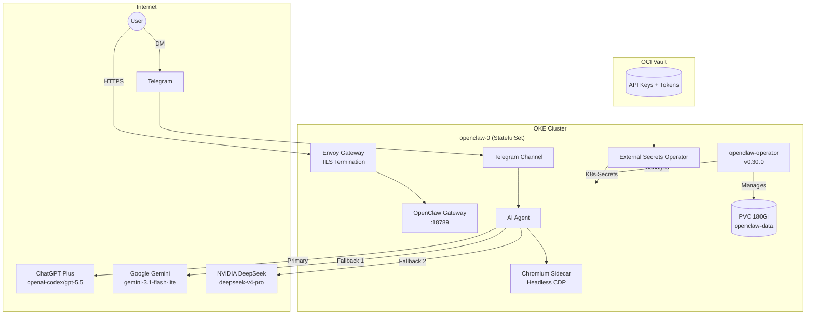

import { Aside } from '@astrojs/starlight/components';

This cluster runs **OpenClaw 2026.5.4**, deployed via the **openclaw-operator** (v0.30.0). A single `OpenClawInstance` custom resource manages the full deployment — StatefulSet, PVC, RBAC, service, and config — no custom Docker image required.

## Endpoints

| Interface | URL |
|-----------|-----|
| Web UI | `https://claw.k8s.sudhanva.me` |
| Telegram | @CoochiepieBot |

<Aside type="tip">
The web UI uses a gateway token for authentication (auto-generated by the operator and stored in the `openclaw-gateway-token` secret). The Telegram bot uses DM pairing for access control.
</Aside>

## Architecture



## AI Models

| Priority | Provider | Model | Auth |
|----------|----------|-------|------|
| Primary | OpenAI Codex | `openai-codex/gpt-5.5` | ChatGPT Plus OAuth (stored on PVC) |
| Fallback 1 | Google | `google/gemini-3.1-flash-lite-preview` | `GEMINI_API_KEY` env var |
| Fallback 2 | NVIDIA | `nvidia/deepseek-ai/deepseek-v4-pro` | `NVIDIA_API_KEY` env var |

### ChatGPT Subscription Auth

After deployment, authenticate with your ChatGPT Plus subscription (requires a TTY):

```bash
kubectl exec -it -n default openclaw-0 -- openclaw models auth login --provider openai-codex
```

This opens an OAuth browser flow. The tokens are saved to the PVC and persist across restarts.

## Operator Deployment

The operator is installed via ArgoCD as a Helm OCI chart:

```yaml
# argocd/applications.yaml (sync-wave 4)
repoURL: ghcr.io/openclaw-rocks/charts
chart: openclaw-operator
targetRevision: "*"
```

The `OpenClawInstance` CR is deployed at sync-wave 5:

```bash
argocd/apps/openclaw/openclawinstance.yaml
argocd/apps/openclaw/httproute.yaml
argocd/apps/openclaw/kustomization.yaml
```

## Key Configuration

The full config lives in `argocd/apps/openclaw/openclawinstance.yaml`. Key sections:

```yaml
spec:
  image:
    repository: ghcr.io/openclaw/openclaw
    tag: "2026.5.4"

  config:
    raw:
      gateway:
        mode: local
        bind: lan          # required for 2026.5.4+; "0.0.0.0" no longer accepted
        port: 18789
      agents:
        defaults:
          model:
            primary: openai-codex/gpt-5.5
            fallbacks:
              - google/gemini-3.1-flash-lite-preview
              - nvidia/deepseek-ai/deepseek-v4-pro
      channels:
        telegram:
          enabled: true
          dmPolicy: pairing  # no botToken needed; uses TELEGRAM_BOT_TOKEN env var

  gateway:
    enabled: false  # Envoy Gateway handles TLS; operator's nginx proxy not needed

  storage:
    persistence:
      size: 180Gi       # 200Gi = 215GB exceeds OCI 200GB free tier
      storageClass: oci-bv
```

<Aside type="caution" title="gateway.enabled must be false">
Without `spec.gateway.enabled: false`, the operator adds an nginx proxy sidecar and shifts OpenClaw to an internal port (18790), breaking the health probes. Envoy Gateway handles all external TLS termination.
</Aside>

<Aside type="caution" title="PVC must be ≤ 180Gi">
OCI Always Free block storage is 200 **GB** (not GiB). 200Gi ≈ 215 GB which exceeds the free limit and causes billing. Keep the PVC at 180Gi or below.
</Aside>

## Features

| Feature | Description |
|---------|-------------|
| **Telegram Bot** | @CoochiepieBot — DM to chat, pairing-based access |
| **Web UI** | `claw.k8s.sudhanva.me` — gateway token auth |
| **ChatGPT Plus** | GPT-5.5 via OAuth subscription (no per-token billing) |
| **Multi-model fallback** | Auto-falls back to Gemini then DeepSeek if primary unavailable |
| **Browser Control** | Chromium sidecar via CDP for web automation |
| **Memory + Dreaming** | Persistent memory with background consolidation |
| **Session Isolation** | Per-sender sessions, 30 min idle auto-reset |
| **Plugins** | browser, device-pair, file-transfer, memory-core, phone-control, talk-voice, telegram, codex |
| **Tools** | gws (Google Workspace), gh (GitHub), bw (Bitwarden), uv/Python 3.14, Alpha Vantage |

## Secrets

All secrets are stored in OCI Vault and synced via External Secrets Operator.

| Vault Secret | K8s Secret | Purpose |
|-------------|------------|---------|
| `telegram-bot-token` | `telegram-bot-token` | Telegram Bot API token |
| `gemini-api-key` | `gemini-api-key` | Google Gemini API |
| `nvidia-api-key` | `nvidia-api-key` | NVIDIA AI Catalog (DeepSeek) |
| `github-pat` | `github-pat` | GitHub CLI |
| `google-places-api-key` | `google-places-api-key` | Google Places API |
| `alphavantage-api-key` | `alphavantage-api-key` | Stock/financial data |
| `bw-credentials` | `bw-credentials` | Bitwarden CLI |

The operator auto-generates the gateway token secret (`openclaw-gateway-token`) — no Vault entry needed.

### Getting the Web UI Token

```bash
kubectl get secret openclaw-gateway-token -o jsonpath='{.data.token}' | base64 -d
```

## Resource Allocation

| Resource | Request | Limit |
|----------|---------|-------|
| Memory | 1 GB | 4 GB |
| CPU | 500m | 2000m |
| Storage | 180Gi PVC | — |

## Telegram Setup

1. Create a bot via [@BotFather](https://t.me/BotFather)
2. Add the token to OCI Vault as `telegram-bot-token`
3. Deploy via ArgoCD — the operator reads `TELEGRAM_BOT_TOKEN` env var automatically
4. DM the bot, get the pairing code
5. Approve it:

```bash
kubectl exec -n default openclaw-0 -- openclaw pairing approve telegram <CODE>
```

<Aside type="note">
Pairing data is stored on the PVC and persists across pod restarts. You only need to pair once.
</Aside>

## Deployment from Scratch

### 1. Add Secrets to OCI Vault

```hcl
# tf-oke/terraform.tfvars
telegram_bot_token = "your-botfather-token"
gemini_api_key     = "your-google-api-key"
nvidia_api_key     = "your-nvidia-api-key"
```

```bash
cd tf-oke
terraform apply -target=oci_vault_secret.telegram_bot_token \
  -target=oci_vault_secret.gemini_api_key \
  -target=oci_vault_secret.nvidia_api_key
git checkout -- ../argocd/
```

### 2. Deploy via ArgoCD

```bash
kubectl apply -f argocd/applications.yaml
```

Force sync (wave 4 → 5):

```bash
kubectl patch app openclaw-operator -n argocd --type merge \
  -p '{"metadata":{"annotations":{"argocd.argoproj.io/refresh":"hard"}}}'
kubectl patch app openclaw-app -n argocd --type merge \
  -p '{"metadata":{"annotations":{"argocd.argoproj.io/refresh":"hard"}}}'
```

### 3. Authenticate ChatGPT (optional, requires TTY)

```bash
kubectl exec -it -n default openclaw-0 -- openclaw models auth login --provider openai-codex
```

### 4. Pair Telegram

```bash
kubectl exec -n default openclaw-0 -- openclaw pairing approve telegram <CODE>
```

## Upgrading OpenClaw

Update the `image.tag` in `openclawinstance.yaml` and push:

```yaml
spec:
  image:
    tag: "2026.5.4"   # change to new version
```

ArgoCD detects the change, the operator rolls the StatefulSet, and the pod restarts with the new image. Always trigger a sync after pushing:

```bash
kubectl patch app openclaw-app -n argocd --type merge \
  -p '{"metadata":{"annotations":{"argocd.argoproj.io/refresh":"hard"}}}'
```

## Troubleshooting

### Bot Not Responding

```bash
kubectl logs openclaw-0 | grep telegram
```

- **Pairing not approved:** `kubectl exec -n default openclaw-0 -- openclaw pairing approve telegram <CODE>`
- **Invalid token:** `kubectl get secret telegram-bot-token -o jsonpath='{.data.telegram-bot-token}' | base64 -d`

### Pod CrashLoopBackOff

```bash
kubectl logs openclaw-0 --previous | head -20
```

Common causes in 2026.5.4:
- `Invalid --bind` — add `bind: lan` to `spec.config.raw.gateway` (raw IP addresses no longer accepted)
- `Config auto-restored from backup` loop — delete the PVC to clear stale backup state: `kubectl delete pvc openclaw-data`
- Gateway proxy port conflict — ensure `spec.gateway.enabled: false` is set

### Check All Model Auth

```bash
kubectl exec -n default openclaw-0 -- openclaw models status
```

### Stale PVC / Fresh Start

If config state is corrupted (repeated restarts, backup restore loops):

```bash
kubectl delete pvc openclaw-data -n default
```

The operator recreates the PVC fresh on the next reconcile. ChatGPT OAuth tokens will need to be re-authenticated.
