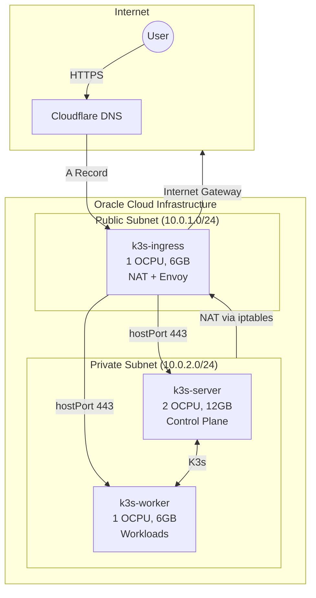
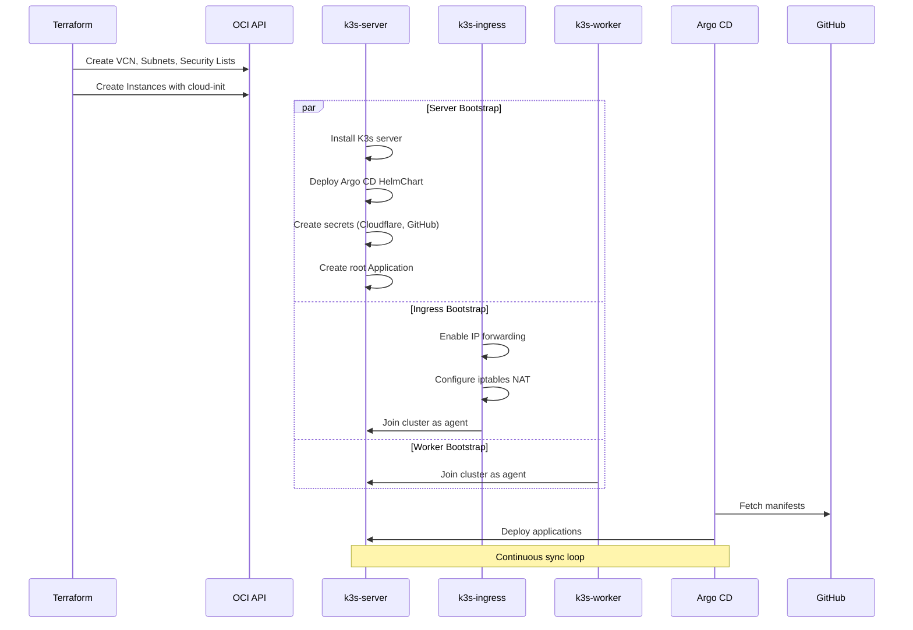
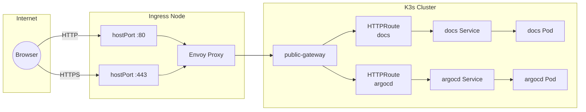
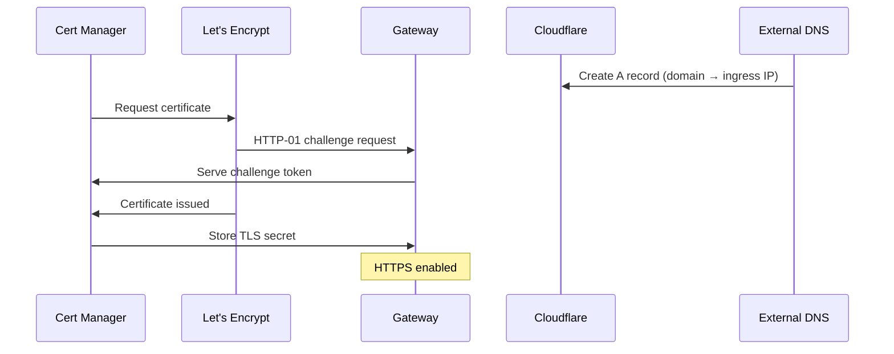

This cluster runs on Oracle Cloud Infrastructure's Always Free tier using three Ampere A1 ARM64 instances.

## Node Topology

| Node | OCPUs | RAM | Subnet | Purpose |
|------|-------|-----|--------|---------|
| k3s-ingress | 1 | 6GB | Public (10.0.1.0/24) | NAT gateway, ingress controller |
| k3s-server | 2 | 12GB | Private (10.0.2.0/24) | K3s control plane |
| k3s-worker | 1 | 6GB | Private (10.0.2.0/24) | Application workloads |

## Infrastructure

Terraform provisions the OCI environment in `tf-k3s/`.

### Network

- VCN CIDR: 10.0.0.0/16
- Public subnet: 10.0.1.0/24
- Private subnet: 10.0.2.0/24
- Internet gateway for public subnet
- Route table directing private subnet traffic through ingress node

### Security Lists

- Ingress ports 80 and 443 from 0.0.0.0/0
- NodePort range 30000-32767
- Full VCN internal communication

## Bootstrapping

Cloud-init scripts configure each node automatically.

### Ingress Node

Defined in `cloud-init/ingress.yaml`:

- Enables IP forwarding
- Configures iptables masquerade for NAT
- Installs K3s agent with `role=ingress` label

### Server Node

Defined in `cloud-init/server.yaml`:

- Installs K3s server with Traefik disabled
- Deploys Argo CD via HelmChart manifest
- Creates secrets for Cloudflare, GitHub, and registry credentials
- Configures root Application for GitOps

### Worker Node

Defined in `cloud-init/worker.yaml`:

- Installs K3s agent
- Joins cluster using K3s token

## GitOps

Argo CD manages all cluster resources using the App-of-Apps pattern.

### Applications

| Application | Purpose |
|-------------|---------|
| gateway-api-crds | Gateway API CRDs |
| cert-manager | TLS certificate automation |
| external-dns | Cloudflare DNS management |
| external-secrets | OCI Vault integration |
| managed-secrets | Vault secret sync configuration |
| envoy-gateway | Gateway API implementation |
| argocd-self-managed | Self-managed Argo CD |
| argocd-ingress | Argo CD UI ingress |
| docs-app | Documentation website |

## Ingress

Envoy Gateway implements the Kubernetes Gateway API. The proxy binds to ports 80 and 443 on the ingress node using hostPort, allowing external traffic while maintaining cluster network connectivity for DNS resolution.

## TLS Certificates

Cert Manager issues Let's Encrypt certificates using HTTP-01 challenges via Gateway API. External DNS updates Cloudflare A records to point to the ingress node public IP.

