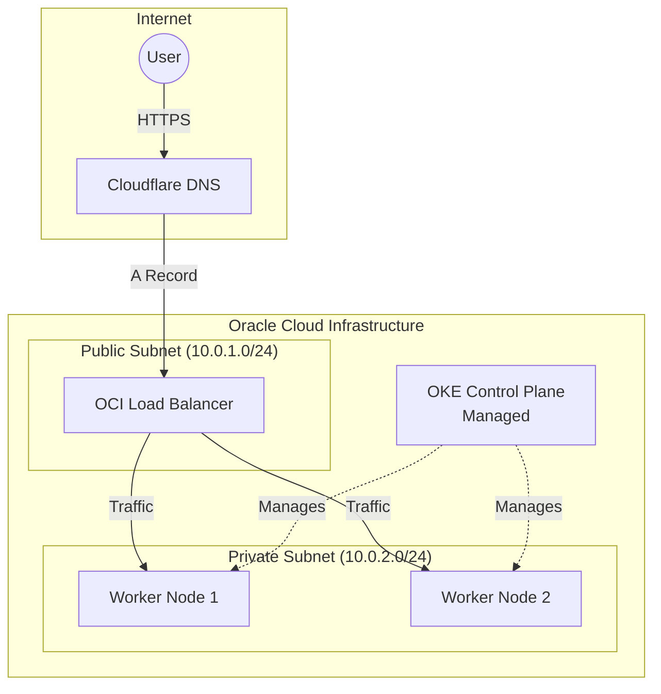
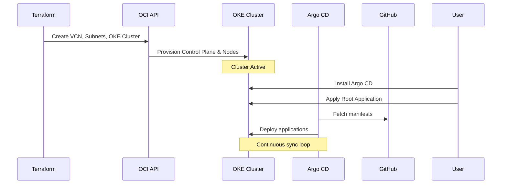
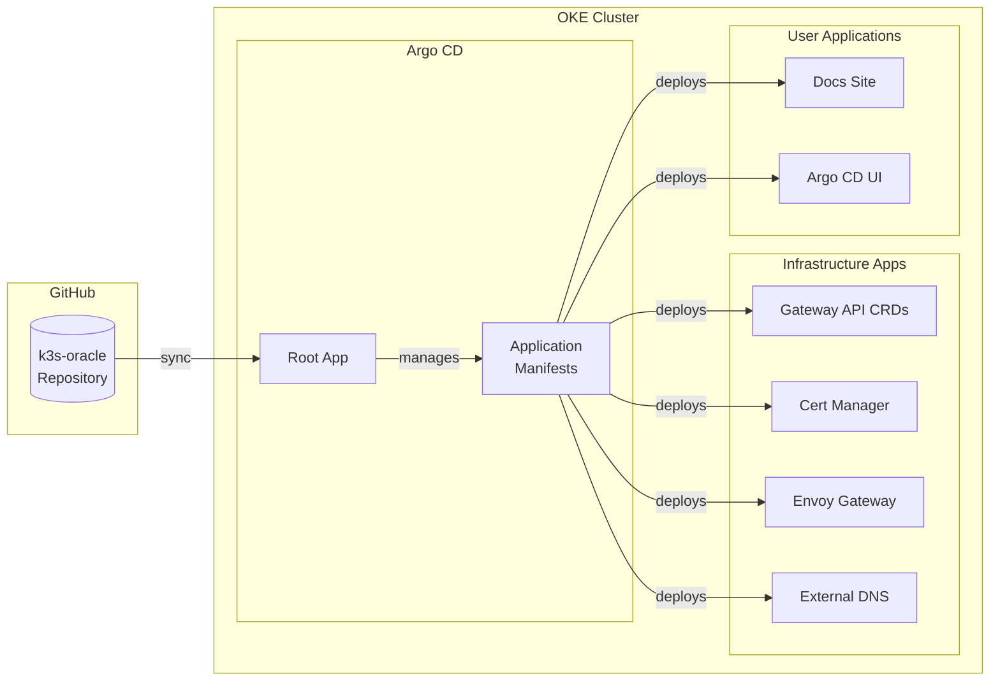
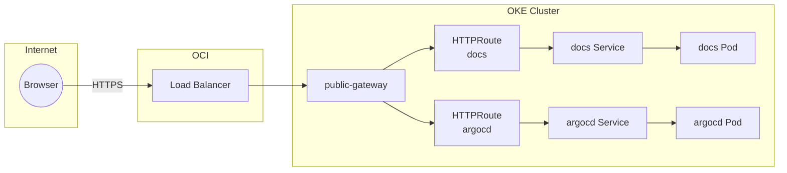
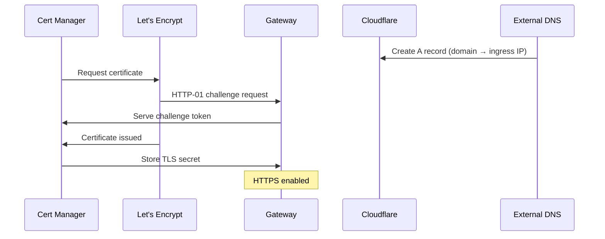

This cluster runs on Oracle Cloud Infrastructure's Free tier using OKE (Oracle Kubernetes Engine) Basic Cluster.

## Node Topology

| Node | OCPUs | RAM | Subnet | Purpose |
|------|-------|-----|--------|---------|
| Control Plane | - | - | Managed | OKE Basic Control Plane |
| Worker 1 | 2 | 12GB | Private (10.0.2.0/24) | Application workloads |
| Worker 2 | 2 | 12GB | Private (10.0.2.0/24) | Application workloads |

## Infrastructure

Terraform provisions the OCI environment in `tf-oke/`.

### Network

- VCN CIDR: 10.0.0.0/16
- Public subnet: 10.0.1.0/24 (Load Balancers)
- Private subnet: 10.0.2.0/24 (Worker Nodes)
- Internet gateway for public subnet
- NAT gateway for private subnet outbound access

### Security Lists

- Load Balancer ports 80 and 443 from 0.0.0.0/0
- SSH access to bastion (if configured)
- Full VCN internal communication

## Bootstrapping

Terraform provisions the OKE cluster and node pool. Once the cluster is active, you configure `kubectl` and install Argo CD manually.

## GitOps

Argo CD manages all cluster resources using the App-of-Apps pattern.

### Applications

| Application | Purpose |
|-------------|---------|
| gateway-api-crds | Gateway API CRDs |
| cert-manager | TLS certificate automation |
| external-dns | Cloudflare DNS management |
| external-secrets | OCI Vault integration |
| managed-secrets | Vault secret sync configuration |
| envoy-gateway | Gateway API implementation |
| argocd-self-managed | Self-managed Argo CD |
| argocd-ingress | Argo CD UI ingress |
| docs-app | Documentation website |

## Ingress

Envoy Gateway implements the Kubernetes Gateway API. It provisions an OCI Load Balancer to handle external traffic.

## TLS Certificates

Cert Manager issues Let's Encrypt certificates using HTTP-01 challenges via Gateway API. External DNS updates Cloudflare A records to point to the ingress node public IP.

