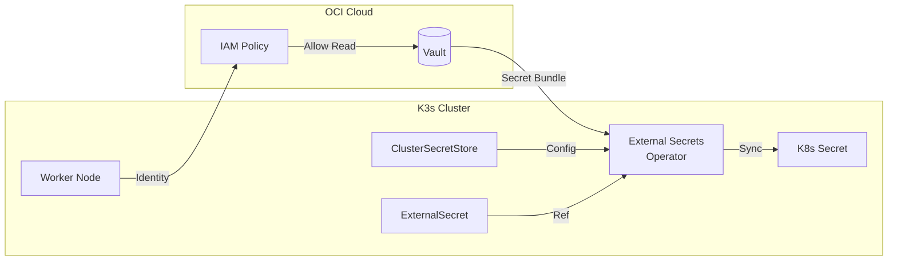

import { Aside, Steps, Tabs, TabItem } from '@astrojs/starlight/components';

This cluster uses **OCI Vault** (Always Free tier) to securely store all sensitive configuration. This approach ensures that secrets are never committed to the repository and can be retrieved for cluster recreation.

## OCI Always Free Limits

| Resource | Free Limit | Our Usage |
|----------|------------|-----------|
| Vault Secrets | 150 | ~10 |
| Master Key Versions | 20 | 1 |
| HSM-protected Keys | ✓ | ✓ |

## Secrets Inventory

All secrets are stored in the `k3s-secrets-vault` OCI Vault:

| Secret Name | Purpose | Used By |
|-------------|---------|---------|
| `cloudflare-api-token` | DNS automation | External DNS, Cert Manager |
| `cloudflare-zone-id` | Cloudflare zone | External DNS |
| `domain-name` | Base domain | Manifests |
| `github-pat` | Repository access | ArgoCD, GHCR |
| `github-username` | GitHub authentication | ArgoCD, GHCR |
| `git-repo-url` | Repository URL | ArgoCD |
| `k3s-token` | Cluster join token | K3s nodes |
| `acme-email` | Let's Encrypt contact | Cert Manager |
| `argocd-admin-password` | ArgoCD UI login | ArgoCD |
| `ssh-public-key` | Instance access | OCI Compute |

## Retrieving Secrets

### Prerequisites

Install and configure the OCI CLI:

```bash
brew install oci-cli
oci setup config
```

### List All Secrets

```bash
oci vault secret list \
  --compartment-id <your-compartment-ocid> \
  --query 'data[].{"name":"secret-name","id":id}' \
  --output table
```

### Retrieve a Secret Value

```bash
oci secrets secret-bundle get \
  --secret-id <secret-ocid> \
  --query 'data."secret-bundle-content".content' \
  --raw-output | base64 -d
```

### Retrieve ArgoCD Password

The ArgoCD admin password is automatically synced from Vault to the cluster via External Secrets Operator.

```bash
# From cluster (password is synced from Vault)
kubectl -n argocd get secret argocd-initial-admin-secret \
  -o jsonpath='{.data.password}' | base64 -d

# Or directly from Vault
ARGOCD_SECRET_ID=$(terraform -chdir=tf-k3s output -json secret_ocids | jq -r '.argocd_admin_password')

oci secrets secret-bundle get \
  --secret-id "$ARGOCD_SECRET_ID" \
  --query 'data."secret-bundle-content".content' \
  --raw-output | base64 -d
```

## Generating terraform.tfvars

To recreate `terraform.tfvars` from OCI Vault:

<Steps>
1. **Get all secret OCIDs**
   ```bash
   terraform -chdir=tf-k3s output -json secret_ocids
   ```

2. **Create the tfvars file**
   ```bash
   cat > tf-k3s/terraform.tfvars << 'EOF'
   tenancy_ocid     = "<from OCI Console>"
   user_ocid        = "<from OCI Console>"
   fingerprint      = "<from OCI Console>"
   private_key_path = "/path/to/oci_api_key.pem"
   region           = "<your-region>"
   compartment_ocid = "<from OCI Console>"
   EOF
   ```

3. **Add secrets from Vault**
   ```bash
   # Example for one secret
   echo "cloudflare_api_token = \"$(oci secrets secret-bundle get \
     --secret-id <cloudflare-api-token-ocid> \
     --query 'data."secret-bundle-content".content' \
     --raw-output | base64 -d)\"" >> tf-k3s/terraform.tfvars
   ```
</Steps>

<Aside type="tip">
  The OCI authentication values (tenancy_ocid, user_ocid, fingerprint, private_key_path, region) are not stored in Vault as they are needed to access Vault itself. Store these securely in a password manager.
</Aside>

## External Secrets Operator

The cluster runs [External Secrets Operator](https://external-secrets.io/) (ESO) to sync OCI Vault secrets to Kubernetes Secrets. This enables GitOps-friendly secret management where:

1. Secrets are stored in OCI Vault
2. ESO reads secrets from Vault
3. ESO creates/updates Kubernetes Secrets
4. Applications reference standard Kubernetes Secrets

### Authentication

The cluster uses **Instance Principals** to authenticate with OCI Vault. This eliminates the need for managing long-lived API keys for the cluster itself.

1. **Dynamic Group**: `k3s-nodes-dg` groups all instances in the compartment (`instance.compartment.id = '<compartment_ocid>'`).
2. **Policy**: `k3s-secrets-read-policy` allows the dynamic group to `read secret-family` and `use vaults` in the compartment.
3. **ClusterSecretStore**: Configured with `principalType: InstancePrincipal`.

<Aside type="note">
  The ESO manifests are generated by Terraform from templates in `tf-k3s/templates/manifests/managed-secrets/`. Sensitive values like the Vault OCID are injected at deploy time and gitignored to prevent accidental commits.
</Aside>

### Architecture



## Security Best Practices

1. **Never commit secrets** - All `.tfvars` files are gitignored
2. **Use HSM protection** - OCI Vault uses HSM-backed master keys
3. **Enable versioning** - Secret versions are retained for rollback
4. **Least privilege** - Use scoped API tokens (Cloudflare Zone.DNS only)
5. **Rotate regularly** - Update secrets and create new versions

## Terraform Remote State

Terraform state is stored in OCI Object Storage:

| Setting | Value |
|---------|-------|
| Bucket | `k3s-tfstate` |
| Versioning | Enabled |
| Access | Private (NoPublicAccess) |
| Encryption | Server-side (default) |

<Aside type="caution">
  Never delete the tfstate bucket. It contains the mapping between Terraform resources and actual OCI infrastructure.
</Aside>
