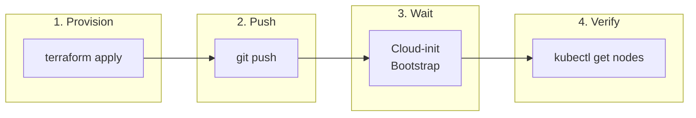
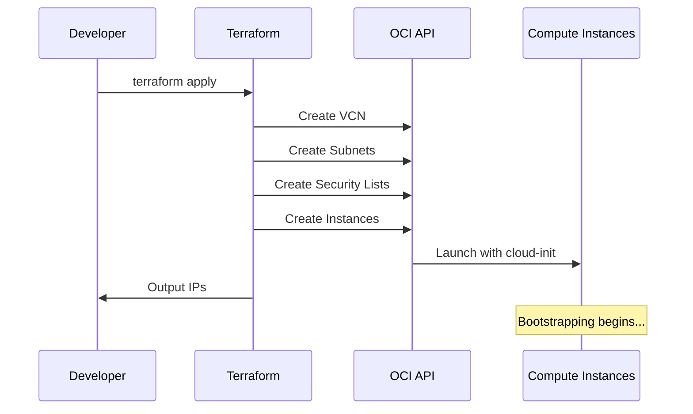
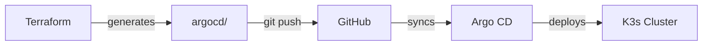

## Provisioning

After creating `terraform.tfvars`, run Terraform to provision the infrastructure:

```bash
cd tf-k3s
terraform init
terraform apply
```



Terraform creates the OCI networking and compute instances, then generates Kubernetes manifests in the `argocd/` directory.

## Push Manifests

The generated manifests must be committed to your repository for Argo CD to sync them:

```bash
cd ..
git add argocd/
git commit -m "Configure cluster manifests"
git push
```



## Bootstrapping

Cloud-init scripts automatically configure each node:

```mermaid
gantt
    title Node Bootstrap Timeline
    dateFormat X
    axisFormat %s

    section Ingress
    Enable IP forwarding    :0, 30
    Configure iptables NAT  :30, 60
    Install K3s agent       :60, 120
    Join cluster            :120, 150

    section Server
    Install K3s server      :0, 90
    Deploy Argo CD          :90, 150
    Create secrets          :150, 180
    Sync applications       :180, 300

    section Worker
    Install K3s agent       :0, 90
    Join cluster            :90, 120
```



- Ingress node enables IP forwarding and NAT
- Server node installs K3s and Argo CD
- Worker node joins the cluster

Allow approximately five minutes for all nodes to initialize and Argo CD to begin syncing.

## Verification

### Check Nodes

```bash
terraform output
ssh -J ubuntu@<ingress-public-ip> ubuntu@10.0.2.10 "sudo kubectl get nodes"
```

Expected output:

```text
NAME       STATUS   ROLES           AGE   VERSION
ingress    Ready    <none>          5m    v1.34.3+k3s1
server     Ready    control-plane   5m    v1.34.3+k3s1
worker-1   Ready    <none>          5m    v1.34.3+k3s1
```

### Check Applications

```bash
ssh -J ubuntu@<ingress-public-ip> ubuntu@10.0.2.10 "sudo kubectl get applications -n argocd"
```

Expected output:

```text
NAME                  SYNC STATUS   HEALTH STATUS
argocd-ingress        Synced        Healthy
argocd-self-managed   Synced        Healthy
cert-manager          Synced        Healthy
docs-app              Synced        Healthy
envoy-gateway         Synced        Healthy
external-dns          Synced        Healthy
external-secrets      Synced        Healthy
gateway-api-crds      Synced        Healthy
managed-secrets       Synced        Healthy
root-app              Synced        Healthy
```

### Check Pods

```bash
ssh -J ubuntu@<ingress-public-ip> ubuntu@10.0.2.10 "sudo kubectl get pods -A"
```

All pods should be Running except for completed Job pods.

### Verify DNS and TLS

After a few minutes, test the deployed application:

```bash
dig +short k3s.yourdomain.com
curl -I https://k3s.yourdomain.com
```

## Troubleshooting First Deploy

### Applications Stuck in Unknown/OutOfSync

If ArgoCD applications remain in Unknown status after initial deploy:

1. Check if `kustomize.buildOptions` is set:
```bash
kubectl -n argocd get cm argocd-cm -o jsonpath='{.data.kustomize\.buildOptions}'
```

2. If empty, patch it:
```bash
kubectl -n argocd patch cm argocd-cm --type=merge -p '{"data":{"kustomize.buildOptions":"--enable-helm"}}'
kubectl -n argocd rollout restart deploy argocd-repo-server
```

3. Sync applications in dependency order:
```bash
for app in gateway-api-crds external-dns cert-manager external-secrets envoy-gateway managed-secrets argocd-self-managed argocd-ingress docs-app; do
  kubectl -n argocd patch application $app --type=merge -p '{"operation":{"sync":{}}}'
  sleep 10
done
```

### Node Not Joining Cluster

If a node fails to join with label validation errors, SSH to the node and check:
```bash
sudo journalctl -u k3s-agent -n 50
```

If you see `unknown 'kubernetes.io' labels`, the cloud-init used a restricted label. Fix by reinstalling:
```bash
sudo /usr/local/bin/k3s-agent-uninstall.sh
curl -sfL https://get.k3s.io | INSTALL_K3S_EXEC='agent --node-label role=ingress' K3S_URL=https://10.0.2.10:6443 K3S_TOKEN='<token>' sh -
```

### HTTPS Verification

After all applications are synced, verify HTTPS works:
```bash
curl -I https://k3s.yourdomain.com
curl -I https://cd.k3s.yourdomain.com
```

Both should return `HTTP/2 200`. HTTP requests should redirect with `301`:
```bash
curl -I http://k3s.yourdomain.com
```

See [Common Issues](/troubleshooting/common-issues/) for more solutions.

## Next Steps

- [Set up local kubectl access](/operation/accessing-cluster/)
- [Deploy applications](/operation/adding-apps/)
