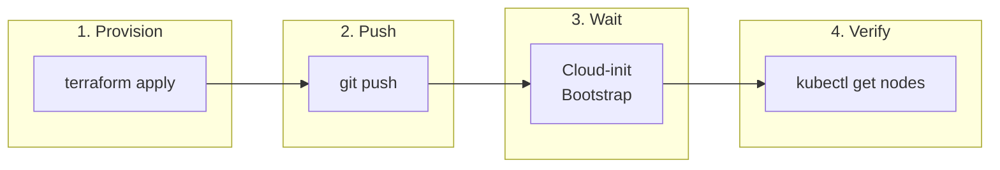
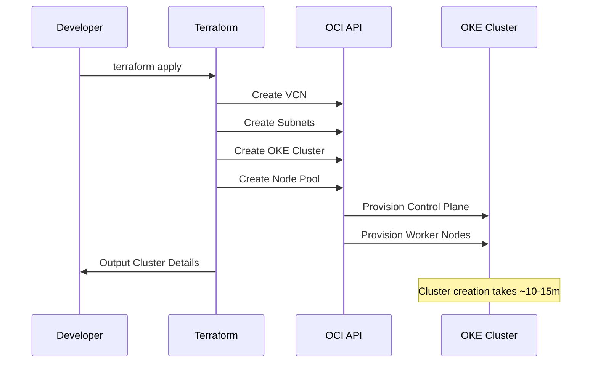
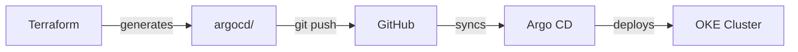

## Provisioning

After creating `terraform.tfvars`, run Terraform to provision the infrastructure:

```bash
cd tf-oke
terraform init
terraform apply
```



Terraform creates the OCI networking, OKE cluster, and node pool, then generates Kubernetes manifests in the `argocd/` directory.

## Push Manifests

The generated manifests must be committed to your repository for Argo CD to sync them:

```bash
cd ..
git add argocd/
git commit -m "Configure cluster manifests"
git push
```



## Bootstrapping

The OKE cluster is fully managed by Oracle. Once Terraform completes, the cluster is active, but we need to configure `kubectl` and install Argo CD.

1. **Configure kubectl**:

   ```bash
   oci ce cluster create-kubeconfig \
     --cluster-id $(terraform output -raw cluster_id) \
     --file $HOME/.kube/config \
     --region $(terraform output -raw region) \
     --token-version 2.0.0 \
     --kube-endpoint PUBLIC_ENDPOINT
   ```

2. **Install Argo CD**:

   ```bash
   kubectl create namespace argocd
   kubectl apply -n argocd -f https://raw.githubusercontent.com/argoproj/argo-cd/stable/manifests/install.yaml
   kubectl apply -f ../argocd/applications.yaml
   ```

Allow approximately five minutes for Argo CD to initialize and begin syncing applications.

## Verification

### Check Nodes

```bash
kubectl get nodes
```

Expected output:

```text
NAME             STATUS   ROLES   AGE   VERSION
10.0.10.x        Ready    node    5m    v1.32.1
10.0.10.y        Ready    node    5m    v1.32.1
```

### Check Applications

```bash
kubectl get applications -n argocd
```

Expected output:

```text
NAME                  SYNC STATUS   HEALTH STATUS
argocd-ingress        Synced        Healthy
argocd-self-managed   Synced        Healthy
cert-manager          Synced        Healthy
docs-app              Synced        Healthy
envoy-gateway         Synced        Healthy
external-dns          Synced        Healthy
external-secrets      Synced        Healthy
gateway-api-crds      Synced        Healthy
managed-secrets       Synced        Healthy
root-app              Synced        Healthy
```

### Check Pods

```bash
kubectl get pods -A
```

All pods should be Running except for completed Job pods.

### Verify DNS and TLS

After a few minutes, test the deployed application:

```bash
dig +short k8s.yourdomain.com
curl -I https://k8s.yourdomain.com
```

:::caution[Rate Limiting]
Let's Encrypt limits you to **5 certificates per week** for the same domain. If you destroy and recreate your cluster frequently, you will hit this limit and HTTPS will fail. Use the [Staging Issuer](/troubleshooting/common-issues/#lets-encrypt-rate-limiting) for development.
:::

## Troubleshooting First Deploy

### Applications Stuck in Unknown/OutOfSync

If ArgoCD applications remain in Unknown status after initial deploy:

Check if `kustomize.buildOptions` is set:

```bash
kubectl -n argocd get cm argocd-cm -o jsonpath='{.data.kustomize\.buildOptions}'
```

If empty, patch it and **restart the repo server**:

```bash
kubectl -n argocd patch cm argocd-cm --type=merge -p '{"data":{"kustomize.buildOptions":"--enable-helm"}}'
kubectl -n argocd rollout restart deploy argocd-repo-server
```

Sync applications in dependency order:

```bash
for app in gateway-api-crds external-dns cert-manager external-secrets envoy-gateway managed-secrets argocd-self-managed argocd-ingress docs-app; do
  kubectl -n argocd patch application $app --type=merge -p '{"operation":{"sync":{}}}'
  sleep 10
done
```

### HTTPS Verification

After all applications are synced, verify HTTPS works:

```bash
curl -I https://k8s.yourdomain.com
curl -I https://cd.k8s.yourdomain.com
```

Both should return `HTTP/2 200`. HTTP requests should redirect with `301`:

```bash
curl -I http://k8s.yourdomain.com
```

See [Common Issues](/troubleshooting/common-issues/) for more solutions.

## Next Steps

- [Set up local kubectl access](/operation/accessing-cluster/)
- [Deploy applications](/operation/adding-apps/)
