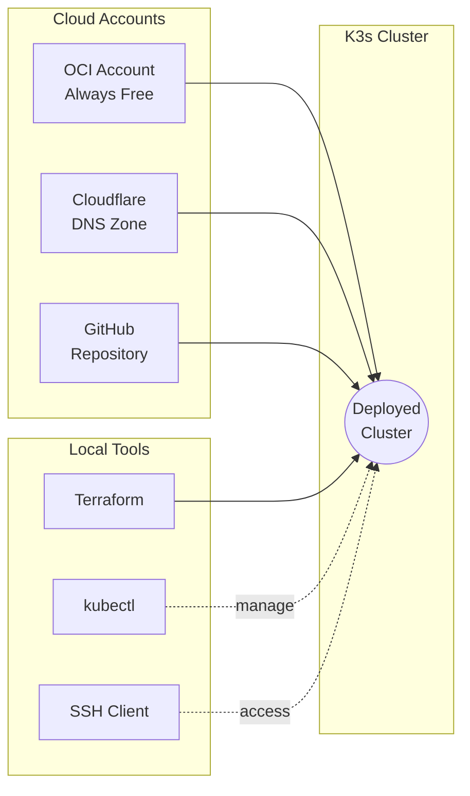

## Cloud Accounts

### Oracle Cloud Infrastructure

An OCI account with Always Free tier eligibility is required. You need availability for Ampere A1 Compute instances in your region. US-Ashburn-1 and EU-Frankfurt-1 typically have better availability.

Required credentials:

- Tenancy OCID
- User OCID
- API Key fingerprint
- Private key file (.pem)

### Cloudflare

A domain managed by Cloudflare is required for DNS and TLS certificate automation. Create an API Token with Zone.DNS Edit permissions. This token is used by External DNS to create A records and by Cert Manager for HTTP-01 challenges.

### GitHub

Fork this repository to your account. Create a Personal Access Token (Classic) with `repo` and `read:packages` scopes. This allows Argo CD to pull configuration from your private repository and pull container images from GHCR.

## Local Tools

### Terraform

Version 1.5.0 or higher. Used to provision OCI infrastructure and generate Kubernetes manifests.

[Installation Guide](https://developer.hashicorp.com/terraform/tutorials/aws-get-started/install-cli)

### OCI CLI

Optional but recommended for validating credentials and checking service limits.

[Installation Guide](https://docs.oracle.com/en-us/iaas/Content/API/SDKDocs/cliinstall.htm)

### kubectl

Required for interacting with the cluster after deployment.

[Installation Guide](https://kubernetes.io/docs/tasks/tools/)

### SSH Client

Standard OpenSSH client, pre-installed on macOS and Linux.
