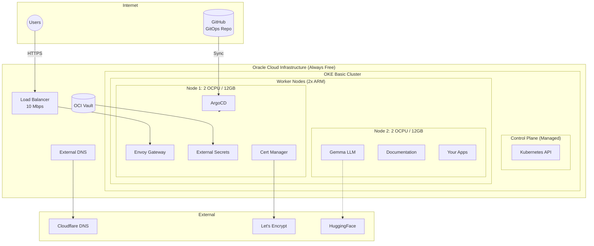

import { Card, CardGrid, LinkCard, Tabs, TabItem } from '@astrojs/starlight/components';

## What You Get

<CardGrid>
  <Card title="Free Managed Kubernetes" icon="seti:kubernetes">
    OKE Basic Cluster provides a fully managed control plane at no cost. Focus on your apps, not infrastructure.
  </Card>
  <Card title="4 OCPUs + 24GB RAM" icon="rocket">
    Ampere A1 ARM instances deliver high performance. Two worker nodes with 2 OCPU and 12GB RAM each.
  </Card>
  <Card title="GitOps with ArgoCD" icon="github">
    Everything deployed via Git. App-of-Apps pattern for organized, scalable deployments.
  </Card>
  <Card title="Production Security" icon="approve-check-circle">
    OCI Vault for secrets, Let's Encrypt TLS, Bearer token auth for APIs.
  </Card>
</CardGrid>

## Architecture Overview



## Stack

| Component | Technology | Purpose |
|-----------|------------|---------|
| **Infrastructure** | Terraform | Declarative OCI resource provisioning |
| **Kubernetes** | OKE Basic | Free managed control plane |
| **GitOps** | ArgoCD | Continuous deployment from Git |
| **Ingress** | Envoy Gateway | Gateway API with load balancing |
| **DNS** | External DNS + Cloudflare | Automatic DNS record management |
| **TLS** | Cert Manager + Let's Encrypt | Automatic certificate issuance |
| **Secrets** | External Secrets + OCI Vault | Secure secret synchronization |
| **LLM** | llama.cpp + Gemma 3 1B | Self-hosted AI with OpenAI API |

## Quick Start

<Tabs>
  <TabItem label="1. Clone">
```bash
git clone https://github.com/nsudhanva/k8s-oracle.git
cd k8s-oracle/tf-oke
```
  </TabItem>
  <TabItem label="2. Configure">
```bash
cp terraform.tfvars.example terraform.tfvars
# Edit terraform.tfvars with your OCI credentials
```
  </TabItem>
  <TabItem label="3. Deploy">
```bash
terraform init
terraform plan
terraform apply
```
  </TabItem>
</Tabs>

## Why OKE over K3s?

| | **OKE Basic** | **K3s on VM** |
|---|---|---|
| **Control Plane** | Managed (Free) | Self-managed on VM |
| **Worker Resources** | Full 4 OCPU / 24GB | Reduced by control plane overhead |
| **Maintenance** | Oracle handles upgrades | Manual upgrades required |
| **Storage** | OCI Block Volume CSI | Local path provisioner |
| **Networking** | OCI VCN integration | Manual CNI setup |

## Live Demo

This documentation site runs on the cluster. Try the self-hosted LLM:

```bash
curl https://gemma.k8s.sudhanva.me/v1/chat/completions \
  -H "Authorization: Bearer YOUR_API_KEY" \
  -H "Content-Type: application/json" \
  -d '{"model":"gemma","messages":[{"role":"user","content":"Hello!"}]}'
```

## Explore

<CardGrid>
  <LinkCard title="Prerequisites" href="/getting-started/prerequisites/" description="What you need before starting" />
  <LinkCard title="Installation" href="/getting-started/installation/" description="Step-by-step deployment guide" />
  <LinkCard title="Architecture" href="/architecture/overview/" description="How all components work together" />
  <LinkCard title="Gemma LLM" href="/architecture/gemma-llm/" description="Self-hosted AI with OpenAI-compatible API" />
  <LinkCard title="Secrets Management" href="/architecture/secrets-management/" description="OCI Vault integration" />
  <LinkCard title="Adding Apps" href="/operation/adding-apps/" description="Deploy your own applications" />
</CardGrid>
