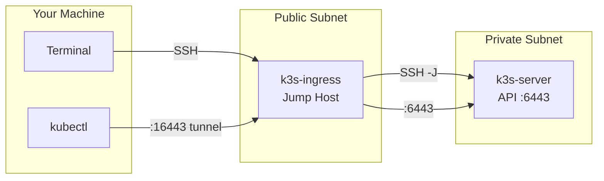
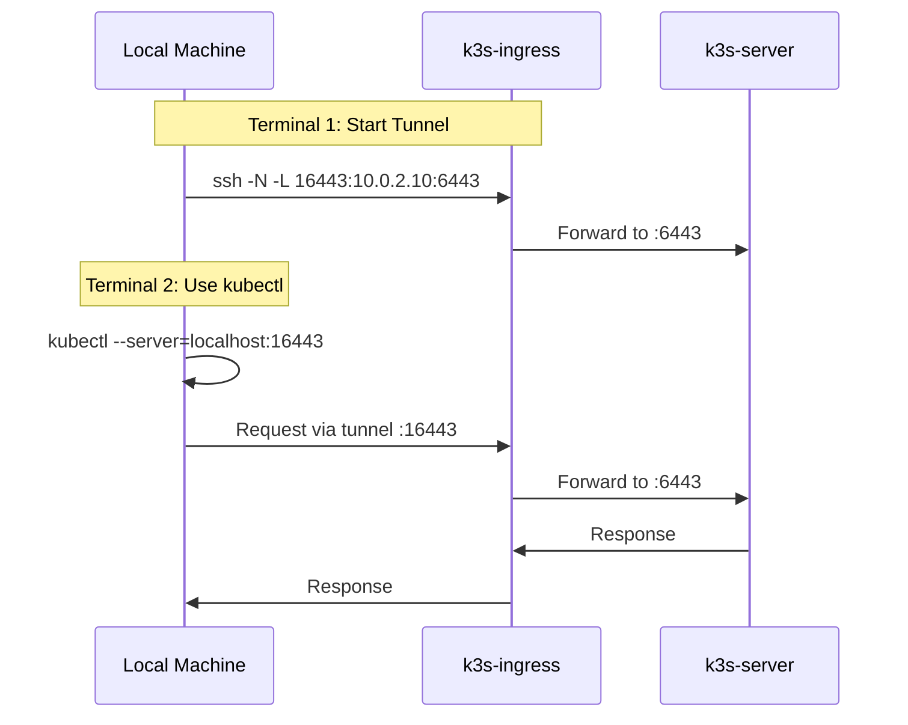

The K3s control plane runs in a private subnet. Access requires using the ingress node as a jump host.



## Connection Details

Get IP addresses from Terraform:

```bash
cd tf-k3s
terraform output
```

## SSH Access

### Ingress Node

```bash
ssh ubuntu@<ingress-public-ip>
```

### Server Node

```bash
ssh -J ubuntu@<ingress-public-ip> ubuntu@10.0.2.10
```

### Worker Node

```bash
ssh -J ubuntu@<ingress-public-ip> ubuntu@<worker-private-ip>
```

## Kubectl Access



### Start SSH Tunnel

Open a terminal and start the tunnel:

```bash
ssh -N -L 16443:10.0.2.10:6443 ubuntu@<ingress-public-ip>
```

Port 16443 avoids conflicts with local Kubernetes clusters.

### Fetch Kubeconfig

In a new terminal:

```bash
mkdir -p ~/.kube

ssh -J ubuntu@<ingress-public-ip> ubuntu@10.0.2.10 "sudo cat /etc/rancher/k3s/k3s.yaml" | \
  sed 's|server: https://127.0.0.1:6443|server: https://127.0.0.1:16443|g' | \
  sed 's|name: default|name: k3s-oracle|g' | \
  sed 's|cluster: default|cluster: k3s-oracle|g' | \
  sed 's|user: default|user: k3s-oracle|g' | \
  sed 's|current-context: default|current-context: k3s-oracle|g' \
  > ~/.kube/k3s-oracle.yaml
```

### Merge Kubeconfig

To use alongside other clusters:

```bash
cp ~/.kube/config ~/.kube/config.backup
KUBECONFIG=~/.kube/config:~/.kube/k3s-oracle.yaml kubectl config view --flatten > ~/.kube/config.merged
mv ~/.kube/config.merged ~/.kube/config
kubectl config use-context k3s-oracle
```

### Verify

```bash
kubectl get nodes
```

### Standalone Usage

Without merging:

```bash
KUBECONFIG=~/.kube/k3s-oracle.yaml kubectl get nodes
```

Or export for the session:

```bash
export KUBECONFIG=~/.kube/k3s-oracle.yaml
```

## Argo CD UI

### Via Public Ingress

If argocd-ingress is configured:

```text
https://cd.<your-domain>
```

### Via Port Forward

```bash
ssh -L 8080:localhost:8080 -J ubuntu@<ingress-public-ip> ubuntu@10.0.2.10 \
  "sudo kubectl port-forward svc/argocd-server -n argocd 8080:443"
```

Open `https://localhost:8080` in a browser.

### Credentials

Username: `admin`

Password:

```bash
kubectl -n argocd get secret argocd-initial-admin-secret -o jsonpath='{.data.password}' | base64 -d
```

## Troubleshooting

### Host Key Verification Failed

Remove old host keys after cluster recreation:

```bash
ssh-keygen -R <ingress-public-ip>
```

### Connection Timeout

Verify the ingress node is running in OCI Console and security list rules allow SSH from your IP.

### Connection Refused on Port 16443

Ensure the SSH tunnel is running in another terminal.

### Persistent Tunnel

Use autossh for automatic reconnection:

```bash
brew install autossh
autossh -M 0 -N -L 16443:10.0.2.10:6443 ubuntu@<ingress-public-ip>
```

Or add keep-alive options:

```bash
ssh -N -L 16443:10.0.2.10:6443 -o ServerAliveInterval=60 -o ServerAliveCountMax=3 ubuntu@<ingress-public-ip>
```
