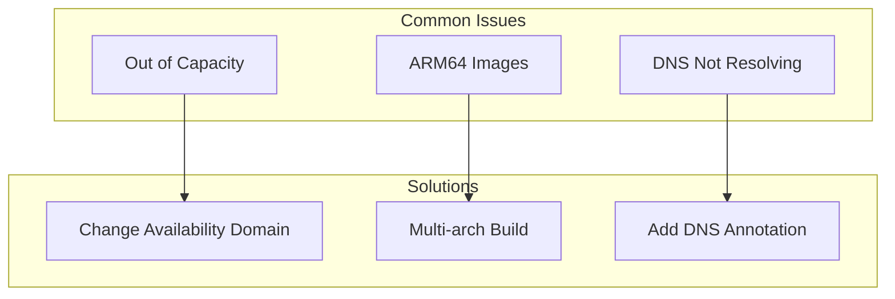
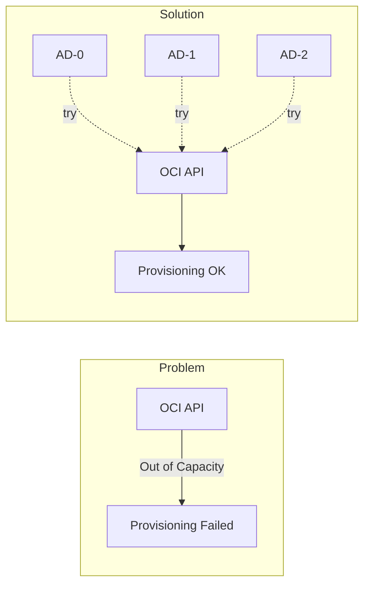

## Out of Capacity

Ampere A1 instances are frequently unavailable in popular regions.



Try changing the `availability_domain` index in `compute.tf` to 0, 1, or 2.

## ARM64 Image Architecture

Standard container images often fail with `exec format error` on ARM64 nodes.

Build multi-architecture images using GitHub Actions with `docker/setup-qemu-action` for `linux/amd64,linux/arm64`.

## Persistent Storage

OKE uses the OCI CSI driver (Block Volume) for persistent storage. Ensure your StorageClass is configured correctly (default `oci-bv` is usually provided).

## Argo CD Helm Chart Errors

When using Kustomize to inflate Helm charts, Argo CD requires explicit enablement.

Error: `must specify --enable-helm`

Fix: Patch `argocd-cm` ConfigMap and **restart the repo-server**:

```bash
kubectl -n argocd patch cm argocd-cm --type=merge -p '{"data":{"kustomize.buildOptions":"--enable-helm"}}'
kubectl -n argocd rollout restart deploy argocd-repo-server
```

## SSH Key Format

OCI requires OpenSSH formatted public keys, not PEM format.

Convert PEM keys:

```bash
ssh-keygen -y -f ~/.oci/oci_api_key.pem > ssh_key.pub
```

## Docker Hub Rate Limiting

Docker Hub rate-limits OCI artifact requests from cloud IPs.

Use Git-based installation for Envoy Gateway instead of Helm OCI.

## External DNS Zone ID Discovery

Scoped Cloudflare API tokens may fail to discover the zone ID automatically.

Error: `Could not route to /client/v4/zones//dns_records...`

Fix: Explicitly provide the zone ID with `--zone-id-filter=<zone-id>`.

## Gateway API External DNS Integration

External DNS may not detect HTTPRoute targets if the Gateway status address is internal.

Fix: Add the annotation `external-dns.alpha.kubernetes.io/target: <public-ip>` to the HTTPRoute.

## Gateway TLS Certificate RefNotPermitted

If the Gateway shows `PROGRAMMED: False` with `RefNotPermitted` errors, it cannot access TLS secrets from other namespaces.

Symptom: `kubectl describe gateway public-gateway` shows:

```text
Certificate ref to secret argocd/argocd-tls not permitted by any ReferenceGrant
```

Fix: Create ReferenceGrants in each namespace containing TLS secrets:

```yaml
apiVersion: gateway.networking.k8s.io/v1beta1
kind: ReferenceGrant
metadata:
  name: allow-gateway-to-secrets
  namespace: argocd
spec:
  from:
  - group: gateway.networking.k8s.io
    kind: Gateway
    namespace: envoy-gateway-system
  to:
  - group: ""
    kind: Secret
```

The Envoy Gateway config template includes these ReferenceGrants automatically.

## Argo CD Application Sync Order

Applications may fail to sync if dependencies aren't deployed yet.

Symptom: `one or more synchronization tasks are not valid` with message about missing CRDs.

Common dependency issues:

- `envoy-gateway` needs `external-dns` CRD (DNSEndpoint)
- `docs-app` needs `cert-manager` CRD (Certificate)
- All apps using Helm charts need `kustomize.buildOptions: "--enable-helm"` in argocd-cm

Fix: Manually sync in order:

```bash
kubectl -n argocd patch application external-dns --type=merge -p '{"operation":{"sync":{}}}'
kubectl -n argocd patch application cert-manager --type=merge -p '{"operation":{"sync":{}}}'
kubectl -n argocd patch application envoy-gateway --type=merge -p '{"operation":{"sync":{}}}'
kubectl -n argocd patch application docs-app --type=merge -p '{"operation":{"sync":{}}}'
```

## ArgoCD Kustomize Helm Support

If applications using Kustomize with helmCharts fail with `must specify --enable-helm`:

Fix: Ensure the argocd-cm ConfigMap has the correct setting:

```bash
kubectl -n argocd patch cm argocd-cm --type=merge -p '{"data":{"kustomize.buildOptions":"--enable-helm"}}'
kubectl -n argocd rollout restart deploy argocd-repo-server
```

The ArgoCD kustomization includes this configuration automatically via the argocd-self-managed application.

## Envoy Gateway Always OutOfSync

The Envoy Gateway controller modifies the Gateway resource after ArgoCD applies it, causing perpetual OutOfSync status.

Symptom: `envoy-gateway` application shows OutOfSync but Healthy.

Fix: Add `ignoreDifferences` to the Application spec:

```yaml
spec:
  ignoreDifferences:
    - group: gateway.networking.k8s.io
      kind: Gateway
      jsonPointers:
        - /spec/listeners
        - /status
```

This is included in the `applications.yaml.tpl` template automatically.

## ArgoCD Redirect Loop with Gateway TLS

When using Envoy Gateway for TLS termination, ArgoCD may cause redirect loops because it expects HTTPS connections internally.

Symptom: `cd.k3s.sudhanva.me` returns HTTP 307 redirect loop.

Fix: Configure ArgoCD to run in insecure mode (TLS handled by Gateway):

```yaml
valuesInline:
  server:
    extraArgs:
      - --insecure
```

The ArgoCD kustomization template includes this configuration.

## HTTP-to-HTTPS Redirect Not Working

HTTPRoutes may serve content on both HTTP and HTTPS if not bound to specific listeners.

Symptom: `http://k3s.sudhanva.me` returns 200 instead of redirecting to HTTPS.

Fix: Use `sectionName` to bind routes to HTTPS listeners and create separate redirect routes:

```yaml
apiVersion: gateway.networking.k8s.io/v1
kind: HTTPRoute
metadata:
  name: docs-route
spec:
  parentRefs:
  - name: public-gateway
    namespace: envoy-gateway-system
    sectionName: https-docs
  # ... backend config
---
apiVersion: gateway.networking.k8s.io/v1
kind: HTTPRoute
metadata:
  name: docs-redirect
spec:
  parentRefs:
  - name: public-gateway
    namespace: envoy-gateway-system
    sectionName: http
  hostnames:
  - "k3s.sudhanva.me"
  rules:
  - filters:
    - type: RequestRedirect
      requestRedirect:
        scheme: https
        statusCode: 301
```

The HTTPRoute templates include these redirect configurations.

## ExternalSecret Template Parsing Error

Go templates in ExternalSecret resources require specific syntax for nested expressions.

Symptom: ExternalSecret shows `SecretSyncedError` with `unable to parse template`.

Fix: Use `%s` format specifiers instead of escaped quotes:

```yaml
# Wrong
"auth": "{{ printf \"${username}:%s\" .password | b64enc }}"

# Correct
"auth": "{{ printf "%s:%s" "${username}" .password | b64enc }}"
```

## Let's Encrypt Rate Limiting

**Critical for Development/Testing:** Let's Encrypt enforces strict rate limits (5 certificates per week for the same set of domains).

Symptom: Certificate shows `Failed` status with error:

```text
429 urn:ietf:params:acme:error:rateLimited: too many certificates (5) already issued for this exact set of identifiers in the last 168h0m0s
```

This is common during iterative cluster development where you destroy and recreate the cluster frequently.

**Prevention:**

1. **Use Staging Issuer (Recommended):**
    For development, use the Let's Encrypt Staging environment which has much higher limits. The certificates won't be trusted by browsers (you'll see a warning), but it verifies the entire ACME flow works.

    Update `cluster-issuer.yaml` (or create a separate staging issuer):

    ```yaml
    spec:
      acme:
        server: https://acme-staging-v02.api.letsencrypt.org/directory
    ```

2. **Wait:** The limit resets after 7 days from the first issuance.

## Envoy Gateway Pod Stuck Pending

When restarting or rolling out Envoy Gateway pods, new pods may remain Pending.

Symptom: `kubectl get pods -n envoy-gateway-system` shows:

```text
envoy-...-new   0/2   Pending   0   5m
envoy-...-old   2/2   Running   0   1h
```

Events show: `0/3 nodes are available: 1 node(s) didn't have free ports for the requested pod ports`

This occurs because Envoy uses `hostPort` for ports 80 and 443. Only one pod can bind these ports on a node at a time, causing deployment rollouts to deadlock.

Fix: Delete the old pod to free the ports:

```bash
kubectl delete pod -n envoy-gateway-system <old-pod-name> --grace-period=10
```

The new pod will then schedule and start.

**Note:** This is expected behavior for hostPort deployments. The deployment strategy could be changed to `Recreate` instead of `RollingUpdate` to avoid this, but that causes brief downtime during updates.

## ACME HTTP-01 Challenges Failing with Cloudflare

When using Cloudflare as your DNS provider with HTTP-01 ACME challenges, certificate issuance may fail if Cloudflare proxy is enabled.

Symptom: Certificate stuck in `Pending` state, cert-manager logs show:

```text
Waiting for HTTP-01 challenge propagation: wrong status code '403'
```

This occurs because Cloudflare's proxy intercepts the `/.well-known/acme-challenge/` requests and returns 403 Forbidden.

Fix: Disable Cloudflare proxy for your DNS records. In DNSEndpoint resources:

```yaml
spec:
  endpoints:
    - dnsName: k8s.example.com
      recordType: A
      targets:
        - "1.2.3.4"
      providerSpecific:
        - name: cloudflare-proxied
          value: "false"
```

The `cloudflare-proxied: "false"` setting creates DNS-only (grey cloud) records instead of proxied (orange cloud) records.

## External DNS Not Creating Records for Gateway API

External DNS supports Gateway API but may not create records if only watching HTTPRoute resources without the Gateway having a routable address.

Symptom: DNS records not created, External DNS logs show no activity for your domains.

Fix: Use DNSEndpoint CRD to explicitly define DNS records:

```yaml
apiVersion: externaldns.k8s.io/v1alpha1
kind: DNSEndpoint
metadata:
  name: gateway-dns
  namespace: envoy-gateway-system
spec:
  endpoints:
    - dnsName: k8s.example.com
      recordType: A
      targets:
        - "1.2.3.4"  # Your Load Balancer IP
```

The `envoy-gateway` kustomization includes DNSEndpoint resources that are populated with the Load Balancer IP by Terraform.

## OCI Network Load Balancer Backend Health Check Failures

When using OCI Network Load Balancer (NLB) with NodePort services, health checks may fail if the Network Security List (NSL) doesn't allow traffic on NodePort ranges.

Symptom: NLB backend health shows unhealthy, ACME challenges timeout, services return 503.

The NLB health checks originate from OCI's infrastructure and must reach the NodePort on worker nodes.

Fix: Add an ingress rule to the private subnet's NSL allowing TCP traffic on NodePort range (30000-32767):

```hcl
# In network.tf - private subnet security list
ingress_security_rules {
  protocol    = "6"  # TCP
  source      = "10.0.0.0/16"  # VCN CIDR
  source_type = "CIDR_BLOCK"
  description = "Allow NLB to reach NodePorts"

  tcp_options {
    min = 30000
    max = 32767
  }
}
```

The Terraform configuration includes this rule automatically.

## GHCR Package ImagePullBackOff

GitHub Container Registry packages are **private by default**, even for public repositories.

Symptom: Pods show `ImagePullBackOff` with error:

```text
Failed to pull image "ghcr.io/username/repo/image:tag": unauthorized
```

Fix: Make the GHCR package public:

1. Go to `https://github.com/users/<username>/packages/container/<repo>%2F<image>/settings`
2. Scroll to "Danger Zone"
3. Click "Change visibility" → Select "Public"

Alternatively, create an imagePullSecret with a GitHub PAT that has `read:packages` scope.
