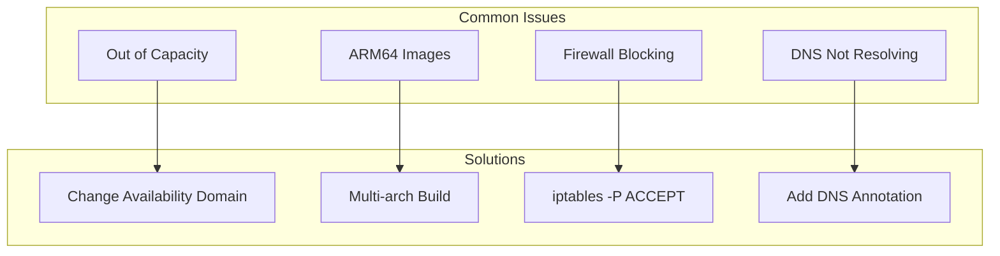
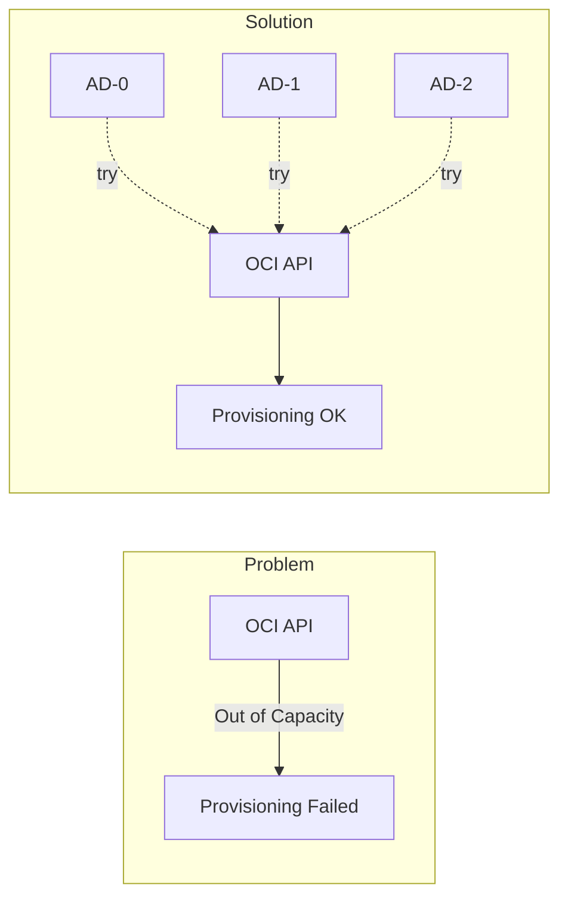
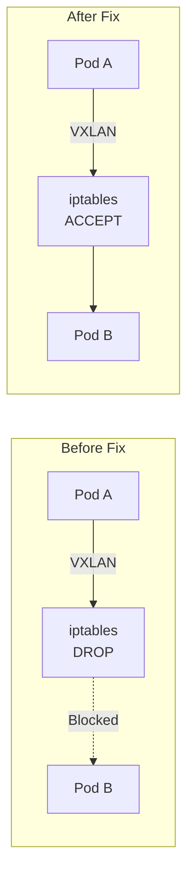

## Out of Capacity

Ampere A1 instances are frequently unavailable in popular regions.



Try changing the `availability_domain` index in `compute.tf` to 0, 1, or 2.

## ARM64 Image Architecture

Standard container images often fail with `exec format error` on ARM64 nodes.

Build multi-architecture images using GitHub Actions with `docker/setup-qemu-action` for `linux/amd64,linux/arm64`.

## Persistent Storage

K3s uses `local-path-provisioner` by default. For block volumes, implement the OCI CSI driver.

## SSH Tunneling

The API server is not publicly accessible. Create an SSH tunnel:

```bash
ssh -N -L 16443:10.0.2.10:6443 ubuntu@<ingress-ip>
```

See [Accessing the Cluster](/operation/accessing-cluster/) for complete instructions.

## Firewall Blocking CNI Traffic

OCI Ubuntu images have strict iptables rules that block Flannel VXLAN traffic.



Symptom: Pods cannot resolve DNS with `i/o timeout` errors.

Fix:

```bash
sudo iptables -P INPUT ACCEPT
sudo iptables -P FORWARD ACCEPT
sudo iptables -F
sudo netfilter-persistent save
```

Cloud-init applies these rules automatically.

## Argo CD Helm Chart Errors

When using Kustomize to inflate Helm charts, Argo CD requires explicit enablement.

Error: `must specify --enable-helm`

Fix: Patch `argocd-cm` ConfigMap:

```yaml
data:
  kustomize.buildOptions: "--enable-helm"
```

## SSH Key Format

OCI requires OpenSSH formatted public keys, not PEM format.

Convert PEM keys:

```bash
ssh-keygen -y -f ~/.oci/oci_api_key.pem > ssh_key.pub
```

## Docker Hub Rate Limiting

Docker Hub rate-limits OCI artifact requests from cloud IPs.

Use Git-based installation for Envoy Gateway instead of Helm OCI.

## External DNS Zone ID Discovery

Scoped Cloudflare API tokens may fail to discover the zone ID automatically.

Error: `Could not route to /client/v4/zones//dns_records...`

Fix: Explicitly provide the zone ID with `--zone-id-filter=<zone-id>`.

## Gateway API External DNS Integration

External DNS may not detect HTTPRoute targets if the Gateway status address is internal.

Fix: Add the annotation `external-dns.alpha.kubernetes.io/target: <public-ip>` to the HTTPRoute.
