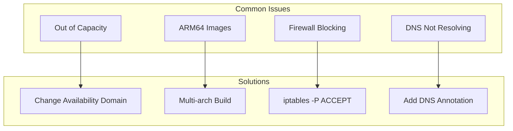
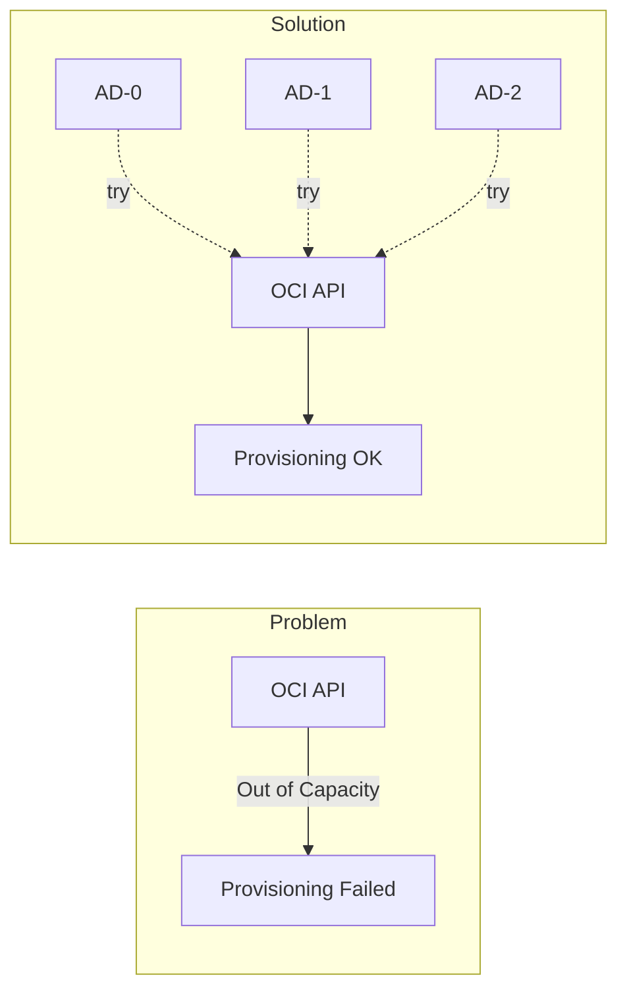
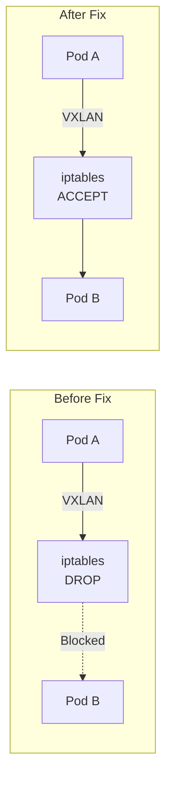

## Out of Capacity

Ampere A1 instances are frequently unavailable in popular regions.



Try changing the `availability_domain` index in `compute.tf` to 0, 1, or 2.

## ARM64 Image Architecture

Standard container images often fail with `exec format error` on ARM64 nodes.

Build multi-architecture images using GitHub Actions with `docker/setup-qemu-action` for `linux/amd64,linux/arm64`.

## Persistent Storage

K3s uses `local-path-provisioner` by default. For block volumes, implement the OCI CSI driver.

## SSH Tunneling

The API server is not publicly accessible. Create an SSH tunnel:

```bash
ssh -N -L 16443:10.0.2.10:6443 ubuntu@<ingress-ip>
```

See [Accessing the Cluster](/operation/accessing-cluster/) for complete instructions.

## Firewall Blocking CNI Traffic

OCI Ubuntu images have strict iptables rules that block Flannel VXLAN traffic (UDP 8472).



Symptom: Pods cannot resolve DNS with `i/o timeout` errors, or pods on the ingress node cannot reach pods on other nodes.

The ingress node requires specific iptables rules because it's in a different subnet (10.0.1.0/24) than the server/worker nodes (10.0.2.0/24):

```bash
sudo iptables -I INPUT -p udp --dport 8472 -j ACCEPT
sudo iptables -I INPUT -s 10.0.2.0/24 -j ACCEPT
sudo iptables -I INPUT -s 10.42.0.0/16 -j ACCEPT
sudo iptables -I FORWARD -s 10.42.0.0/16 -d 10.42.0.0/16 -j ACCEPT
sudo netfilter-persistent save
```

Cloud-init applies these rules automatically.

## Pod-to-Pod Connectivity Issues

If pods on the ingress node (e.g., Envoy) cannot connect to pods on other nodes:

Symptom: Envoy returns `503 Service Unavailable` with `upstream_reset_before_response_started{remote_connection_failure}`.

This occurs when:

- VXLAN traffic (UDP 8472) is blocked by iptables
- Traffic from the pod network (10.42.0.0/16) is blocked

Verify connectivity:

```bash
ssh ubuntu@<ingress-ip> "ping -c 2 10.42.0.26"
```

If ping works but TCP doesn't, check iptables INPUT chain for REJECT rules.

## SSH Host Key Verification Failed

When recreating the cluster, new instances will have different SSH host keys, causing connection errors.

Symptom: `StrictHostKeyChecking` error when running SSH or kubectl commands.

```text
@@@@@@@@@@@@@@@@@@@@@@@@@@@@@@@@@@@@@@@@@@@@@@@@@@@@@@@@@@@
@    WARNING: REMOTE HOST IDENTIFICATION HAS CHANGED!     @
@@@@@@@@@@@@@@@@@@@@@@@@@@@@@@@@@@@@@@@@@@@@@@@@@@@@@@@@@@@
```

Fix: Remove the old host keys:

```bash
ssh-keygen -R <ingress-public-ip>
ssh-keygen -R 10.0.2.10
```

Alternative: Use strict checking disable flags for ad-hoc commands:

```bash
ssh -o StrictHostKeyChecking=no -o UserKnownHostsFile=/dev/null ubuntu@<ip>
```

## K3s Installation Hung on Cloud-Init

In rare cases, temporary DNS or network issues during boot can cause the K3s installation script to fail silently.

Symptom: `kubectl get nodes` shows connection refused, or `systemctl status k3s` says unit not found after 10+ minutes.

Check logs:

```bash
ssh ubuntu@<ingress-ip> "tail -n 50 /var/log/cloud-init-output.log"
```

Fix: If the installation failed, manually rerun the install command found in the logs or in `tf-k3s/cloud-init/server.yaml`.

## Argo CD Helm Chart Errors

When using Kustomize to inflate Helm charts, Argo CD requires explicit enablement.

Error: `must specify --enable-helm`

Fix: Patch `argocd-cm` ConfigMap and **restart the repo-server**:

```bash
kubectl -n argocd patch cm argocd-cm --type=merge -p '{"data":{"kustomize.buildOptions":"--enable-helm"}}'
kubectl -n argocd rollout restart deploy argocd-repo-server
```

## SSH Key Format

OCI requires OpenSSH formatted public keys, not PEM format.

Convert PEM keys:

```bash
ssh-keygen -y -f ~/.oci/oci_api_key.pem > ssh_key.pub
```

## Docker Hub Rate Limiting

Docker Hub rate-limits OCI artifact requests from cloud IPs.

Use Git-based installation for Envoy Gateway instead of Helm OCI.

## External DNS Zone ID Discovery

Scoped Cloudflare API tokens may fail to discover the zone ID automatically.

Error: `Could not route to /client/v4/zones//dns_records...`

Fix: Explicitly provide the zone ID with `--zone-id-filter=<zone-id>`.

## Gateway API External DNS Integration

External DNS may not detect HTTPRoute targets if the Gateway status address is internal.

Fix: Add the annotation `external-dns.alpha.kubernetes.io/target: <public-ip>` to the HTTPRoute.

## Gateway TLS Certificate RefNotPermitted

If the Gateway shows `PROGRAMMED: False` with `RefNotPermitted` errors, it cannot access TLS secrets from other namespaces.

Symptom: `kubectl describe gateway public-gateway` shows:

```text
Certificate ref to secret argocd/argocd-tls not permitted by any ReferenceGrant
```

Fix: Create ReferenceGrants in each namespace containing TLS secrets:

```yaml
apiVersion: gateway.networking.k8s.io/v1beta1
kind: ReferenceGrant
metadata:
  name: allow-gateway-to-secrets
  namespace: argocd
spec:
  from:
  - group: gateway.networking.k8s.io
    kind: Gateway
    namespace: envoy-gateway-system
  to:
  - group: ""
    kind: Secret
```

The Envoy Gateway config template includes these ReferenceGrants automatically.

## Node Label Namespace Restrictions

Kubernetes 1.28+ restricts labels in the `kubernetes.io` and `k8s.io` namespaces.

Symptom: k3s-agent fails to start with error:

```text
Error: failed to validate kubelet flags: unknown 'kubernetes.io' or 'k8s.io' labels specified with --node-labels: [node-role.kubernetes.io/ingress]
```

Fix: Use custom labels without the `kubernetes.io` prefix:

```bash
--node-label role=ingress
--node-label role=worker
```

The cloud-init templates use `role=ingress` and `role=worker` which are allowed.

## ArgoCD Application Sync Order

Applications may fail to sync if dependencies aren't deployed yet.

Symptom: `one or more synchronization tasks are not valid` with message about missing CRDs.

Common dependency issues:

- `envoy-gateway` needs `external-dns` CRD (DNSEndpoint)
- `docs-app` needs `cert-manager` CRD (Certificate)
- All apps using Helm charts need `kustomize.buildOptions: "--enable-helm"` in argocd-cm

Fix: Manually sync in order:

```bash
kubectl -n argocd patch application external-dns --type=merge -p '{"operation":{"sync":{}}}'
kubectl -n argocd patch application cert-manager --type=merge -p '{"operation":{"sync":{}}}'
kubectl -n argocd patch application envoy-gateway --type=merge -p '{"operation":{"sync":{}}}'
kubectl -n argocd patch application docs-app --type=merge -p '{"operation":{"sync":{}}}'
```

## ArgoCD Kustomize Helm Support

If applications using Kustomize with helmCharts fail with `must specify --enable-helm`:

Fix: Ensure the argocd-cm ConfigMap has the correct setting:

```bash
kubectl -n argocd patch cm argocd-cm --type=merge -p '{"data":{"kustomize.buildOptions":"--enable-helm"}}'
kubectl -n argocd rollout restart deploy argocd-repo-server
```

The ArgoCD kustomization includes this configuration automatically via the argocd-self-managed application.

## Envoy Gateway Always OutOfSync

The Envoy Gateway controller modifies the Gateway resource after ArgoCD applies it, causing perpetual OutOfSync status.

Symptom: `envoy-gateway` application shows OutOfSync but Healthy.

Fix: Add `ignoreDifferences` to the Application spec:

```yaml
spec:
  ignoreDifferences:
    - group: gateway.networking.k8s.io
      kind: Gateway
      jsonPointers:
        - /spec/listeners
        - /status
```

This is included in the `applications.yaml.tpl` template automatically.

## ArgoCD Redirect Loop with Gateway TLS

When using Envoy Gateway for TLS termination, ArgoCD may cause redirect loops because it expects HTTPS connections internally.

Symptom: `cd.k3s.sudhanva.me` returns HTTP 307 redirect loop.

Fix: Configure ArgoCD to run in insecure mode (TLS handled by Gateway):

```yaml
valuesInline:
  server:
    extraArgs:
      - --insecure
```

The ArgoCD kustomization template includes this configuration.

## HTTP-to-HTTPS Redirect Not Working

HTTPRoutes may serve content on both HTTP and HTTPS if not bound to specific listeners.

Symptom: `http://k3s.sudhanva.me` returns 200 instead of redirecting to HTTPS.

Fix: Use `sectionName` to bind routes to HTTPS listeners and create separate redirect routes:

```yaml
apiVersion: gateway.networking.k8s.io/v1
kind: HTTPRoute
metadata:
  name: docs-route
spec:
  parentRefs:
  - name: public-gateway
    namespace: envoy-gateway-system
    sectionName: https-docs
  # ... backend config
---
apiVersion: gateway.networking.k8s.io/v1
kind: HTTPRoute
metadata:
  name: docs-redirect
spec:
  parentRefs:
  - name: public-gateway
    namespace: envoy-gateway-system
    sectionName: http
  hostnames:
  - "k3s.sudhanva.me"
  rules:
  - filters:
    - type: RequestRedirect
      requestRedirect:
        scheme: https
        statusCode: 301
```

The HTTPRoute templates include these redirect configurations.

## ExternalSecret Template Parsing Error

Go templates in ExternalSecret resources require specific syntax for nested expressions.

Symptom: ExternalSecret shows `SecretSyncedError` with `unable to parse template`.

Fix: Use `%s` format specifiers instead of escaped quotes:

```yaml
# Wrong
"auth": "{{ printf \"${username}:%s\" .password | b64enc }}"

# Correct
"auth": "{{ printf "%s:%s" "${username}" .password | b64enc }}"
```

## Worker Node TLS Certificate Mismatch

When a cluster is recreated, worker nodes may fail to rejoin with TLS certificate errors.

Symptom: Worker node shows errors in `journalctl -u k3s-agent`:

```text
level=error msg="Failed to connect to proxy" error="tls: failed to verify certificate: x509: certificate signed by unknown authority"
```

This happens because the worker node has cached certificates from the old cluster that don't match the new server's CA.

Fix: Reset the worker node's certificates:

```bash
ssh -J ubuntu@<ingress-ip> ubuntu@<worker-ip>
sudo systemctl stop k3s-agent
sudo rm -rf /var/lib/rancher/k3s/agent/*.kubeconfig /var/lib/rancher/k3s/agent/client*
sudo systemctl start k3s-agent
```

The agent will re-download certificates from the server and rejoin the cluster.

## Let's Encrypt Rate Limiting

**Critical for Development/Testing:** Let's Encrypt enforces strict rate limits (5 certificates per week for the same set of domains).

Symptom: Certificate shows `Failed` status with error:

```text
429 urn:ietf:params:acme:error:rateLimited: too many certificates (5) already issued for this exact set of identifiers in the last 168h0m0s
```

This is common during iterative cluster development where you destroy and recreate the cluster frequently.

**Prevention:**

1. **Use Staging Issuer (Recommended):**
    For development, use the Let's Encrypt Staging environment which has much higher limits. The certificates won't be trusted by browsers (you'll see a warning), but it verifies the entire ACME flow works.

    Update `cluster-issuer.yaml` (or create a separate staging issuer):

    ```yaml
    spec:
      acme:
        server: https://acme-staging-v02.api.letsencrypt.org/directory
    ```

2. **Wait:** The limit resets after 7 days from the first issuance.

## Envoy Gateway Pod Stuck Pending

When restarting or rolling out Envoy Gateway pods, new pods may remain Pending.

Symptom: `kubectl get pods -n envoy-gateway-system` shows:

```text
envoy-...-new   0/2   Pending   0   5m
envoy-...-old   2/2   Running   0   1h
```

Events show: `0/3 nodes are available: 1 node(s) didn't have free ports for the requested pod ports`

This occurs because Envoy uses `hostPort` for ports 80 and 443. Only one pod can bind these ports on a node at a time, causing deployment rollouts to deadlock.

Fix: Delete the old pod to free the ports:

```bash
kubectl delete pod -n envoy-gateway-system <old-pod-name> --grace-period=10
```

The new pod will then schedule and start.

**Note:** This is expected behavior for hostPort deployments. The deployment strategy could be changed to `Recreate` instead of `RollingUpdate` to avoid this, but that causes brief downtime during updates.
